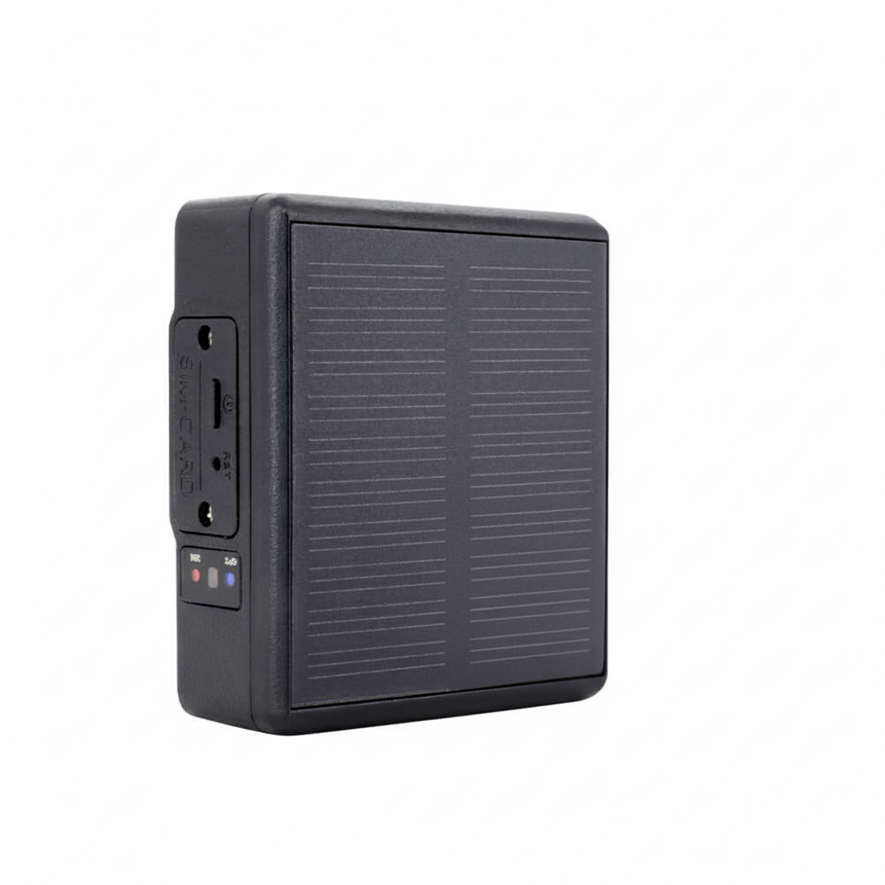

# iStartek - PT24

The PT24 Solar GPS Tracker is a Plaspy compatible GPS tracker purpose-built for long-duration animal and asset monitoring. Rugged, IP67-rated and solar-charged, the PT24 combines multi-mode positioning \(GPS + Beidou + Wi‑Fi + LBS + AGPS\) with a high-capacity 4000mAh battery to deliver reliable real-time tracking and telemetry for livestock, working animals and remote assets. Its low standby current and durable enclosure make it ideal where long field life and dependable location fixes are essential.

Designed for straightforward integration with Plaspy, the PT24 provides location updates, tamper and SIM removal alerts, SOS and listen-in features, plus light-sensor and motion detection from a built-in G‑sensor. Use Plaspy for cloud reporting, geofencing and alert management to turn PT24 telemetry into operational insights for fleet management, anti-theft protection and behavioral monitoring of animals in the field.

## Key Highlights

- Plaspy compatible GPS tracker: seamless upload of location and alert data for cloud dashboards and reports.
- Solar-powered with 4000mAh Li‑ion battery: extended field operation with automatic solar charging and very low standby current.
- Robust multi-mode positioning: GPS + Beidou + Wi‑Fi + LBS + AGPS for faster and more accurate fixes \(5–15 m average accuracy\).
- Rugged IP67 enclosure: water- and dust-resistant housing for outdoor and pastoral environments.
- Integrated sensors: ceramic GPS antenna, G‑sensor and light sensor enable tamper, movement and ambient-light alarms.
- Field-ready communications: 4G/3G/2G cellular support across broad LTE/WCDMA/GSM bands for wide-area connectivity.
- Operational safeguards: tamper, SIM removal and geo-fence alarms plus SOS call, listen‑in and ring‑to‑find capabilities.

## How It Works with Plaspy

When paired with Plaspy, the PT24 delivers continuous location and event data that Plaspy translates into real-time tracking, alerts and historical reports. The multi-mode GNSS and cellular uplink ensure frequent, accurate position updates while Plaspy handles geofencing, alert routing and fleet dashboards. Data flows are optimized for low-power operation so collars and asset tags can remain in the field for extended periods.

- Real-time location and telemetry updates sent to Plaspy for live maps and historical playback.
- Tamper and SIM removal alarms routed to Plaspy to support anti-theft workflows and immediate operator notification.
- Geo-fence alerts and configurable rules in Plaspy for automated containment and breach notifications.
- SOS, listen-in and ring-to-find events integrated into Plaspy alerts for rapid field response and animal welfare checks.
- Sensor-driven events \(G-sensor and light sensor\) reported to Plaspy to detect behavioral anomalies or unauthorized handling.

## Technical Overview

| Model | PT24 Solar GPS Tracker |
| --- | --- |
| Connectivity | 4G / 3G / 2G cellular \(LTE/WCDMA/GSM\) |
| Bands | FDD B1/B2/B3/B5/B7/B8/B20/B28A; WCDMA B1/2/5/8; GSM B2/3/5/8 |
| Positioning Modes | GPS + Beidou + Wi‑Fi + LBS + AGPS \(TD1030 GPS module\) |
| GPS Sensitivity | Tracking -163 dBm | Capture -147 dBm |
| Battery & Charging | 4000mAh Li‑ion; automatic solar charging; charging voltage 5V/1A |
| Power Consumption | Standby ~5 mA; average working ~8 mA/hour \(10‑minute reporting interval\) |
| Onboard Processor & Memory | RTOS ASR3603S chip; RAM 128 MB + internal ROM 196 MB |
| Sensors & Inputs | Built-in ceramic GPS antenna, G‑sensor, light sensor; SOS call, listen‑in, ring‑to‑find; tamper and SIM removal detection; geo‑fence alarms |
| SIM | Nano SIM |
| Environmental | IP67 waterproof rating; operating temperature -20°C to +70°C; humidity 5%–95% non‑condensing |
| Dimensions & Weight | 65 × 55 × 26 mm; 108 g |
| Form Factor | Rugged, collar/asset-mountable enclosure with multiple collar sizes |

## Use Cases

- Livestock and ranch management: track cattle, sheep and horses for grazing patterns, return-to-pen alerts and welfare monitoring.
- Working dogs and large animals: real-time location, SOS and listen-in for safety during field or search tasks.
- Asset supervision in remote sites: secure remote equipment and trailers with tamper and SIM removal alarms integrated to Plaspy.
- Behavioral and health anomaly detection: use G‑sensor and light-sensor events to flag unusual movement or unexpected handling.
- Long-duration field studies: solar charging and low-power design support extended deployments for research or pastoral operations.

## Why Choose This Tracker with Plaspy

The PT24 Solar GPS Tracker is a reliable Plaspy compatible option when you need long battery life, rugged protection and multi-mode positioning in one compact unit. Its solar charging and low standby current reduce maintenance and battery swaps, while IP67 protection makes it resilient to wet and dusty environments. With tamper, SIM removal and geo-fence alerts, PT24 supports anti-theft strategies and rapid operator response through Plaspy’s notification and dashboard tools.

For operations that require more than location alone, the PT24 supplies sensor-driven telemetry that complements fleet management workflows. While the device is primarily focused on positioning and animal/asset monitoring, its telemetry integrates effectively into Plaspy for use alongside fuel monitoring, ignition control or Bluetooth sensors when part of a broader, integrated solution. Choose PT24 with Plaspy to simplify remote monitoring, centralize alerts and gain actionable insights from durable, field-ready tracking hardware.

