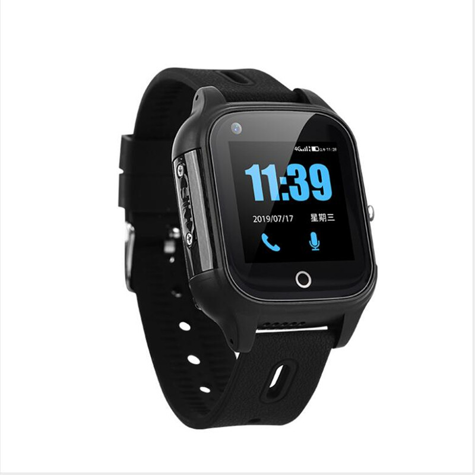

# iStartek - PT28S

The PT28S is a rugged wearable GPS tracker watch from iStartek designed for personal safety and location monitoring. Built with a compact form factor and an IPS display, the device combines multi mode positioning and wide cellular support to provide continuous location updates, one key SOS emergency signaling, two way voice communication and basic health telemetry. Its IP67 rating and lightweight construction make it suitable for everyday wear and outdoor activities.

As a Plaspy compatible device, the PT28S can feed position fixes, emergency events and safety telemetry into Plaspy for live visibility and operational oversight. Plaspy can ingest the watch’s location and alerts to power real time maps, configurable notifications and historical playback so families, caretakers and operators can monitor status and respond to incidents from a central platform.

## Key Highlights

- Plaspy compatible wearable for real time tracking and location based alerts
- Multi mode positioning combining GNSS with Wi Fi and network based location for reliable fixes
- Dedicated emergency features including SOS one key dialing and two way voice for rapid response
- Health and activity telemetry such as heart rate monitoring, fall alerts and step counting
- Broad cellular band support for wide area coverage and consistent connectivity
- Rugged compact design with IP67 waterproofing suitable for daily wear and outdoor use
- Remote management capabilities and up to three months of route playback for review

## How It Works with Plaspy

When integrated with Plaspy, the PT28S streams location, alert and telemetry data to a central dashboard where it is presented as live maps, alerts and historical reports. Plaspy organizes incoming events from the watch into actionable items for monitoring teams and caregivers while preserving recent route history for post incident analysis.

- Real time location updates and mapping for live tracking and situational awareness
- SOS and emergency events prioritized and forwarded as alerts to designated users
- Geo fence notifications and up to three months of route playback for incident review
- Health and safety telemetry surfaced in dashboards and trend reports for monitoring
- Two way voice event indicators made available in Plaspy for verification and response
- Remote parameter updates and firmware management exposed via platform workflows

## Typical Use Cases

- Child safety tracking with SOS and two way voice for quick parent communication
- Elderly monitoring where heart rate and fall alerts assist caregivers and responders
- Outdoor activities such as hiking or cycling where rugged design and location matter
- Daily personal safety for commuters and lone workers using geo fences and emergency alerts
- Care programs and institutions needing continuous visibility of wearable devices

## Why Choose This Tracker with Plaspy

The PT28S pairs practical wearable safety features with Plaspy’s platform capabilities to deliver continuous visibility and timely alerts. Its combination of multi mode positioning, emergency signaling and basic health telemetry aligns well with Plaspy workflows for monitoring individuals, managing alerts and reviewing historical movement. For organizations focused on personal safety rather than vehicle telematics, this device provides a compact way to extend monitoring capabilities to people who need constant oversight.

To learn more about how Plaspy works with compatible devices like the PT28S visit https://www.plaspy.com. Product specifications and availability can change over time, so please verify current details with the manufacturer at https://istartek.com/.
