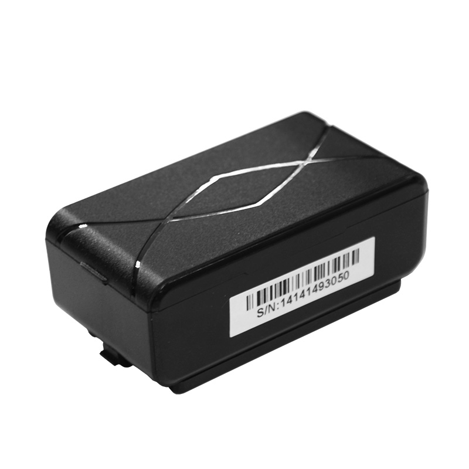

# iStartek - PT55

The PT55 is a compact, Plaspy compatible GPS tracker engineered for long-term asset and personal tracking where discreet installation and multi-year standby are priorities. With a strong magnetic housing, reliable real-time GPS positioning plus LBS fallback, and multiple telemetry/alert options \(UDP/SMS/web and mobile apps\), the PT55 is built to integrate smoothly into Plaspy-enabled fleet management and anti-theft workflows.

The PT55 emphasizes practical, low-maintenance tracking: large internal battery capacity, configurable reporting modes, tamper/light-trigger alarms and anti-fake-LBS protection combine to deliver dependable location, history playback and alarm delivery for trailers, containers, luggage and covert vehicle mounting. Plaspy users get the benefit of long battery life, configurable telemetry, and standard server protocols for easy integration into real-time tracking dashboards and automated alerts.

## Key Highlights

- Plaspy compatible for real-time tracking via UDP/SMS and web/mobile platforms — ideal for fleet management and anti-theft monitoring.
- Extra-long standby life: large internal lithium battery designed for multi-year standby when using low reporting intervals \(marketing standby up to three years at one report/day\).
- Discreet magnetic mounting and compact form factor make covert vehicle or asset installation simple and secure.
- Reliable positioning with GPS plus LBS fallback and anti-fake-LBS protection to reduce false locations in challenging environments.
- Flexible alerting: tamper/light-trigger alarms, low-battery alerts, configurable timing and alarm modes for event-driven telemetry.
- Remote configuration and management via message-based settings \(IP/port, APN, device number, alarm parameters\), supporting large deployments without physical recall.
- Historical track query \(up to 30 days\) for playback and incident investigation in Plaspy dashboards.

## How It Works with Plaspy

Integrating the PT55 with Plaspy delivers real-time location, telemetry and event alerts to Plaspy dashboards and mobile apps. The PT55 can send position updates and alarms via UDP to custom servers or via SMS for environments where data connectivity is intermittent. Plaspy ingests UDP and SMS payloads, decodes GNSS and LBS data, and presents location, history and alert feeds for fleet management, anti-theft response and operational reporting.

- Real-time location and telemetry updates sent over GPRS \(UDP\) or SMS for Plaspy processing and display.
- LBS fallback ensures continued location reporting where GNSS is obstructed; anti-fake-LBS protection helps avoid spoofed cells.
- Tamper/light-triggered alarms and low-battery alerts are forwarded to Plaspy for immediate notification and automated workflows.
- Configurable reporting modes \(timing, alarm, timer, week modes\) allow Plaspy users to tune update frequency for power vs. resolution trade-offs.
- Historical track query \(up to 30 days stored on the device\) supports incident reconstruction and location history in Plaspy.

## Technical Overview

| Connectivity | GSM/GPRS \(GPRS class 12, up to 85.6 kbps\) |
| --- | --- |
| Bands | GSM 850 / 900 / 1800 / 1900 MHz |
| GNSS Chipset | MT2503D \(GNSS + GSM functions\) |
| GNSS Performance | Acquisition sensitivity ≈ -148 dBm; Tracking ≈ -165 dBm; Reacquisition ≈ -160 dBm; 22 tracking / 66 acquisition channels; Typical position accuracy &lt; 10 m CEP; TTFF \(open sky\) cold &lt;40 s, warm &lt;30 s, hot &lt;5 s, reacquisition &lt;1 s |
| Power & Battery | Power supply DC 3.0 V \(internal battery\). Spec table lists 4000 mAh \(Panasonic CR123A \* 3\); marketing materials reference up to 5000 mAh—either way the device uses a large-capacity polymer lithium cell designed for multi-year standby at low reporting rates. Typical consumption ≈ 80 mA/h; rated up to three years standby at one position report per day \(configuration-dependent\). |
| Power Features | Low battery alarm, long standby optimized reporting modes |
| Interfaces | Internal cellular and GNSS antennas, LED indicators \(CEL, GNSS\). Message-based remote configuration \(IP/port, APN, device number, alarm settings\). |
| Protocols | UDP transmission to custom servers, SMS location queries and alarms |
| Form Factor & Mounting | Compact: 77 x 41 x 27 mm; weight ~100 g; strong magnetic mounting for vehicle/asset attachment |
| Environmental | Operating temperature -20° to 75° C; humidity tolerance 5%–90% non-condensing |
| Storage & History | Historical track query available \(up to 30 days\) |
| Special Features | Anti-fake-LBS protection, tamper/light-triggered alarm, scheduled reporting modes |

## Use Cases

- Long-term covert tracking of trailers and shipping containers — minimal maintenance and multi-year standby reduce retrieval frequency.
- Asset protection for high-value goods and baggage — magnetic mounting and tamper/light alarms provide discreet anti-theft alerts to Plaspy.
- Fleet management for intermittently used equipment — configurable timing and week modes let managers balance reporting granularity and battery life.
- Historical route reconstruction and incident investigation — up to 30 days of on-device track history supports playback in Plaspy.
- Remote deployments where cellular coverage is variable — GPS with LBS fallback and SMS/UDP transport keep Plaspy informed even in degraded conditions.

## Why Choose This Tracker with Plaspy

The PT55 is a focused solution for organizations and individuals who need reliable, low-maintenance GPS tracking that integrates with Plaspy for fleet management, anti-theft response and telemetry workflows. Its large internal battery and configurable reporting modes minimize operational overhead, while UDP/SMS transport and message-based remote configuration simplify large deployments. Anti-fake-LBS protection, tamper/light-trigger alarms and historical track playback give Plaspy users stronger assurance of correct location data and faster response to suspicious events.

For teams managing diverse assets, the PT55 serves as a dependable Plaspy compatible tracker: it delivers real-time tracking, telemetry and alarms without frequent battery swaps, supports discreet magnetic mounting for covert installations, and provides the fundamental connectivity and reporting options needed to integrate into existing Plaspy fleet management, anti-theft and telemetry-driven processes — including downstream workflows such as fuel monitoring or ignition/immobilizer control when used alongside compatible external sensors or gateways.

