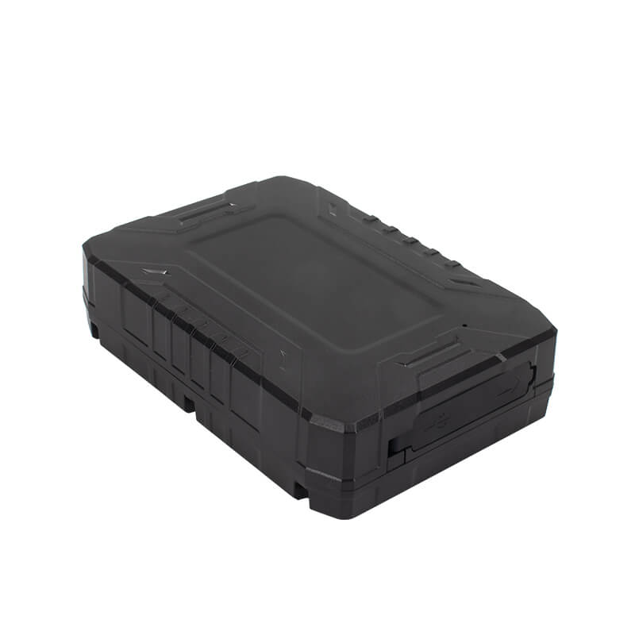

# iStartek - PT60-L

The PT60-L is a 4G wireless GPS tracker designed for long term, low maintenance tracking of vehicles and assets. It combines a high sensitivity GNSS module, regional 4G cellular support, a large rechargeable battery, and a strong magnetic mount to provide reliable location and telemetry for unattended assets such as trailers, containers, and personal equipment. Its installation free form factor and emphasis on extended standby life make it suitable where frequent access to power is limited.

As a Plaspy compatible device, the PT60-L integrates with Plaspy to deliver configurable reporting modes and platform visibility without fixed installation. When paired with Plaspy, the device can be set for near real time updates or ultra low power periodic reporting, and it reports alarms, battery state, and event history into Plaspy dashboards and reports. This compatibility makes the PT60-L a practical option for teams that need long endurance tracking combined with centralized fleet and asset management.

## Key Highlights

- Plaspy compatible 4G GPS tracker built for long standby life and unattended deployments.
- Large 7,500 mAh rechargeable battery and configurable working modes to optimize reporting versus battery life.
- High sensitivity GNSS positioning using an L76K module for dependable location in mixed environments.
- Rugged, installation free design with strong magnetic mount for covert attachment to trailers, containers and equipment.
- Onboard telemetry and security features including tamper detection, driving behavior events, low battery alerts, and local logging.
- Support for remote firmware updates and dual server reporting to improve operational resilience.
- Environmental durability suitable for long term outdoor or storage deployments.

## How It Works with Plaspy

Once the PT60-L is connected to Plaspy, location and telemetry are delivered to the platform so teams can monitor assets from a single interface. Plaspy ingests the device messages and converts them into location traces, alerts, and historical reports that support operational oversight and incident response.

- Configurable reporting intervals for near real time tracking or timer wake up modes to maximize battery life.
- Tamper and low battery alerts surfaced in Plaspy for anti theft and maintenance workflows.
- Driving behavior and event telemetry available in Plaspy for fleet safety review and service planning.
- Local storage and dual server reporting help ensure Plaspy receives buffered data when primary links are intermittent.
- Dashboards, geofences, and scheduled reports in Plaspy present location history and device status for distributed assets.

## Typical Use Cases

- Long term fleet asset tracking for trailers, unpowered equipment, and seasonal assets.
- Anti theft and tamper monitoring for parked or stored vehicles and containers.
- Remote asset telemetry and event logging to support maintenance programs and safety reviews.
- Multi site or pan IoT deployments where low maintenance and remote management are priorities.
- Discrete monitoring of personal or portable assets that benefit from a magnetic, installation free device.

## Why Choose This Tracker with Plaspy

The PT60-L pairs a purpose built hardware design for endurance with Plaspy platform features to create a low maintenance tracking solution. Its large battery and multiple power modes let organizations balance reporting frequency against battery life while onboard alarms and event telemetry feed Plaspy for actionable insights. Dual server reporting and remote update capability reduce operational friction for larger, distributed deployments.

If you want a rugged, installation free tracker that can operate for extended periods while feeding location and event data into a centralized fleet platform, the PT60-L is a sensible fit for Plaspy users. Learn more about Plaspy on the main website https://www.plaspy.com. Product specifications, available variants, and manufacturer details can change over time, so please verify current specifications and regional options on the iStartek site https://istartek.com/ before large scale procurement.
