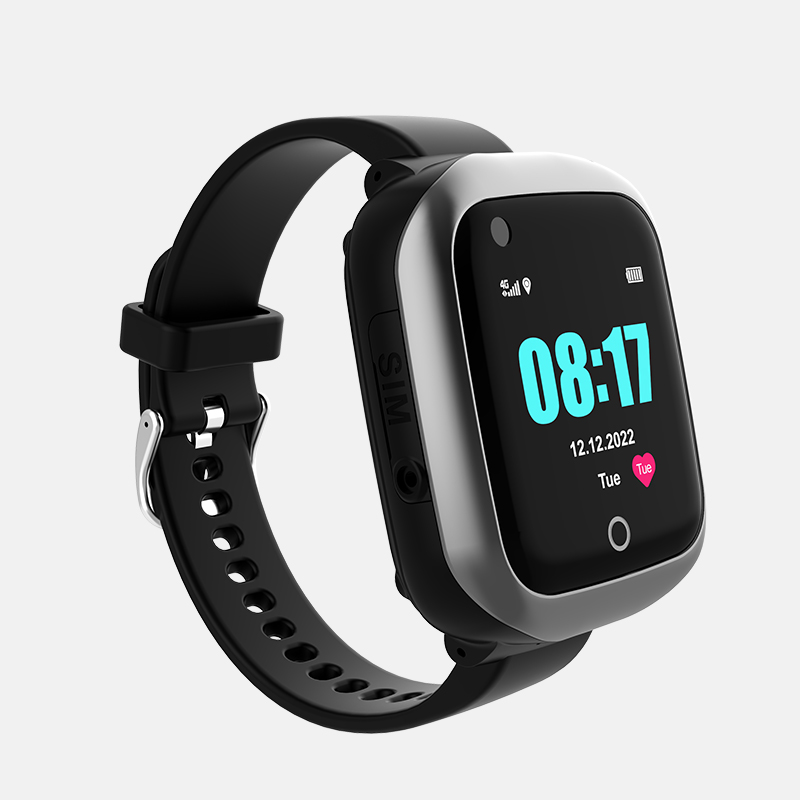

# iStartek - PT66

The PT66 4G Watch Elder GPS Tracker is a purpose-built wearable that brings dependable Plaspy compatible GPS tracking and caregiver-focused telemetry to everyday elder care. Designed as a comfortable wristwatch with a 1.30-inch IPS color touchscreen and IP67 waterproofing, the PT66 combines multi-mode precise positioning \(GPS + BDS + Wi‑Fi + LBS\) with health sensors and safety alarms so families and care teams can maintain situational awareness without invasive hardware.

As a Plaspy compatible GPS tracker, the PT66 is optimized for real-time tracking, SOS response, remote monitoring and routine health checks. The device pairs with the companion app for remote photo capture, voice and video calls, two-way communication and voice monitoring — while Plaspy aggregates location and telemetry into dashboards, geofence alerts, and caregiver notifications for a complete personal safety solution.

## Key Highlights

- Plaspy compatible GPS tracker: multi-mode positioning \(GPS + Beidou + Wi‑Fi + LBS\) for accurate, reliable location updates \(GPS accuracy 5–15 m\).
- Wearable safety and health telemetry: continuous heart rate, blood pressure, sleep monitoring, step counting and medication reminders tailored for elder care.
- Immediate alerting: SOS button, fall-down alarm, GEO‑fence notifications and low-battery alerts for fast caregiver response.
- Long standby battery and convenient charging: 700 mAh battery with intelligent low-power CPU yielding up to 7 days standby and magnetic fast charging \(5V/1A\).
- Durable, everyday design: 1.30" IPS 240×240 touchscreen, IP67 waterproof rating suitable for washing and rainy conditions.
- Rich communications: two-way voice, voice/video call support, voice monitoring and remote photo capture to verify the user’s situation.
- No monthly server fee for tracking: vendor notes only SIM card calling/data fees are required, reducing recurring costs for basic Plaspy integration.

## How It Works with Plaspy

The PT66 transmits location and sensor telemetry over cellular networks to Plaspy, enabling real-time tracking and coordinated alerts. Once the watch is registered in Plaspy, caregivers can receive live map updates, set geofence zones, and view health and safety events alongside other Plaspy-compatible devices. Plaspy’s platform consolidates GPS tracker data into centralized reports and notifications, so you can manage personal safety alongside fleet or asset deployments from the same dashboard.

- Real-time location and telemetry updates from multi-mode GNSS and network positioning.
- Safety alerts: SOS, fall-down alarms, GEO-fence breach and low-battery notifications forwarded to Plaspy in real time.
- Health telemetry: heart rate, blood pressure, sleep data and step counts available for caregiver review through Plaspy or the companion app.
- Remote voice monitoring, two-way calls and remote photo capture to verify circumstances without a site visit.
- Integration-friendly: Plaspy aggregates PT66 events with other device types; optional accessories and related trackers can be managed from the same platform for broader use cases including fleet management and asset tracking.

## Technical Overview

| Connectivity | Cellular 4G/FDD + WCDMA + GSM \(region-specific variants\) |
| --- | --- |
| Bands | US/AU: FDD B1/B2/B3/B4/B5/B7/B12\(17\)/B28A; WCDMA B1/2/5; GSM B2/3/5/8. AS/EU: FDD B1/B2/B3/B4/B5/B7/B20; WCDMA B1/2/5; GSM B2/3/5. |
| Power & Battery | 700 mAh lithium battery; intelligent low-power CPU; up to 7 days standby; magnetic fast charging \(5V/1A\). |
| Interfaces | 1 multifunction button \(power/SOS\), reset button; touchscreen interaction; cellular audio for two-way/voice/video calls. |
| GNSS | GPS + Beidou \(BDS\) with Wi‑Fi and LBS assistance; GPS accuracy approximately 5–15 m. |
| Bluetooth | Not specified in product description. |
| Remote Management | Companion app for remote monitoring, remote photo capture, device finder \(remote ring\); Plaspy integration for alerts and reporting. No monthly server fee for tracking \(SIM calling/data fees apply\). |
| Form Factor | Wearable watch; 1.30-inch IPS HD color touchscreen \(240×240\); IP67 waterproof; temperature range -20°C to +70°C; humidity 5%–95% non-condensing. |
| Certifications | CE certified |

## Use Cases

- Elder care monitoring: continuous location tracking plus heart rate and blood pressure telemetry to support remote caregiver oversight and routine check-ins.
- Emergency response: SOS button and fall-down alarms routed through Plaspy for immediate notification and coordinated assistance.
- Daily routine management: medication reminders, sedentary alerts and sleep tracking help maintain health routines and provide actionable telemetry to caregivers.
- Remote verification and contact: two-way voice/video calls, voice monitoring and remote photo capture allow caregivers to assess well-being without physical visits.
- Combined deployments: manage PT66 wearables alongside other Plaspy compatible trackers and accessories for mixed personal, asset and fleet management scenarios.

## Why Choose This Tracker with Plaspy

The PT66 delivers a focused combination of personal safety features and health telemetry in a Plaspy compatible package that emphasizes reliability, ease of use and cost transparency. Its multi-mode positioning and real-time alarm reporting make it an effective GPS tracker for elder safety, while the companion app and Plaspy integration provide caregivers and organizations with centralized real-time tracking, event alerts and historical reports. For households or care providers seeking a wearable solution without recurring server fees \(beyond SIM costs\), the PT66 offers a practical balance of telemetry, communication capability and robust standby life.

