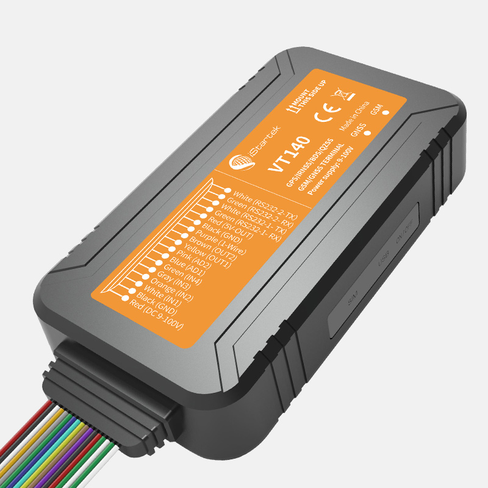

# iStartek - VT140

The VT140 from iStartek is an AIS-140 approved GPS tracker designed for professional fleet management and vehicle security. It is built to operate in demanding automotive environments and combines multi GNSS positioning, robust I O for vehicle telemetry and accessories, and industry features such as remote cut off, fuel theft detection support and camera event upload. Dual server IP upload and CDAC protocol capability make the VT140 suitable for regulated deployments that require continuous reporting.

As a Plaspy compatible device, the VT140 can feed location, events and sensor data into Plaspy for live monitoring, reporting and operational oversight. Its onboard buffering and dual server upload help maintain route continuity during intermittent connectivity, while the unit's telemetry options enable fleet managers using Plaspy to combine positioning with anti theft controls, fuel monitoring and scheduled compliance reports.

## Key Highlights

- AIS 140 approval and CDAC protocol capability for regulatory reporting and simplified integration with tracking platforms.
- Multi GNSS positioning for accurate real time location tracking across varied operating environments.
- Rugged IP66 enclosure and wide operating voltage range for reliable performance across vehicle types.
- Extensive telemetry and I O support for peripherals, camera event uploads and fuel sensor inputs.
- Remote cut off and anti theft features that support fleet security workflows.
- Onboard flash buffering and dual server IP upload to preserve tracking data during connectivity interruptions.
- Remote firmware update and OTA control support to reduce field maintenance needs.

## How It Works with Plaspy

When connected to Plaspy, the VT140 transmits GNSS positions, events and sensor telemetry to Plaspy's platform using its dual server upload and supported protocols. Plaspy receives and processes these streams to present live maps, alerts and historical reports, while the tracker’s local buffering ensures data continuity when network conditions vary.

- Real time location and telemetry updates appear on Plaspy live maps for operational visibility.
- Event and alarm forwarding for conditions such as power change, sensor triggers and designated alerts.
- Scheduled and on demand reports in Plaspy use the device data for compliance reporting and operational analysis.
- Anti theft workflows including remote immobilizer actions can be coordinated through Plaspy and reflected in platform alerts.
- Camera event uploads and event snapshots support incident documentation within Plaspy dashboards.

## Typical Use Cases

- Regulated fleet reporting and compliance for public transport and commercial vehicle operators.
- Continuous real time fleet tracking and route oversight across cars, buses and trucks.
- Vehicle anti theft and immobilization scenarios paired with rapid alerting and intervention.
- Fuel level monitoring and fuel theft detection using ultrasonic or capacitive sensor inputs.
- Incident documentation and investigation using event driven camera uploads and telemetry.

## Why Choose This Tracker with Plaspy

The VT140 is a practical choice for organizations that need a compliant, rugged tracker with broad telemetry capabilities and Plaspy compatibility. Its emphasis on regulatory readiness, data buffering and peripheral support makes it well suited to fleets that require reliable reporting and integrated anti theft measures without heavy on site maintenance.

For fleets using Plaspy, the VT140 offers a balance of continuity, flexibility and device level controls that help maintain operational visibility and support safety and compliance programs. If your deployment priorities include regulated reporting, fuel monitoring and event driven media capture, the VT140 paired with Plaspy can provide a cohesive solution.

To learn more about how Plaspy works with compatible trackers like the VT140 visit https://www.plaspy.com. Product specifications and availability can change over time, so please verify current technical details and regulatory information on the manufacturer site https://istartek.com/.
