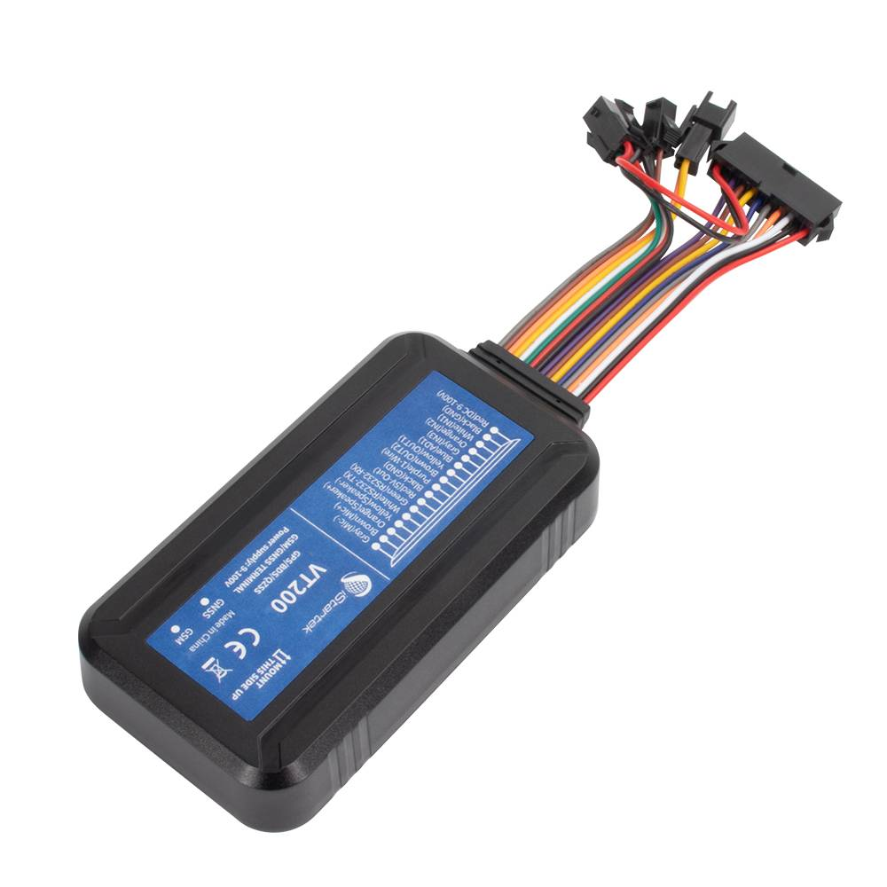

# iStartek - VT200

The VT200 2G Waterproof GPS Tracker is a rugged, Plaspy compatible GPS tracker built for reliable real-time tracking and telemetry in demanding vehicle and asset applications. With an IP66 waterproof enclosure, multi-constellation GNSS and quad-band 2G cellular connectivity \(Quectel M26\), the VT200 delivers persistent location data, buffered logging in blind spots, and remote firmware management — making it an ideal choice for fleet management, anti-theft protection, and asset telemetry when integrated with the Plaspy platform.

Engineered for broad vehicle fitment \(cars, motorcycles, trucks, trailers and special equipment\), the VT200 combines precise positioning, comprehensive IOs and peripheral support \(camera, RS232, external microphone/speaker\) so Plaspy users can receive live location, event-triggered photo uploads, driver behavior alerts and remote control actions from a single, waterproof device.

## Key Highlights

- Plaspy compatible for seamless real-time tracking, geo-fencing and fleet reporting.
- IP66 waterproof design and wide 9–100V operating range for diverse vehicle installations.
- Multi-constellation GNSS \(GPS/BDS/GLONASS/QZSS\) with \<2.5 m CEP accuracy for precise location data.
- Quad-band 2G GSM \(GPRS\) connectivity via Quectel M26 for global cellular coverage where 2G is available.
- On-device 128 Mbit flash buffer and dual-server IP upload to preserve and reliably deliver data through blind spots.
- Rich I/O and peripheral support \(RS232, camera, external MIC/speaker, 1-Wire\) for telemetry, diagnostics and event media.
- FOTA \(firmware-over-the-air\) and remote output control to keep devices updated and manage actuators remotely.

## How It Works with Plaspy

When integrated with Plaspy, the VT200 streams location and vehicle telemetry to the Plaspy cloud for live maps, alerts and historical reports. Plaspy ingests the device’s GNSS fixes, buffered records, and event notifications so operators can monitor fleets, trigger anti-theft workflows, and review driver behavior in near real time. The VT200’s support for event-triggered photo uploads and two-way audio enriches incident context for recovery or compliance use cases.

- Real-time location and telemetry updates delivered via GPRS to Plaspy servers.
- Ignition and digital input monitoring using configurable inputs for event-driven alerts \(e.g., ignition on/off, door triggers\).
- Fuel monitoring supported when paired with optional capacitive or ultrasonic fuel sensors; Plaspy displays fuel level trends and alerts.
- Remote output control to integrate immobilizer or vehicle speed limiter workflows via Plaspy-managed commands.
- Camera and two-way audio support for event-triggered photo upload and in-cab communications through Plaspy.

## Technical Overview

| Connectivity | Quad-band 2G GSM \(Quectel M26\), GPRS data \(850/900/1800/1900 MHz\) |
| --- | --- |
| Bands | GSM 850 / 900 / 1800 / 1900 MHz |
| Power & Battery | Operating voltage: 9–100 V; Backup battery: 500 mAh; Normal power consumption ~65 mA/h; Power-saving working time ~33 hours, normal mode ~7.5 hours |
| Interfaces | Digital inputs \(configurable; positive/negative trigger\), 2 digital outputs \(open-drain, 500 mA max\), 1 analog input \(0–36 V\), RS232, 1-Wire, external MIC and speaker connectors, CEL and GNSS LED indicators |
| GNSS | Airoha AG3331 multi-constellation \(GPS / BDS / GLONASS / QZSS\), position accuracy &lt;2.5 m CEP, TTFF \(cold\) &lt;26 s |
| Memory | 128 Mbit flash for on-device buffering and event storage |
| Remote Management | FOTA \(firmware-over-the-air\), dual-server IP upload for redundancy |
| Form Factor & Environment | Dimensions 99 × 54 × 19.5 mm; Weight 106 g; IP66 waterproof rating; Operating temperature -20°C to 75°C; Humidity 5–95% non-condensing |

## Use Cases

- Fleet management: real-time tracking, route replay, driver behavior monitoring \(harsh acceleration/braking/turning, speeding\).
- Anti-theft and recovery: continuous location stream, geo-fence alerts and remote output control to assist recovery workflows.
- Fuel monitoring and telemetry: integrate optional capacitive or ultrasonic fuel sensors to report fuel levels and detect theft or leaks.
- Trailer and towed-vehicle detection: idle and trailer alarms for trailer separation and asset security.
- Camera-enabled incident documentation: event-triggered photos and two-way audio for context during accidents or inspections.

## Why Choose This Tracker with Plaspy

The VT200 is a practical, Plaspy compatible GPS tracker that balances rugged design with a full set of telematics features. Its waterproof IP66 housing and wide voltage range make it easy to deploy across mixed fleets and harsh environments. Plaspy benefits from the VT200’s multi-constellation GNSS and on-device buffering to maintain historical continuity through coverage gaps, while FOTA and dual-server uploads simplify fleet-wide maintenance and reliability.

Operators who need integrated telemetry \(speed, position, inputs\), peripheral support \(camera, RS232 devices, fuel sensors\) and remote control capabilities will find the VT200 a dependable option. Combined with Plaspy’s real-time tracking, alerting and reporting, the VT200 helps reduce theft risk, improve fuel efficiency and deliver actionable driver behavior insights — all managed through a single, scalable platform.

