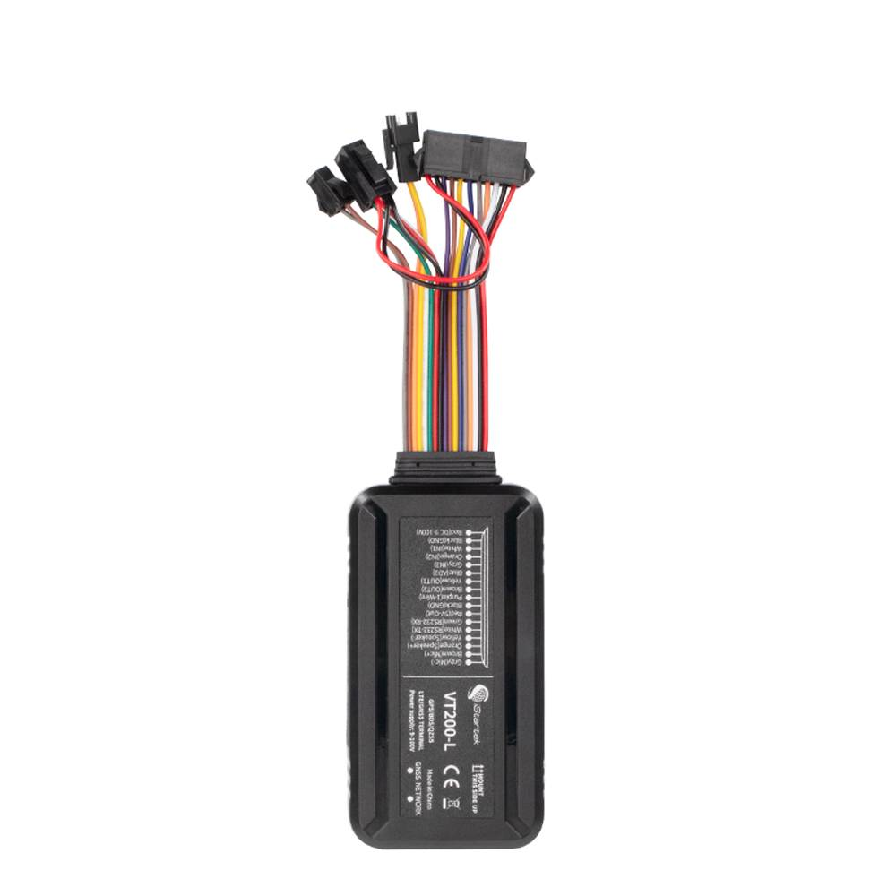

# iStartek - VT200-L

The VT200-L is a 4G vehicle GPS tracker designed for reliable real time tracking and comprehensive fleet telematics. Built for demanding vehicle environments, the unit combines high precision GNSS positioning with cellular fallback and robust I O to deliver continuous location, telemetry and anti theft features. It includes onboard flash memory for offline buffering and is designed to maintain reporting continuity in challenging coverage scenarios.

As a Plaspy compatible device, the VT200-L is suited to feed live position updates, event alerts and buffered historical data into Plaspy dashboards and workflows. Its configuration and transport options enable integration with Plaspy for fleet visibility, driver behavior monitoring, remote action control and operational reporting without requiring bespoke hardware changes.

## Key Highlights

- Plaspy compatible 4G vehicle tracking with cellular fallback for broad coverage and timely updates
- Multi GNSS support for improved positioning accuracy and resilience in urban areas
- Built in flash memory to buffer historical data during network outages and resend on reconnect
- Robust I O and peripheral support for telemetry, status inputs and remote outputs
- Rugged design and wide vehicle voltage support for use across diverse vehicle types
- Support for remote firmware upgrades and dual server upload to aid device management at scale

## How It Works with Plaspy

The VT200-L transmits location and vehicle telemetry using platform friendly transport methods and a standard device protocol supported by Plaspy. Once provisioned, it supplies both periodic and event driven updates, plus buffered records after connectivity is restored, enabling continuous tracking and automated platform workflows.

- Live location and telemetry feeding Plaspy dashboards for real time visibility and dispatch
- Event alerts for ignition status, door or alarm triggers to drive rules and notifications
- Fuel level reporting and fuel alarm events integrated into Plaspy for cost control insights
- Remote control of digital outputs through Plaspy to support immobilization and alarm actions
- Multimedia and event triggered uploads where external cameras or microphones are attached to provide incident context

## Typical Use Cases

- Fleet management and dispatch for route optimization and operational oversight
- Anti theft protection and remote immobilization for private and commercial vehicles
- School buses and public transport to monitor routes, stops and incident reporting
- Taxi and ride hailing operations for trip monitoring and driver behavior alerts
- Insurance and leasing fleets where continuous mileage and usage data inform programs

## Why Choose This Tracker with Plaspy

The VT200-L pairs rugged vehicle oriented hardware with platform ready communications, making it a practical option for organizations using Plaspy for real time tracking and telematics. Its combination of multi GNSS positioning, cellular fallback and onboard buffering helps maintain data continuity, while extensive I O enables a wide set of telemetry and control scenarios that Plaspy can surface in dashboards and alerts.

For fleets and operators who need dependable reporting and scalable device management, the VT200-L supports remote maintenance and resilient upload options that align with Plaspy deployment patterns. Choosing this tracker can simplify hardware integration while providing the telemetry needed for safety, efficiency and anti theft programs managed through Plaspy.

Learn more about Plaspy on the main website https://www.plaspy.com. Product specifications, availability and manufacturer details can change over time, so please verify current technical information on the official iStartek site https://istartek.com/.
