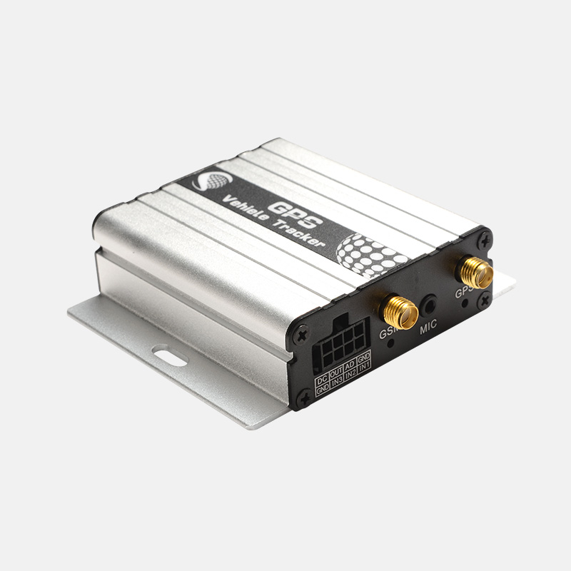

# iStartek - VT600

The VT600 is a compact GPS tracker from iStartek designed for reliable real time tracking and fleet management. It combines a high sensitivity SIRF Star IV GNSS receiver with GSM GPRS and SMS uplink to deliver accurate location, event telemetry, and configurable alarms. The unit is engineered for vehicle use and supports buffered storage of coordinates to preserve track history during temporary connectivity interruptions.

As a Plaspy compatible device, the VT600 integrates into Plaspy fleet workflows to provide live location markers, timeline events, and alarm notifications. Its support for event driven reporting, internal flash buffering, and multiple input output interfaces makes it a practical choice for fleet operators who want straightforward telemetry, remote immobilization options, and enhanced operational visibility through the Plaspy platform.

## Key Highlights

- Plaspy compatible GPS tracker built for real time vehicle tracking and fleet reporting.
- High sensitivity SIRF Star IV GNSS receiver offering dependable positioning accuracy.
- GSM GPRS and SMS connectivity with internal flash memory to buffer coordinates during outages.
- Security features including remote cut off for fuel or power and multiple configurable alarms.
- Multiple I O interfaces plus 1 wire support for external telemetry and control integration.
- Smart alarms for movement, power cut, GPS antenna disconnect, geo fence breaches and SOS.
- Compact and rugged design suitable for continuous vehicle monitoring and anti theft workflows.

## How It Works with Plaspy

The VT600 transmits periodic and event driven GPS and status data to Plaspy via GSM GPRS or SMS. Plaspy ingests location points, alarm triggers, and input output events from the device and presents them as live markers, timeline events, and customizable alerts for operators. Internal flash buffering ensures that track history is uploaded to Plaspy when connectivity is restored.

- Real time location updates and continuous telemetry for fleet visibility and dispatching.
- Alarm and status reporting such as movement alerts, power cut, antenna disconnect, GPS blind area alerts, geo fence events and SOS notifications.
- Fuel monitoring support when paired with optional fuel sensors, allowing Plaspy to correlate sensor readings with vehicle location for consumption reports.
- Remote immobilization and cut off controls issued from Plaspy to disable fuel or power for anti theft response.
- Sensor data ingestion from digital, analog and 1 wire interfaces so Plaspy can present consolidated telemetry and event histories.

## Typical Use Cases

- Fleet anti theft and recovery using live tracking and remote cut off commands.
- Driver behavior monitoring and route optimization through continuous location and event telemetry.
- Fuel monitoring and theft detection by integrating optional fuel sensors with vehicle location.
- Alarm and event monitoring to notify dispatch teams of power loss, geofence breaches or SOS events.
- Specialized asset tracking and environmental monitoring using 1 wire temperature sensors or access control options.

## Why Choose This Tracker with Plaspy

Pairing the VT600 with Plaspy provides fleet managers with a balanced telematics solution that emphasizes reliable location data, resilient offline storage, and flexible I O for telemetry and remote control. The combination of smart alarms, remote immobilization, and compact ruggedness makes the VT600 a practical fit for operations that need dependable tracking and straightforward integration.

To learn more about how Plaspy can manage VT600 devices and support your fleet operations, visit https://www.plaspy.com. Product specifications and availability can change over time, so please verify current details and official documentation on the manufacturer site https://istartek.com/.
