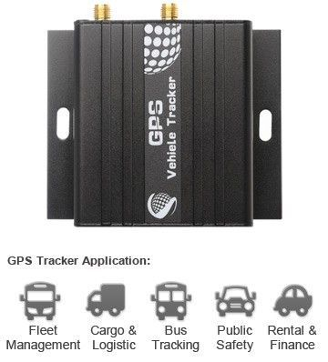

# iStartek - VT600-3G

The iStartek VT600-3G is a compact and lightweight GPS tracker designed for a range of vehicle and asset tracking applications. Measuring 65mm by 61mm by 26mm and weighing about 90g, it is built for discreet deployment where space and weight matter. The device operates across a broad input voltage range and includes a 500mAh backup battery to maintain operation during primary power loss. Its positioning is driven by a SIRF-Star IV GPS chipset with 20 channel all in view support and published positioning accuracy around 10 meters.

As a Plaspy compatible device, the VT600-3G can be used to feed location and status information into Plaspy for centralized monitoring and reporting. Its multi band communication support helps maintain connectivity across different regions, while onboard indicators and an SOS button provide simple local status cues and emergency signalling. With options for external accessories and on device data storage, the tracker offers flexibility for common fleet and asset management workflows when paired with Plaspy.

## Key Highlights

- Compact form factor and low weight suitable for diverse vehicle and asset installations
- Wide input voltage support and a 500mAh backup battery for continued operation during power loss
- SIRF-Star IV GPS chipset with 20 channel all in view tracking for reliable positioning
- Multi band cellular connectivity including UMTS HSDPA and GSM GPRS for regional coverage
- Position accuracy around 10 meters with precise time synchronization to GPS time
- Built in SOS button plus LED status indicators for GPS and cellular condition
- Expandable with optional accessories such as fuel sensor, temperature sensor, microphone, and relay

## How It Works with Plaspy

When integrated with Plaspy, the VT600-3G transmits its location and basic device status so operators can view positions and events in a single platform. Plaspy consumes the device data to enable real time visibility, alerts, and historical reporting without requiring users to manage raw device communications.

- Live location tracking on Plaspy maps for individual units and whole fleets
- Event and alert handling such as SOS notifications and status changes routed into Plaspy workflows
- Historical position playback and trip reports to support route analysis and compliance
- Monitoring of device connectivity and basic health indicators within the Plaspy dashboard
- Use of optional accessory inputs to extend reporting where accessory data is available and configured

## Typical Use Cases

- Fleet vehicle tracking for route oversight and operational coordination
- Asset tracking for high value or mobile equipment across sites
- Personal safety and lone worker monitoring using the SOS function
- Fuel or temperature monitoring when paired with compatible optional sensors
- Rental and logistics visibility where compact trackers are preferred

## Why Choose This Tracker with Plaspy

The VT600-3G is a practical choice for organizations that need a compact tracker with dependable GNSS performance and multi band cellular connectivity. Its small footprint and backup battery help ensure continued reporting in vehicles and mobile assets, while the range of optional accessories allows the unit to be adapted to different monitoring needs. When used with Plaspy, the device contributes location and event data to a unified fleet management environment for operational oversight.

Plaspy provides the platform tools to turn VT600-3G device data into actionable insights, combining mapping, alerts, and historical reports to support daily operations. For teams evaluating devices, the VT600-3G represents a balance of size, positioning capability, and accessory options that can suit many fleet and asset tracking scenarios.

If you want to learn more about how Plaspy can work with the VT600-3G and other compatible devices, visit https://www.plaspy.com. Product specifications, availability, and manufacturer details can change over time, so please verify current technical specifications and accessory compatibility with the manufacturer at https://istartek.com/ before making procurement decisions.
