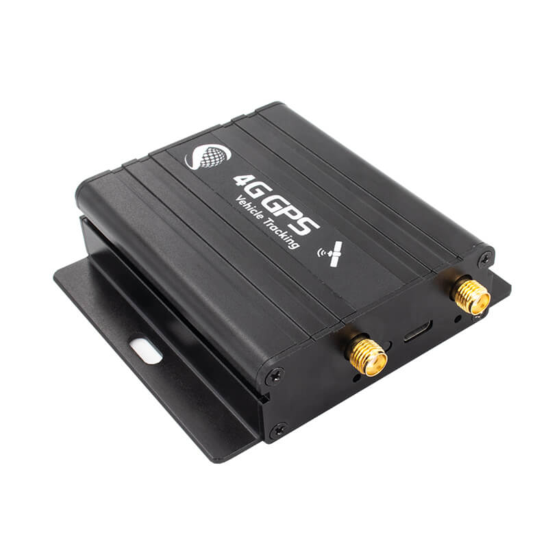

# iStartek - VT800

The VT800 series from iStartek is a truck GPS tracker built for real time vehicle tracking and fleet management. It combines multi GNSS positioning with cellular data upload and local storage to provide continuous location information. The device is designed to capture and buffer coordinates when a live connection is not available, and it offers multiple inputs for external peripherals commonly used in fleet operations.

As a Plaspy compatible device, the VT800 can feed its position and operational events into the Plaspy platform to support visibility and operational oversight. Its combination of network compatibility, onboard buffer, peripheral inputs, and monitoring features makes it a practical fit for organizations that want to consolidate tracking, fuel monitoring, temperature logging, and basic event alerts inside Plaspy for reporting and fleet control.

## Key Highlights

- Real time vehicle location tracking with support for multiple global navigation systems
- 4G network compatibility and options for dual server upload to improve data redundancy
- Local buffer memory to store position data when a connection is unavailable
- Support for external peripheral devices such as RFID or card readers via serial input
- Integrated fuel monitoring support to help track consumption and tank status
- Built in tamper alarm, temperature monitoring, and driving behavior monitoring for operational oversight

## How It Works with Plaspy

When connected to Plaspy, the VT800 streams location and event data that Plaspy ingests for mapping, monitoring, and reporting. Plaspy uses incoming device data to build vehicle histories, generate alerts, and present operational dashboards that help fleets run more efficiently.

- Centralized live tracking and historical playback inside Plaspy dashboards
- Automated alerts for tamper events, temperature thresholds, and other on device alarms
- Fuel monitoring data available for consumption reports and anomaly detection
- Buffered data upload support ensures missing intervals are reconciled after connectivity is restored
- External reader inputs and I O events logged for access control or route validation purposes

## Typical Use Cases

- Truck fleet location tracking and route visibility for logistics operators
- Cold chain or temperature sensitive transport with on device temperature monitoring
- Fuel usage tracking and fuel theft detection for commercial fleets
- Security and tamper monitoring for high value cargo and trailers
- Driver behavior monitoring and operational reporting for compliance and coaching

## Why Choose This Tracker with Plaspy

The VT800 is a practical option for fleet operators who need a combined solution for location, fuel monitoring, and basic environmental sensing. Its ability to store buffered data and to forward information to two servers helps reduce data gaps, which in turn improves the reliability of analytics and reporting within Plaspy. The presence of peripheral inputs and audio/listen features also gives operators flexibility to integrate additional hardware used in daily operations.

Paired with Plaspy, the VT800 enables centralized visibility across vehicles and assets, making it easier to translate raw device data into actionable fleet insights. Organizations seeking a tracker with redundancy features and multi use case capability will find the VT800 aligns well with standard fleet monitoring workflows supported by Plaspy.

To learn more about how Plaspy can work with the VT800 and other compatible devices, visit https://www.plaspy.com. Product specifications and availability can change over time, so please verify current VT800 details and documentation with the manufacturer at https://istartek.com/ before purchase.
