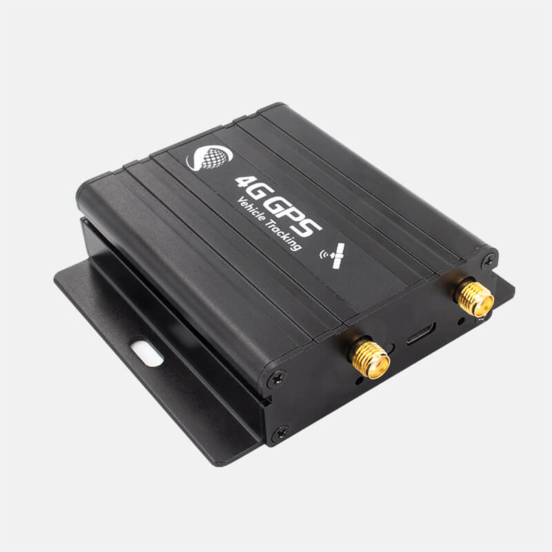

# iStartek - VT800-L

The VT800-L from iStartek is a professional 4G CAT4 GPS tracker engineered for demanding fleet management and vehicle anti-theft deployments. Plaspy compatible out of the box, the VT800-L supplies reliable real-time tracking and rich telemetry so operators can monitor vehicle position, status and driving behavior across mixed-network environments.

Designed for trucks, buses, taxis, rental fleets and high-value private vehicles, the VT800-L combines a high-precision L76K GPS+BD dual-mode GNSS receiver with a Quectel EC200A-CN 4G communication module and 128Mbit flash buffering. That combination ensures continuous data flow to Plaspy even in signal blind areas and enables robust scheduling, route monitoring and rapid anti-theft response.

## Key Highlights

- Plaspy compatible for seamless integration into existing real-time tracking and fleet management workflows.
- 4G CAT4 connectivity \(Quectel EC200A-CN\) with multi-mode cellular support for wide-area coverage and fast uplink/downlink.
- High-precision GNSS \(GPS/BDS/QZSS\) with local buffering \(128Mbit flash\) to preserve history during coverage gaps.
- Rich I/O and expansion: RS232 ports, analog AD inputs, multiple digital inputs and high-current open-drain outputs for telemetry and accessories.
- Advanced telematics: driving behavior monitoring \(harsh acceleration/braking/cornering, overspeed\), tamper and geofence alarms, and temperature monitoring support for up to eight sensors.
- Optional fuel monitoring via capacitive or ultrasonic sensors for fleet fuel monitoring and anomaly detection.
- Compact, rugged form factor with wide 9–100V power input and internal 500mAh high-temperature polymer backup battery for uninterrupted operation.

## How It Works with Plaspy

The VT800-L delivers continuous position and status updates to Plaspy using its 4G data link and dual-server IP upload capability. When the tracker detects network loss, built-in 128Mbit flash memory caches position and telemetry; the unit automatically forwards stored history to Plaspy when connectivity resumes. Plaspy ingests location, alarm and telemetry records to provide live dashboards, alerts and historic route playback.

- Real-time location and telemetry: GNSS positions, speed, heading and 3D accelerometer events feed Plaspy for live tracking and behavior analytics.
- Tamper and geofence events: immediate alerts allow Plaspy to notify dispatch or security teams for anti-theft response.
- Buffered history upload: stored points are forwarded to Plaspy after reconnection, preserving accurate trip records and compliance logs.
- Sensor telemetry: temperature inputs \(up to 8 sensors\) and optional fuel monitoring data are mapped into Plaspy reports and dashboards.
- Peripheral integration: RS232-connected RFID/iButton or OBD decoders enable driver ID and engine data to be reported to Plaspy for driver logs and vehicle diagnostics.

## Technical Overview

| Connectivity | 4G CAT4 \(Quectel EC200A-CN\), supports LTE-FDD, LTE-TDD, DC-HSPA+ and WCDMA |
| --- | --- |
| Bands | LTE-FDD B1 / B3 / B8; LTE-TDD B34 / B38 / B40; WCDMA B1 / B8 |
| Data Rate | LTE-FDD up to 150 Mbps downlink / 50 Mbps uplink \(device capability\) |
| Power & Battery | Wide power input 9–100V; low power outage protection; internal 500mAh high-temperature polymer backup battery |
| Interfaces | 2 × RS232, 2 × analog AD inputs, 3 × digital inputs, 2 × open-drain outputs \(>500 mA\), 1-wire interface, micro SIM slot, micro USB debug port, external MIC & speaker |
| GNSS | L76K GPS + BDS dual-mode receiver; supports GPS / BDS / QZSS positioning |
| Storage | 128Mbit flash memory for buffered logging and history upload |
| Sensors | 3D accelerometer for driving behavior detection; supports up to 8 temperature sensors \(1-wire\) |
| Processor & Protocol | Cortex-M4 MCU \(AT32F415RBT7\); iStartek new protocol |
| Antennas & Indicators | External GSM and GPS antenna connectors; two LEDs \(blue, green\) |
| Form Factor | Compact case 72 × 61 × 24 mm; magnetic mounting options for flexible vehicle/trailer installation |
| Remote Management | Dual server IP upload described; FOTA/remote firmware management not specified |

## Use Cases

- Fleet management: real-time tracking, route compliance, and driving behavior analytics for trucks, buses and taxis.
- Anti-theft protection: tamper and geofence alarms combined with position updates enable fast recovery and remote incident response.
- Cold chain and temperature-sensitive loads: up to eight temperature sensors provide telemetry to Plaspy for continuous condition monitoring.
- Fuel monitoring and cost control: optional capacitive or ultrasonic fuel sensors feed fuel level and consumption data to Plaspy reports.
- Driver ID and access control: RS232 support for RFID and iButton systems ties driver events and hours-of-service data into fleet workflows.

## Why Choose This Tracker with Plaspy

The VT800-L pairs industrial-grade hardware with the integration flexibility required by modern fleet operations. Because it is Plaspy compatible, operators get rapid deployment and consistent telemetry ingestion for fleet management, anti-theft monitoring and operational reporting. The device’s 4G connectivity, multi-GNSS positioning and local buffering reduce data gaps, while rich I/O and peripheral support allow telemetry, temperature monitoring and driver identification to be collected and displayed within Plaspy dashboards.

For organizations that require a compact, high-performance GPS tracker for trucks, buses or mixed fleets, the VT800-L offers a dependable foundation for real-time tracking, telemetry-driven insights and scalable fleet operations on the Plaspy platform.

