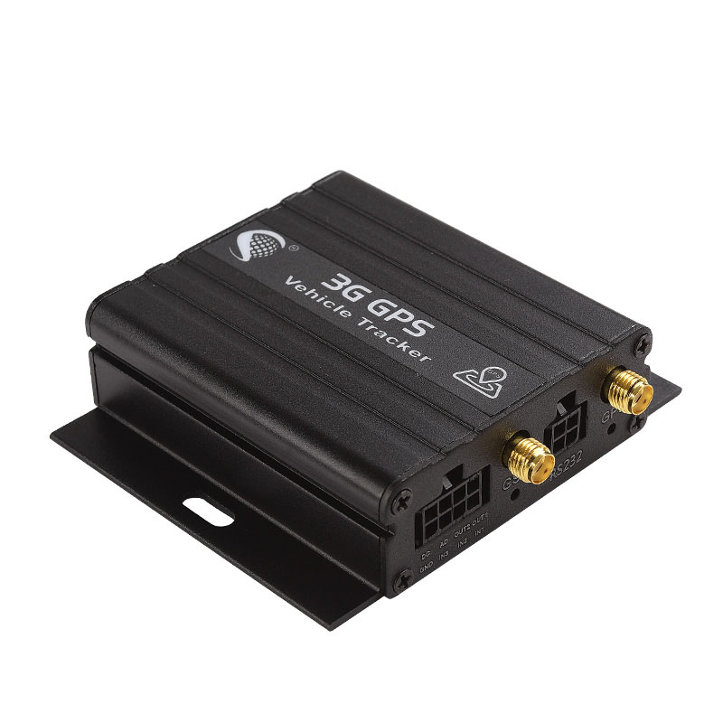

# iStartek - VT900-G

The VT900-G is a professional vehicle tracker from iStartek designed for robust telematics deployments. It combines high sensitivity GNSS positioning with cellular connectivity and onboard data buffering to deliver continuous location and event data for vehicles. The device supports vehicle diagnostics inputs and multiple external sensors, making it suited to fleet monitoring, security, and operational telemetry.

As a Plaspy compatible model, the VT900-G can forward location fixes, diagnostics, and event alerts into Plaspy for real time visibility and historical reporting. Its ability to store data locally during connectivity interruptions and then upload queued records makes it a practical choice for operators who need reliable trip history and consistent reporting inside the Plaspy platform.

## Key Highlights

- Confirmed Plaspy compatibility for integration with fleet dashboards and reporting.
- High sensitivity GNSS positioning for dependable location accuracy in vehicle use.
- Cellular connectivity for continuous reporting and live tracking to Plaspy.
- Onboard storage buffers location and event data when networks are unavailable.
- Support for vehicle diagnostics and external sensors including OBD CANBUS and RS232 peripherals.
- Multiple configurable inputs and outputs for alerting and remote control actions.
- Designed for vehicle telematics use cases such as fuel monitoring and anti theft protection.

## How It Works with Plaspy

When connected to cellular networks, the VT900-G transmits GNSS fixes, telemetry, and configured events to Plaspy so fleets gain live tracking and consolidated history. Plaspy ingests the device data to power maps, alerts, and reports while respecting the device buffered upload behavior when connectivity is lost.

- Live location and telemetry visible in Plaspy dashboards for operational oversight.
- Event and alarm forwarding such as ignition, door, and security alerts for timely notifications.
- Sensor and diagnostics data from OBD CANBUS and analog inputs available for fuel and condition monitoring.
- Remote control capability via outputs that can be used with Plaspy event rules for fleet actions.
- Buffered data synchronization ensures trip continuity in Plaspy after network restoration.

## Typical Use Cases

- Fleet management and dispatch monitoring with route history and alerting.
- Vehicle security and anti theft response with instant alerts and remote control options.
- Fuel monitoring and theft detection using diagnostics and optional fuel sensors.
- Cold chain or temperature sensitive transport monitoring via external sensor inputs.
- Driver access logging and validation with RFID readers supported through RS232.

## Why Choose This Tracker with Plaspy

The VT900-G offers a practical combination of reliable GNSS performance, cellular reporting, and local buffering that aligns well with Plaspy use cases for fleet operations and vehicle security. Its support for vehicle diagnostics and multiple sensor inputs lets operators gather richer telemetry so Plaspy can deliver more actionable reporting and alerts without losing historical continuity during outages.

If you want to learn more about using the VT900-G with Plaspy, visit the Plaspy website at https://www.plaspy.com to explore platform features and deployment options. Product specifications, availability, and manufacturer details can change over time, so please verify current technical information on the official manufacturer site https://istartek.com/ before purchasing or deploying hardware.
