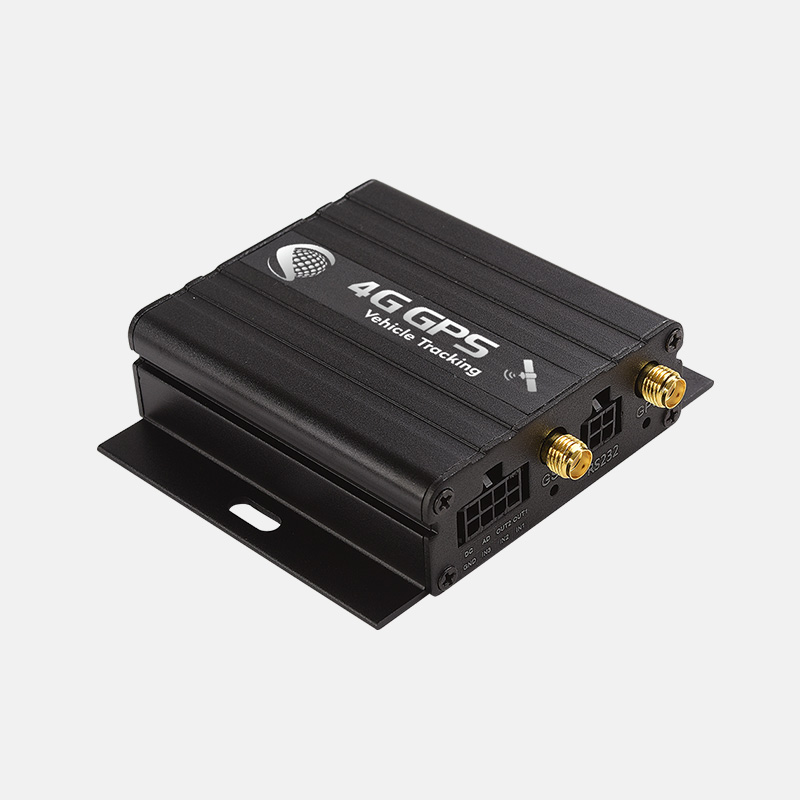

# iStartek - VT900-L

The VT900-L is a compact vehicle GPS tracker from iStartek designed for professional fleet management and vehicle telematics. It provides continuous position reporting and event detection suitable for live monitoring, anti theft workflows, and broader operational telemetry. The unit supports multi channel reporting and local record storage to preserve data during temporary connectivity gaps, making it appropriate for commercial fleet deployments.

As a Plaspy compatible device, the VT900-L can forward location, alerts, and telemetry into the Plaspy platform for visualization, reporting, and operational control. Its combination of reliable positioning, broad cellular support and a range of inputs lets fleet managers consolidate vehicle location and sensor data in Plaspy for oversight, investigation and routine reporting.

## Key Highlights

- Plaspy compatible real time tracking with multi channel reporting and fallback messaging for continuity.
- Dual GNSS positioning with GPS plus BeiDou for improved coverage and position accuracy.
- Multi network cellular support for wide regional reach and consistent connectivity.
- Comprehensive I O and accessory support to connect external sensors and input devices for richer telemetry.
- Onboard logging and internal backup power to preserve records and maintain critical alerts during outages.
- Rich alarm set including geofence, parking and antenna disconnect to support anti theft and recovery workflows.
- Compact vehicle oriented design suited to concealed mounting and fleet installations.

## How It Works with Plaspy

The VT900-L transmits position and event data to Plaspy so fleet operators can monitor assets in real time and review historical records. When connectivity is interrupted, stored records are uploaded once service resumes, ensuring Plaspy maintains a continuous view of vehicle activity.

- Real time location and basic telemetry delivered to Plaspy for map display and fleet visibility.
- Alarm and event forwarding to Plaspy for geofence breaches, parking events and other configured alerts.
- Scheduled and conditional reporting support for time, distance and mileage based reports in Plaspy.
- Remote control of supported digital outputs via Plaspy to assist in staged immobilization and accessory control.
- Aggregation of fuel and temperature sensor inputs so Plaspy can include sensor telemetry alongside location data.

## Typical Use Cases

- Fleet tracking and route optimization where continuous location and scheduled reports inform dispatching.
- Stolen vehicle recovery and anti theft workflows using alerts and remote output control for response.
- Fuel monitoring and consumption analysis when paired with external fuel sensors and integrated through inputs.
- Cold chain and temperature sensitive transport monitoring using external temperature probes and reporting.
- Driver behavior and compliance monitoring for events such as harsh driving or overspeed alerts.

## Why Choose This Tracker with Plaspy

The VT900-L blends reliable positioning, flexible connectivity and a broad set of input options that make it a practical choice for Plaspy powered deployments. Its local logging and backup power help reduce data loss during coverage gaps while the device alarm set and remote management features streamline anti theft and operational workflows.

For organizations seeking to centralize vehicle location, sensor telemetry and event reporting, the VT900-L is a compatible device that integrates into Plaspy to deliver actionable tracking, reporting and control. Learn more about Plaspy on the main website https://www.plaspy.com. Product specifications, availability and manufacturer details can change over time, so please verify current specifications and compatibility on the iStartek official site https://istartek.com/ before purchase.
