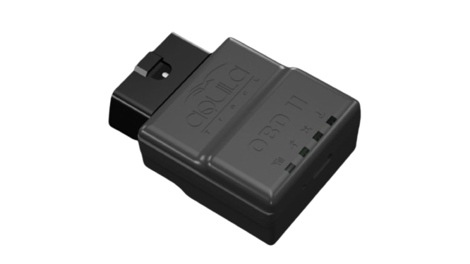

# iTriangle - OBD II

The OBD II from iTriangle is a professional plug and play vehicle tracker designed to provide integrated GNSS and cellular tracking with direct access to vehicle telemetry. Built for fast installation into the vehicle diagnostic port, it offers compact onboard antennas, access to vehicle data streams, and motion sensing to support continuous tracking, diagnostics and fleet oversight without requiring external cabling.

This model is Plaspy compatible out of the box, making it suitable for operators who want immediate integration into a cloud fleet management platform. When paired with Plaspy, the OBD II supplies live location, vehicle diagnostics, event alerts and reporting data that help fleet managers and rental operators monitor assets, respond to incidents and plan maintenance with greater visibility.

## Key Highlights

- Plug and play vehicle installation for rapid deployment across fleets and rental vehicles
- Native compatibility with Plaspy for immediate cloud integration and live tracking
- Integrated GNSS and cellular radios with internal antennas for a clean, tamper resistant install
- Direct access to vehicle telemetry and diagnostics to support condition monitoring and fault reporting
- Support for remote firmware updates and configuration to reduce field service visits
- Low sleep current and a small backup battery to preserve essential reporting during power interruptions
- Rugged temperature rating and tamper alert support for demanding commercial use

## How It Works with Plaspy

When connected to Plaspy, the iTriangle OBD II streams location fixes and vehicle telemetry to the platform so operators can monitor assets in real time, review historical trips and receive automated alerts. Plaspy ingests vehicle data and sensor events from the device and makes those inputs available across maps, reports and notification workflows.

- Live location updates and historical tracks visible in Plaspy maps and trip reports
- Vehicle diagnostics and fault information reported to Plaspy dashboards for maintenance planning
- Alerts for tamper events and power interruptions routed into Plaspy notification channels
- Bluetooth sensor inputs and accessory telemetry surfaced in Plaspy where supported
- Remote configuration and firmware update actions coordinated alongside Plaspy fleet settings

## Typical Use Cases

- Commercial fleet management for location visibility, route monitoring and driver oversight
- Rental fleet deployments where fast plug and play installation speeds vehicle turnover
- Remote diagnostics and preventive maintenance programs using onboard vehicle data
- Anti-theft monitoring and rapid response workflows using tamper alerts and live tracking
- Supplementing operational reporting with accessory sensor data and event logging

## Why Choose This Tracker with Plaspy

The iTriangle OBD II is a practical choice for organizations that need a compact, integrated tracker delivering both location and vehicle telemetry. Its plug and play form factor reduces installation time, while internal antennas and robust environmental ratings make it suitable for continuous, commercial use. Combined with Plaspy, the device helps teams centralize monitoring, automate alerts and produce actionable reports without complex wiring or extensive field configuration.

Learn more about how the OBD II can work with Plaspy and other fleet solutions by visiting https://www.plaspy.com. Product specifications, availability and manufacturer details can change over time, so please verify current technical information and compatibility on the manufacturer site https://www.itriangle.net/.
