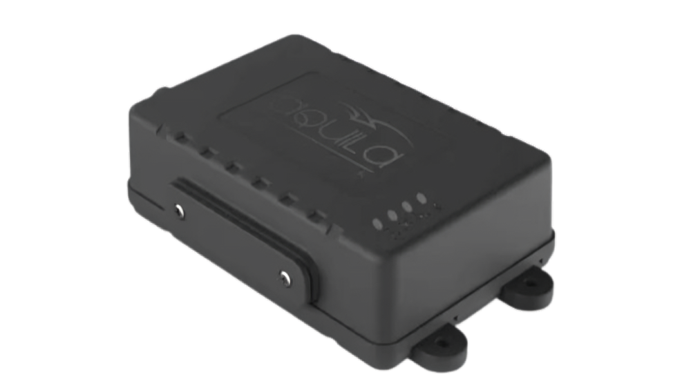

# iTriangle - TS101 Advance

The TS101 Advance GPS tracker is a rugged, Plaspy compatible telematics device built for reliable vehicle monitoring, security, and fleet management. Designed for demanding outdoor environments, the TS101 Advance combines multi-constellation GNSS positioning, 2G cellular connectivity, on-board motion sensors, and robust I/O for accessory integration to deliver continuous real-time tracking and actionable telemetry to the Plaspy platform.

Ideal for fleets, commercial transport, and anti-theft deployments, the TS101 Advance supports remote diagnostics and configuration via SMS, USB, TCP/IP, or Bluetooth and receives OTA/FOTA firmware updates. With tamper alerts, ignition detection, and an internal backup battery, this GPS tracker provides resilient, business-grade tracking that integrates smoothly into Plaspy for reporting, alerts, and operational workflows.

## Key Highlights

- Plaspy compatible GPS tracker for reliable real-time tracking and fleet management integration.
- Multi-constellation GNSS \(GPS, GLONASS, Galileo, BeiDou\) for improved position accuracy in challenging environments.
- Built-in accelerometer and gyroscope for driving behavior analytics, motion detection, and harsh event logging.
- Rugged IP65 enclosure with wide operating temperature range for outdoor and heavy-duty vehicle use.
- Internal 850mAh backup battery providing up to ~6 hours autonomous operation after power loss.
- Comprehensive I/O: analog and digital inputs, digital outputs and RS232 for sensors, immobilizer relay, and fuel monitoring integration.
- Remote management via BLE, TCP/IP, SMS, USB and OTA/FOTA for easy configuration and firmware updates.

## How It Works with Plaspy

Integrating the TS101 Advance with Plaspy enables consistent real-time tracking, telemetry collection, and automated alerts. The device streams GNSS positions, accelerometer/gyroscope events, and I/O state changes over TCP/IP or cellular links to Plaspy, where you can visualize live location, run fleet management reports, and trigger anti-theft workflows.

- Real-time location and telemetry updates transmitted to Plaspy for live mapping and historical route analysis.
- Ignition detection and digital input status feed into Plaspy for ignition-based reports and event rules.
- Fuel monitoring via analog inputs \(supports integration with external fuel sensors\) and telemetry logging.
- Remote immobilizer/relay control using digital outputs to support anti-theft and immobilization workflows from Plaspy.
- Bluetooth sensors and BLE beacons supported for local telemetry \(temperature, cargo sensors, or proximity\) and asset context inside Plaspy.

## Technical Overview

| Model | TS101 Advance |
| --- | --- |
| Connectivity | 2G \(GSM\) with TCP/IP, SMS; BLE 4.x \(Bluetooth Low Energy\) |
| Bands | 2G: 900 / 1800 MHz |
| Power & Battery | Input 9–32V DC; Sleep mode current ~5mA; Backup battery 850mAh Li-ion \(~6 hours operation\) |
| Inputs / Outputs | 2 analog inputs, 4 digital inputs, 2 digital outputs, 1 RS232 interface |
| GNSS | GPS, GLONASS, Galileo, BeiDou |
| Sensors | Built-in accelerometer and gyroscope \(driving behavior and motion detection\) |
| Bluetooth | BLE 4.x for sensor and configuration connectivity |
| Remote Management | Configuration and diagnostics via SMS, USB, TCP/IP, Bluetooth; OTA/FOTA firmware updates |
| Data Logging | 128 Mbit internal memory \(up to ~40,000 records\) |
| Protection & Durability | IP65 enclosure; compliant with vibration, thermal shock, mechanical shock, and electrical transient standards \(ISO 16750, ISO 7637\) |
| Operating Temperature | -25°C to +85°C |
| Form Factor | Dimensions 120 × 68 × 34 mm; Weight 206 g; internal GSM, GNSS and BLE antennas |

## Use Cases

- Fleet tracking and telematics for dispatch, route compliance, and driver behavior monitoring.
- Anti-theft and immobilization: remote relay control and tamper/panic alerts to secure vehicles in critical events.
- Fuel monitoring systems using analog inputs to help detect consumption patterns and unauthorized refueling.
- Driver behavior analytics with accelerometer/gyroscope data for coaching, safety programs, and insurance telematics.
- Remote vehicle diagnostics and public/commercial transport security with durable, weather-resistant installation.

## Why Choose This Tracker with Plaspy

When you deploy the TS101 Advance with Plaspy, you get a hardened, field-proven GPS tracker that balances durability with rich telemetry and easy integration. The multi-constellation GNSS stack ensures dependable positioning, while built-in motion sensors and comprehensive I/O let you capture meaningful telemetry for fleet management, fuel monitoring, and anti-theft actions. Plaspy leverages the device’s real-time streams, logged records, and event alerts to provide actionable dashboards, automated immobilizer control, and compliance reporting.

Choose the TS101 Advance with Plaspy for a solution that prioritizes uptime \(IP65 protection, extended temperature range, and backup battery\), operational simplicity \(remote configuration and OTA/FOTA\), and extensibility \(RS232, analog/digital I/O, BLE sensors\). The combined platform and device deliver scalable fleet management, precise real-time tracking, and trusted anti-theft capabilities for commercial and public transport fleets.

