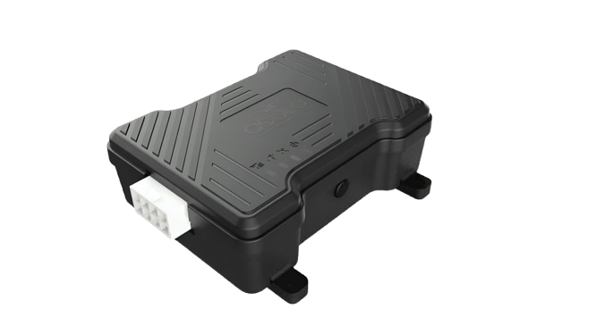

# iTriangle - TS101 BASIC

# TS101 BASIC

The TS101 BASIC is a compact, rugged GPS tracker engineered for essential fleet monitoring and vehicle security. As a Plaspy compatible device, it delivers reliable real-time tracking, multi-constellation GNSS positioning \(GPS/GLONASS/Galileo/BeiDou\), and the interfaces fleets need to collect telemetry and event data from diverse vehicle types.

The unit is purpose-built for fleet management, school transport safety, and logistics applications that demand continuity and simplicity. With wide 9–32V DC input, IP65 protection, onboard storage for up to 6,000 records, and OTA/FOTA support, the TS101 BASIC helps maintain continuous reporting, reduce downtime, and support anti-theft and immobilizer workflows when paired with vehicle systems and Plaspy platform tools.

## Key Highlights

- Plaspy compatible GPS tracker for dependable real-time tracking and reporting across fleets and single vehicles.
- Multi-constellation GNSS \(GPS, GLONASS, Galileo, BeiDou\) for improved location availability in challenging environments.
- Robust data integrity with onboard storage for up to 6,000 tracking records to bridge network outages.
- Wide 9–32V input and internal 500mAh backup battery for uninterrupted telemetry during power-loss situations.
- Integrated motion detection and tamper alerts via an internal accelerometer to support anti-theft monitoring.
- Practical I/O: ignition monitoring, 1 analog input, 2 digital inputs, 1 digital output, and RS232 debug for seamless vehicle integration.
- IP65-rated enclosure and compact form factor for easy installation and reliable operation in harsh vehicle environments.
- Bluetooth Classic \(BLE 3.0\) and TCP/IP communication for local sensor pairing and networked data exchange.

## How It Works with Plaspy

The TS101 BASIC integrates with Plaspy to deliver continuous, actionable fleet data. When installed in a vehicle, the device collects GNSS fixes, acceleration/motion events, ignition status, and I/O signals, then sends compact telemetry packets over 2G TCP/IP. Plaspy ingests that data for real-time location, alerts, historical playback, and reporting.

- Real-time location and telemetry updates delivered to Plaspy for live tracking and routing views.
- Ignition status and digital input events reported to trigger rules, geofence alerts, and driver event tracking.
- Onboard storage of up to 6,000 records ensures no data loss during temporary network outages; stored points sync to Plaspy when connectivity returns.
- OTA/FOTA and remote configuration allow administrators to update firmware and settings through supported Plaspy workflows \(where provisioning allows\).
- Bluetooth support for local sensors or beacons lets Plaspy display extended telemetry \(e.g., temperature or proximity\) when paired with compatible Bluetooth sensors.

## Technical Overview

| Connectivity | 2G GSM, TCP/IP communication |
| --- | --- |
| Bands | 2G GSM \(regional band variants; specific bands depend on market configuration\) |
| Power & Battery | Wide DC input 9–32V; internal 500mAh backup battery for power-loss operation |
| Storage | Onboard storage for up to 6,000 tracking records |
| Interfaces | 1 analog input, 2 digital inputs, 1 digital output, ignition status monitoring, debug RS232 |
| GNSS | Multi-constellation: GPS, GLONASS, Galileo, BeiDou \(accuracy varies with conditions\) |
| Bluetooth | Bluetooth Classic \(BLE 3.0\) for sensor pairing and local device communication |
| Remote Management | OTA/FOTA remote firmware and configuration updates supported |
| Form Factor & Protection | Compact vehicle tracker; IP65-rated enclosure for dust and water resistance |

## Use Cases

- Fleet management: live vehicle tracking, route replay, and telemetry ingestion for cost control and dispatch efficiency.
- Anti-theft and vehicle security: motion detection, tamper alerts, and remote workflows \(immobilizer control via digital output\) to reduce theft risk.
- School transportation safety: ignition and event monitoring to ensure student transport compliance and incident reporting.
- Logistics and asset visibility: continuity of tracking using onboard storage during coverage gaps, improving delivery verification and chain-of-custody.
- Sensor-enabled telemetry: pair Bluetooth sensors or use the analog input for fuel monitoring, temperature sensing, or other custom telemetry when required.

## Why Choose This Tracker with Plaspy

The TS101 BASIC is a practical choice for organizations seeking a Plaspy compatible GPS tracker that balances cost, resilience, and functionality. Its multi-constellation GNSS and internal accelerometer provide reliable position and motion data; the wide voltage range and IP65 enclosure support diverse vehicle fleets. Onboard storage and an internal backup battery preserve telemetry during network or power interruptions, while OTA/FOTA and standard interfaces simplify remote management and integration. For operators focused on real-time tracking, fleet management, anti-theft protection, and straightforward telemetry collection \(including fuel monitoring or immobilizer control via available I/O\), the TS101 BASIC offers a dependable foundation when paired with the Plaspy platform.

