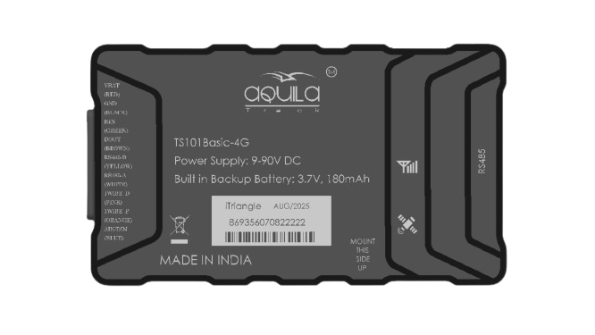

# iTriangle - TS101 Basic 4G

The TS101 Basic 4G is a compact GPS tracker engineered for vehicle telematics and asset monitoring. Designed for mixed fleets that include electric and conventional vehicles, the TS101 Basic 4G combines LTE Cat 1 connectivity, multi GNSS positioning and onboard data storage to provide continuous and reliable real time tracking and telemetry. Its form factor and power range make it suitable for a broad set of fleet and asset scenarios where persistent location and event logging matter.

As a Plaspy compatible device, the TS101 Basic 4G can stream location, event and vehicle telemetry into the Plaspy platform for monitoring, alerts and reporting. Built in backup power, short range wireless support and configurable I O expand how Plaspy can correlate telemetry with ignition state, immobilizer control and sensor inputs, while onboard offline storage ensures records are preserved until they can be uploaded to Plaspy for analysis.

## Key Highlights

- Plaspy compatible GPS tracker offering LTE Cat 1 for dependable real time tracking and telemetry.
- Multi GNSS receiver supporting GPS GLONASS and BeiDou for improved positioning in varied environments.
- Wide 9 to 90V DC input and internal backup battery to maintain visibility during power interruptions.
- Onboard data storage capable of retaining thousands of tracking records for offline logging and later upload.
- Configurable digital and analog I O with optional RS485 and CAN interfaces for integration with vehicle signals.
- BLE 5.0 support for short range sensors and provisioning plus OTA FOTA updates for remote device management.
- Compact telematics unit suited to vehicle and asset installations where space and resilience are important.

## How It Works with Plaspy

When integrated with Plaspy the TS101 Basic 4G sends GNSS positions and vehicle telemetry to the Plaspy platform for live monitoring and historical analysis. Plaspy can use the device streams, inputs and stored records to create alerts, reports and operational insights that support fleet oversight and response workflows.

- Real time location updates and telemetry streaming into Plaspy via the device cellular connection and GNSS fixes.
- Event monitoring such as ignition change door or alarm signals relayed through configurable digital inputs and outputs.
- Offline resilience where onboard records are retained locally and synchronized to Plaspy when network connectivity is restored.
- Sensor and accessory correlation using BLE and analog inputs so Plaspy can include temperature motion or driver ID data in reports.
- Remote control and anti theft actions like immobilizer signaling managed through the device outputs alongside Plaspy alerts.

## Typical Use Cases

- Fleet anti theft and immobilization workflows combining device outputs and Plaspy alerts to trigger responses.
- Real time fleet management and routing oversight with continuous location and movement detection.
- Fuel monitoring and engine telemetry collection for consumption analysis and anomaly detection.
- Short range sensor integration to track cargo conditions driver presence or local environmental data.
- Asset tracking with offline logging to preserve records when vehicles pass through areas with limited coverage.

## Why Choose This Tracker with Plaspy

The TS101 Basic 4G provides a practical balance of connectivity reliability GNSS positioning and flexible I O that make it a sensible choice for organizations using Plaspy. Its wide voltage acceptance and internal backup battery simplify deployment across diverse vehicle types while BLE and optional interfaces allow Plaspy to incorporate additional sensors and vehicle signals into monitoring and reporting workflows.

For fleet managers who need persistent location visibility anti theft controls and resilient offline logging tied into a centralized platform, pairing the TS101 Basic 4G with Plaspy enables a compact remotely manageable solution that brings device telemetry into operational dashboards and alerts.

To learn more about Plaspy visit https://www.plaspy.com. Product specifications availability and manufacturer details can change over time so please verify current technical information on the official iTriangle site https://www.itriangle.net/ before making procurement or deployment decisions.
