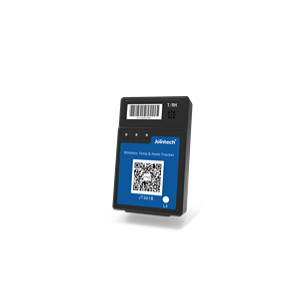

# Jointech - JT301B

The Jointech JT301B is a compact, rechargeable asset GPS tracker that is Plaspy compatible and purpose-built for logistics, distribution and global supply chain monitoring. Combining multi-mode positioning \(GPS, BeiDou and cellular LBS\) with integrated temperature and humidity sensors, the JT301B delivers reliable, event-driven telemetry and tamper alerts for containers, pallets, box trucks and other in‑transit assets.

The JT301B is designed for repeatable deployments: its rechargeable, reusable battery and configurable alarms simplify long-term asset tracking and secure shipments without complex installation. When integrated with Plaspy, the JT301B provides real-time tracking and contextual telemetry to support anti-theft strategies, compliance reporting and improved fleet management decision-making.

## Key Highlights

- Plaspy compatible asset GPS tracker for real-time tracking and visibility across supply chains.
- Multi-mode positioning with GPS, BeiDou and LBS to maintain location accuracy in varied environments.
- Integrated temperature and humidity sensors for refrigerated transport and sensitive cargo monitoring.
- Tamper and intrusion alerts — motion detection, unpacking detection and door-opening detection included.
- Rechargeable, reusable battery designed for repeated deployments and long-term logistics use.
- Configurable alarms and event-driven reporting to streamline exception handling and compliance.
- Compact form factor for easy installation on containers, pallets and box trucks.

## How It Works with Plaspy

When paired with Plaspy, the JT301B sends location and sensor telemetry into Plaspy’s platform so fleet managers and logistics operators can act on real-time events. Plaspy ingests the JT301B’s multi-mode positioning alongside environmental and tamper data, enabling configurable alerts, historical reports and live dashboards that improve asset security and operational efficiency.

- Real-time location and telemetry updates via GPS, BeiDou and cellular LBS for continuous visibility.
- Door-opening and unpacking detection — instant tamper alerts routed through Plaspy for anti-theft response.
- Environmental monitoring — temperature and humidity readings available for refrigerated and sensitive cargo tracking.
- Motion detection and event-driven reporting — triggers for movement, stationary alarms and route exceptions.
- Extensible telemetry — Plaspy can correlate JT301B data with other fleet telemetry \(for example fuel monitoring or ignition events\) when additional vehicle or sensor inputs are available.

## Technical Overview

| Model | JT301B |
| --- | --- |
| Manufacturer | Jointech |
| Connectivity | Cellular LBS \(cellular-based positioning\) and GNSS |
| Bands | Not specified \(uses LBS for cellular-based positioning\) |
| Power & Battery | Rechargeable, reusable battery for repeated deployments |
| Interfaces & Alerts | Motion detection, unpacking detection, door-opening detection, configurable alarms |
| GNSS | GPS and BeiDou multi-mode positioning |
| Environmental Sensors | Integrated temperature and humidity sensors |
| Bluetooth | Not specified |
| Remote Management | Not specified |
| Form Factor | Compact asset tracker for containers, pallets, box trucks and similar cargo |

## Use Cases

- Container and pallet tracking — maintain real-time visibility of cargo across long routes and multimodal transport.
- Refrigerated transport monitoring — monitor temperature and humidity to protect perishable goods and meet regulatory requirements.
- Customs supervision and chain-of-custody — event logs and tamper alerts support documentation for inspections and audits.
- High-value cargo protection — motion, unpacking and door-opening detections provide anti-theft alerts and actionable intelligence.
- Temporary or reusable deployments — rechargeable design enables repeated use for leased containers, returnable packaging and short‑term jobs.

## Why Choose This Tracker with Plaspy

The JT301B is a practical choice when you need a Plaspy compatible GPS tracker that prioritizes secure, repeatable asset monitoring and environmental awareness. Its integrated temperature and humidity telemetry plus tamper detection make it well suited to logistics and refrigerated transport scenarios where product integrity matters. By feeding real-time GPS, BeiDou and LBS positioning into Plaspy, the JT301B helps operations reduce loss, accelerate exception handling and improve asset utilization without complex wiring or permanent installation.

If your deployment requires additional telemetry such as fuel monitoring, ignition/immobilizer control, or Bluetooth sensors for temperature probes and beacons, Plaspy can aggregate JT301B data with external vehicle or sensor inputs. This lets you build a more complete fleet management and anti-theft solution while keeping JT301B as the compact core asset tracker for location and environmental monitoring.

