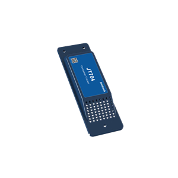

# Jointech - JT704

The Jointech JT704 is a compact GPS tracker purpose built for container monitoring and long haul logistics. Designed for discreet, perforation free mounting, the JT704 provides continuous visibility for containers moving by rail, sea, and other multimodal routes. It supports real time tracking alongside scheduled fixed time reporting to balance ongoing monitoring with extended deployment intervals.

As a Plaspy compatible device out of the box, the JT704 feeds position and status information into Plaspy for centralized fleet and container oversight. Its combination of intelligent power management and a compact form factor makes it well suited for long duration transits, customs supervision, and operational workflows where low maintenance and discreet installation are priorities.

## Key Highlights

- Plaspy compatible GPS tracker that integrates container location and reporting into Plaspy dashboards
- Real time tracking plus scheduled fixed time reporting for predictable check ins during long transits
- Intelligent power management with long standby capability to reduce maintenance cycles
- Perforation free non invasive installation for high invisibility mounting and reduced tampering risk
- Compact form factor tailored to standard and special purpose container mounting
- Optimized for multimodal logistics including railway and marine cross border freight
- Ready to deploy from Jointech for enterprise procurement and operational use

## How It Works with Plaspy

When deployed, the JT704 transmits position and status data that Plaspy ingests to enable live maps, historical playback, and event driven reporting. Plaspy uses the device feed to create alerts, verify routes, and maintain records useful for operations and compliance, while the tracker design supports long duration visibility with minimal intervention.

- Live location updates streamed into Plaspy for map based monitoring and real time oversight
- Scheduled fixed time reports for predictable telemetry during long haul or low power deployments
- Power state and battery condition updates routed to Plaspy to support maintenance planning and low battery alerts
- High invisibility mounting improves data continuity and reduces tamper related gaps in Plaspy event workflows
- Data available for Plaspy alerts, historical reports, route verification, and integration with broader fleet tools

## Typical Use Cases

- Long haul container visibility for multi week transits by rail and sea
- Cross border railway and multimodal freight monitoring for logistics operators
- Customs supervision and route verification for regulatory or audit requirements
- Special purpose container tracking where discreet installation is required
- Enterprise logistics and fleet management workflows that need container level visibility

## Why Choose This Tracker with Plaspy

The JT704 is a practical option for organizations that need discreet, durable container tracking integrated into a unified fleet platform. Its focus on extended standby and scheduled reporting helps lower operational overhead for long duration movements, while non invasive mounting preserves container integrity and reduces tamper exposure. Integrating JT704 feeds into Plaspy gives operations teams centralized visibility and a consistent source of truth for route verification and reporting.

For teams managing large container fleets or cross border logistics, the JT704 paired with Plaspy offers a straightforward path to improved visibility and simplified monitoring. To learn more about Plaspy and how it can work with compatible devices like the JT704 visit https://www.plaspy.com. Product specifications and availability can change over time, so please verify current details on the manufacturer website https://www.jointcontrols.com/ before procurement.
