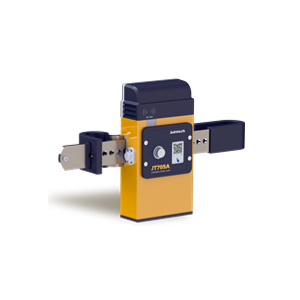

# Jointech - JT705A

The Jointech JT705A is a purpose built GPS tracker and intelligent container monitor designed for enterprise logistics and multimodal cargo operations. Intended for use on shipping containers, refrigerated units, vans and trucks, the JT705A provides continuous location awareness along with security and status reporting to support extended deployments and secure shipments.

As a Plaspy compatible device, the JT705A brings container focused telemetry and tamper protection into Plaspy’s real time tracking and fleet management workflows. Its long duration operation, local status display and audible prompts make it especially useful where secure chain of custody, customs inspections or refrigerated cargo oversight are part of operational requirements.

## Key Highlights

- Purpose built container monitor that provides continuous location awareness and security status reporting for logistics operations.
- Designed for long duration deployments with a high capacity battery to support extended transit legs.
- Local OLED display and real time voice prompts for quick field checks and audible status feedback.
- Remote and on site unsealing capability to support chain of custody and inspection workflows.
- Robust tamper protections and anti theft design to help protect device integrity and cargo security.
- Optimized for refrigerated cargo, customs supervision and high value or financial risk sensitive shipments.

## How It Works with Plaspy

When integrated with Plaspy the JT705A feeds container location and security events into a centralized platform so operations teams can monitor and respond from a single interface. Plaspy ingests position updates, tamper and unseal events and alarm notifications, enabling live visibility and historical playback across multimodal routes.

- Live location and operational status appear in Plaspy for real time monitoring and map based visibility.
- Tamper and unseal events are reported to Plaspy to support chain of custody audits and customs checks.
- Local status indicators and audible alerts aid field teams and are reflected in Plaspy event logs for context.
- Alarm notifications for impact or unauthorized access are routed through Plaspy to trigger escalations and workflows.
- Correlation with mixed fleet telemetry in Plaspy enables end to end oversight across container monitors and vehicle trackers.

## Typical Use Cases

- Container anti theft and tamper detection for high value consignments and financial risk sensitive shipments.
- Cross border customs supervision using remote and on site unsealing plus tamper evidence for inspections.
- Cold chain operations where secure container monitoring complements temperature control systems managed by logistics teams.
- Multimodal transit tracking to maintain visibility across road rail and sea legs for planning and exception handling.
- High security shipments that require documented handling and rapid incident response coordination.

## Why Choose This Tracker with Plaspy

The JT705A is a practical choice for organizations that need a rugged container oriented tracker with an emphasis on security and long battery life. Integrated with Plaspy the device’s status reporting and tamper events become part of centralized fleet and cargo oversight, helping teams detect incidents faster and maintain clearer audit trails for compliance or customs processes.

Plaspy makes it straightforward to include JT705A container telemetry alongside other asset data so logistics and security teams can get consolidated operational insights without changing existing monitoring workflows. For operations that prioritize chain of custody, extended deployments and on site clarity for field staff, the JT705A paired with Plaspy provides a focused solution for container level tracking and incident awareness.

Learn more about Plaspy and how compatible devices are managed on the Plaspy website https://www.plaspy.com. Product specifications and availability can change over time so verify current JT705A details on the manufacturer website https://www.jointcontrols.com/.
