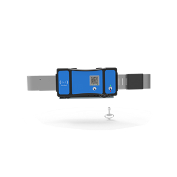

# Jointech - JT705C

# Jointech JT705C Intelligent Video Customs Lock — Plaspy compatible

The Jointech JT705C Intelligent Video Customs Lock is a purpose-built GPS tracker and video lock designed to protect high-value cargo, containers, and regulated shipments. Engineered for customs supervision, supply chain risk control, and valuables transportation, the JT705C combines real-time GPS tracking with integrated event-driven video monitoring to deliver continuous visibility and an auditable evidence trail throughout transit. This makes it an excellent choice for operators who need Plaspy compatible devices to consolidate location, alarm and video telemetry in one platform.

As a Plaspy compatible device, the JT705C can feed location updates, alarm events, and video evidence into your Plaspy dashboard or reporting workflows. Use it to strengthen anti-theft controls, accelerate incident investigations, and ensure compliance with customs or chain-of-custody requirements while maintaining straightforward fleet management and logistics integration.

## Key Highlights

- Integrated GPS tracker with onboard video—real-time tracking paired with remote live-view video for continuous cargo visibility.
- Event-triggered video recording—captures clips automatically on impacts, rollovers, tamper attempts, or other alarm conditions.
- Remote and on-spot unlocking—supports controlled unlocking operations for compliant access and customs workflows.
- Designed for evidence and audit trails—recorded video and logs support incident investigation and regulatory compliance.
- Suitable for high-value shipments—optimizes anti-theft measures and supply chain risk control across multimodal transport.
- Plaspy-compatible integration—streamline telemetry, alerts, and video links in Plaspy for unified fleet management and reporting.

## How It Works with Plaspy

When integrated with Plaspy, the JT705C provides a consolidated stream of location, event, and video data so dispatchers and compliance teams can act quickly. Plaspy ingests the unit’s telemetry and alarm events and links to recorded clips or live streams where available, enabling centralized real-time tracking, alerting, and post-incident review within your existing Plaspy workflows.

- Real-time location and telemetry updates streamed to Plaspy for map visualization and route monitoring.
- Event alerts \(impact, rollover, tamper/dismantle\) pushed to Plaspy for instant notification and escalation.
- Recorded video clips and logs referenced in Plaspy incident reports for evidence and audit trails.
- Remote live-view access initiated from Plaspy \(where network conditions and device configuration permit\) for on-demand situational awareness.
- Remote and on-spot unlocking workflows coordinated through Plaspy-based procedures and command logs.

## Technical Overview

| Model | JT705C |
| --- | --- |
| Brand | Jointech |
| Primary Functions | GPS tracking, integrated video monitoring, event-triggered recording, remote live-view, remote and local unlocking |
| Event Detection | Impact detection, rollover detection, tamper/dismantle alarms |
| Recording & Logs | Event-driven video clips and event logs for incident investigation and compliance |
| Remote Access | Remote live-view and remote unlocking supported \(network connectivity required\) |
| Intended Use | Customs supervision, container video monitoring, high-value cargo protection |
| Connectivity Details | Network connectivity for remote monitoring is indicated by product features; specific cellular types/bands and protocols are not specified in the manufacturer description and should be confirmed with Jointech or your distributor. |
| Bluetooth / Sensors | Not specified in manufacturer description |
| Ignition / Immobilizer | Not specified in manufacturer description |
| Fuel Monitoring | Not specified in manufacturer description |
| Power & Backup | Not specified in manufacturer description — consult manufacturer for power and battery details |
| Form Factor | GPS video lock / container monitoring device designed for installation on cargo and containers |

## Use Cases

- Fleet anti-theft and immobilization workflows—combine location and video evidence to detect and respond to theft or tampering.
- Customs and inspection supervision—provide live-view and recorded proof of seal/unlock events for regulatory compliance.
- Supply chain risk control for high-value goods—continuous monitoring and event logs reduce loss exposure and speed investigations.
- Incident investigation and audit trails—event-driven video clips and logs supply time-stamped evidence for insurers and compliance teams.
- Container monitoring across multimodal transport—maintain visibility through handoffs and transfers where verification is required.

## Why Choose This Tracker with Plaspy

The JT705C is built around the needs of logistics teams and customs authorities who require more than basic GPS tracker telemetry. By combining real-time tracking with integrated video capture and event-based recording, the device provides high confidence in incident verification and chain-of-custody documentation. When deployed as a Plaspy compatible tracker, JT705C data — locations, alarms, and video references — becomes part of a single management layer, simplifying fleet management, incident response, and compliance reporting.

For procurement and technical integration, consult Jointech or an authorized distributor to confirm connectivity options, band support, installation guidelines, and system integration steps. With verified compatibility and the appropriate network setup, JT705C gives operators the telemetry, anti-theft controls, and audit-ready video evidence needed to secure valuable shipments and streamline customs and logistics workflows through Plaspy.

