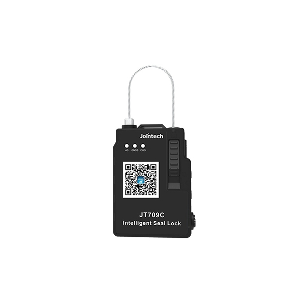

# Jointech - JT709C

The JT709C Smart Electronic Tracking Lock by Jointech is a compact, rechargeable sealing device designed for logistics and asset security. It combines real time positioning with a tamper evident locking mechanism, mobile authorization via Bluetooth, and a persistent audit trail of unlock events, making it suitable for containers, vans, cash bags and warehouse doors that require controlled access and location visibility.

Because the JT709C exposes location and event data alongside stored unlock records, it is well suited to work with fleet and telemetry platforms like Plaspy. When integrated into Plaspy, the JT709C’s positioning and access logs can be viewed and correlated with other operational data to improve traceability, incident response and routine monitoring across transport and storage workflows.

## Key Highlights

- Plaspy compatible integration for consolidating unlock events and location data in a single fleet management dashboard
- Real time positioning for up to date visibility of secured assets during transit and storage
- Bluetooth remote unlocking and mobile app authorization for flexible access control
- Robust audit trail with more than 2,000 stored unlock records for traceability and dispute resolution
- IP67 industrial enclosure for reliable performance in dusty or wet conditions
- Rechargeable, compact and tamper evident form factor designed for long term deployments

## How It Works with Plaspy

When connected to Plaspy, the JT709C feeds position updates and access events into the platform so teams can monitor seal status, review history and receive alerts from a centralized interface. Plaspy ingests unlock logs as auditable events and can surface security or operational issues alongside route and delivery data.

- Display real time location and recent movement history on Plaspy maps and dashboards
- Synchronize stored unlock events for audit, compliance and post incident review
- Surface BLE unlock activity and mobile authorizations alongside other telemetry events
- Trigger alerts for tamper indications or low battery conditions so teams can act proactively
- Correlate seal status with broader fleet data in Plaspy to support operational decisions and investigations

## Typical Use Cases

- Sealing and monitoring container doors or trailer locks for theft prevention and access control
- Customs supervision and chain of custody tracking for regulated shipments
- Cash in transit and secure pouch monitoring where auditable open close history is required
- Warehouse and terminal door control combined with event logging for inventory protection
- Asset tracking in transport or outdoor storage where rugged enclosure and rechargeability matter

## Why Choose This Tracker with Plaspy

The JT709C pairs practical physical security with position reporting and a strong event history, making it a sensible choice for operations that need simple, auditable seals integrated into a wider fleet management system. Integrated into Plaspy, the JT709C’s unlock records and location updates become part of a single operational view that helps teams reduce risk, speed investigations and improve oversight without adding unnecessary complexity.

For organizations seeking a rechargeable, compact electronic seal with environmental protection and a persistent audit trail, the JT709C offers a focused solution that complements Plaspy’s visibility and reporting capabilities. To learn more about Plaspy and how it can consolidate telemetry and access events for your operation visit https://www.plaspy.com. Product specifications, availability and manufacturer details can change over time, so verify current technical information and compatibility on the official Jointech site https://www.jointcontrols.com/.
