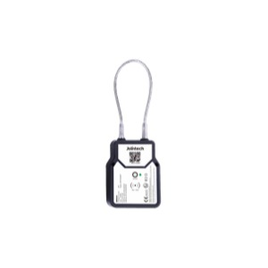

# Jointech - JT709Ex

# JT709Ex Explosion-proof Smart Lock

Jointech

The JT709Ex Explosion-proof Smart Lock from Jointech is a Plaspy compatible security device built for hazardous environments where fuel transportation, tankers, and explosive atmospheres demand certified protection. Engineered to meet IECEx, ATEx and GB 3836 standards, the JT709Ex provides robust physical locking together with long-range LoRa telemetry and Bluetooth on-site unlocking — a practical addition to Plaspy-enabled fleet management and asset protection solutions.

Designed for regulated fuel logistics and long field deployments, the JT709Ex complements GPS tracker data within Plaspy by delivering tamper alerts, lock/unlock events, and remote status reporting over LoRa. Its ultra-low power architecture supports extended standby life \(up to three years under typical conditions\), reducing maintenance and enabling reliable, Plaspy-compatible anti-theft and telemetry workflows for fleets and critical assets.

## Key Highlights

- Plaspy compatible device that integrates lock status and tamper alerts into fleet management workflows.
- Explosion-proof certifications \(IECEx, ATEx, GB 3836\) for safe use in fuel, oil & gas and hazardous environments.
- Long-range LoRa connectivity for low-power telemetry and remote status reporting across logistics routes.
- Bluetooth on-site unlocking plus master-slave remote unlock capability when paired with the JT701D master lock.
- Emergency mechanical key with active alerts when mechanical access is used, improving anti-theft response.
- Ultra-low power design with up to 3-year standby life to minimize maintenance visits and battery logistics.
- Tamper and dismount detection to provide real-time situational awareness to Plaspy dashboards and alerting rules.

## How It Works with Plaspy

The JT709Ex integrates into a Plaspy-managed environment as a secure telemetry and access-control endpoint. While JT709Ex is not a GPS tracker itself, it complements real-time tracking by providing lock state, tamper events, and remote unlock controls that Plaspy can correlate with GPS tracker location, vehicle telemetry, and fleet rules. Plaspy receives LoRa status messages and can trigger notifications, logging, or automated responses based on those events.

- Real-time status and telemetry reports sent over LoRa to Plaspy for centralized monitoring.
- Tamper, dismount, and mechanical-key usage alerts feed directly into Plaspy for anti-theft workflows.
- Lock/unlock event logging provides an auditable trail in Plaspy for compliance and incident review.
- On-site Bluetooth unlocking can be recorded and validated through Plaspy when linked with user or device IDs.
- Works alongside GPS tracker location feeds in Plaspy to enable combined anti-theft and fleet management actions.

## Technical Overview

| Connectivity | LoRa for long-range telemetry; Bluetooth for on-site unlocking |
| --- | --- |
| Bands | LoRa regional frequency support \(device-specific regional configuration\) |
| Power & Battery | Ultra-low power architecture; up to 3 years standby \(typical\) |
| Interfaces | Master-slave remote unlock with JT701D master lock; emergency mechanical key; tamper/dismount detection |
| GNSS | Not applicable — JT709Ex provides lock and telemetry data; pair with a GPS tracker for location |
| Bluetooth | Bluetooth on-site unlocking \(used for local access control\) |
| Remote Management | Remote status reporting over LoRa; integrates with Plaspy for centralized control, logging, and alerts |
| Certifications / Compliance | IECEx, ATEx, GB 3836 \(suitable for explosive atmospheres\) |
| Form Factor | Explosion-proof smart lock for tanker, vehicle and high-value cargo applications |

## Use Cases

- Fuel tanker security: integrate lock state and tamper alerts into Plaspy and GPS trackers to secure petroleum deliveries.
- Oil & gas transport monitoring: certified explosion-proof locking and remote reporting for regulated environments.
- High-value cargo protection: centralized lock/unlock logs and alerts for theft deterrence and audit trails in Plaspy.
- Fleet anti-theft workflows: combine JT709Ex telemetry and GPS tracker location in Plaspy to trigger immobilization or dispatch recovery procedures.

## Why Choose This Tracker with Plaspy

The JT709Ex adds explosion-proof physical security and low-power telemetry to a Plaspy-managed fleet or asset monitoring system. It’s purpose-built for environments where safety certifications matter and where continuous battery life and remote status reporting reduce operational overhead. When used alongside Plaspy and vehicle GPS trackers, the JT709Ex elevates anti-theft, fuel monitoring oversight, and fleet management by supplying lock state, tamper events, and auditable access logs that Plaspy can correlate with real-time tracking and telemetry.

Choose JT709Ex with Plaspy if you need certified explosion-proof security that supports long-range telemetry, reliable tamper detection, and a master-slave unlocking architecture for centralized control. The result is a scalable, compliant solution that strengthens anti-theft defenses, improves situational awareness, and integrates smoothly with existing GPS tracker feeds and fleet management workflows.

