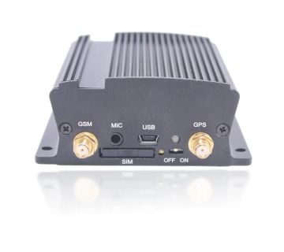

# KHD - KC200

The KHD KC200 is a powerful GNSS tracker specifically designed for vehicle and ship tracking. It combines GSM wireless communication technology with the GPS \(or GLONASS\) system, providing superior receive sensitivity for accurate and reliable tracking. With the KG200, users can easily communicate with the backend server through the GPRS/GSM network or SMS to report emergency alerts, geo-fence boundary crossings, and scheduling. This tracker also allows users to set up custom tracking platforms on their PC or smartphone \(Android or iOS\) for seamless communication with the KG200.

With its advanced features and robust design, the KHD KC200 is an ideal choice for various tracking applications. Whether you need to monitor your fleet of vehicles or track the location of your ships, this tracker offers exceptional performance and reliability. Its high receive sensitivity ensures accurate positioning even in challenging environments, while its GSM wireless communication technology enables real-time communication with the backend server. The KG200 is also highly customizable, allowing users to tailor their tracking platforms to their specific needs.

Key Features:

- Powerful GNSS tracker for vehicle and ship tracking
- Combines GSM wireless communication technology with GPS \(or GLONASS\) system
- Superior receive sensitivity for accurate and reliable tracking
- Communicates with the backend server through GPRS/GSM network or SMS
- Reports emergency alerts, geo-fence boundary crossings, and scheduling
- Customizable tracking platforms for PC and smartphone \(Android or iOS\)

