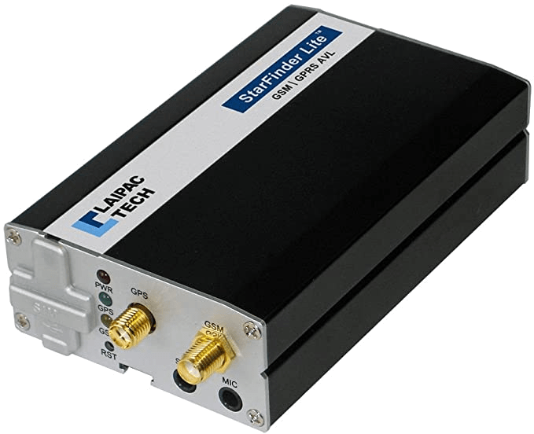

# Laipac - Lite S

The Laipac Lite S, also marketed as the Starfinder Lite S, is a compact GPS tracker designed for a broad set of tracking applications. It uses GNSS positioning and 4G LTE connectivity to provide accurate, near real time location data for vehicles and valuable assets. The device description highlights built in reporting for time intervals and distance travelled, plus event notifications such as tow alerts, over speeding alerts, geofence violations, and missing main power alerts, making it suitable for continuous monitoring and operational oversight.

As a Plaspy compatible device, the Lite S can feed its location, event and reporting data into the Plaspy fleet management platform for centralized visibility. Integrating the tracker with Plaspy enables fleet operators and asset managers to view movement history, receive configured alerts, and include Lite S data in operational reports, helping teams act on incidents and optimize day to day operations.

## Key Highlights

- 4G LTE connectivity paired with GNSS positioning for timely location updates
- Time interval and distance based reporting for movement analysis
- Tow alerts, over speeding alerts, and geofence violation alerts for rapid incident notification
- Driver performance monitoring to support operational oversight
- Remote control of I O devices where supported by the tracker and installation
- Missing main power alerts to detect power interruptions to the tracked asset

## How It Works with Plaspy

When a Lite S device is connected to Plaspy, its location signals and event messages are presented through the Plaspy interface so teams can monitor assets and vehicles from a single dashboard. Plaspy uses the incoming data to populate maps, timelines, and reports while routing configured alerts to the right users for timely response.

- Real time location and movement history displayed on Plaspy maps and timelines
- Event and alert handling for tow, overspeeding, geofence violations, and power loss
- Scheduled and distance based reports available within Plaspy for analysis and compliance
- Driver performance data and event logs aggregated for review and operational improvement
- Visibility into remote I O control status and the ability to surface remote actions where the device and setup support them

## Typical Use Cases

- Fleet management for vehicles requiring continuous tracking and route history
- Asset protection and theft detection using tow and geofence alerts
- Monitoring construction and heavy equipment locations on worksites
- Logistics and delivery operations needing time and distance based reporting
- Driver performance monitoring and incident review for safety programs

## Why Choose This Tracker with Plaspy

The Lite S pairs practical tracking features with flexible reporting and alerts, which aligns well with Plaspy's strengths in fleet visibility and operational monitoring. Organizations that need clear location history, incident notifications, and periodic reporting can use the Lite S data inside Plaspy to centralize oversight and improve response times.

Based on available product information, the Lite S is a strong fit for businesses that want a compact tracker with event reporting and remote I O capability that can be integrated into a broader fleet management platform. To learn more about how Plaspy can use Lite S data for tracking and reporting, visit the Plaspy website at https://www.plaspy.com. Please note that product specifications, availability, and manufacturer details can change over time; verify current specifications and official documentation on the manufacturer site https://laipac.com/.
