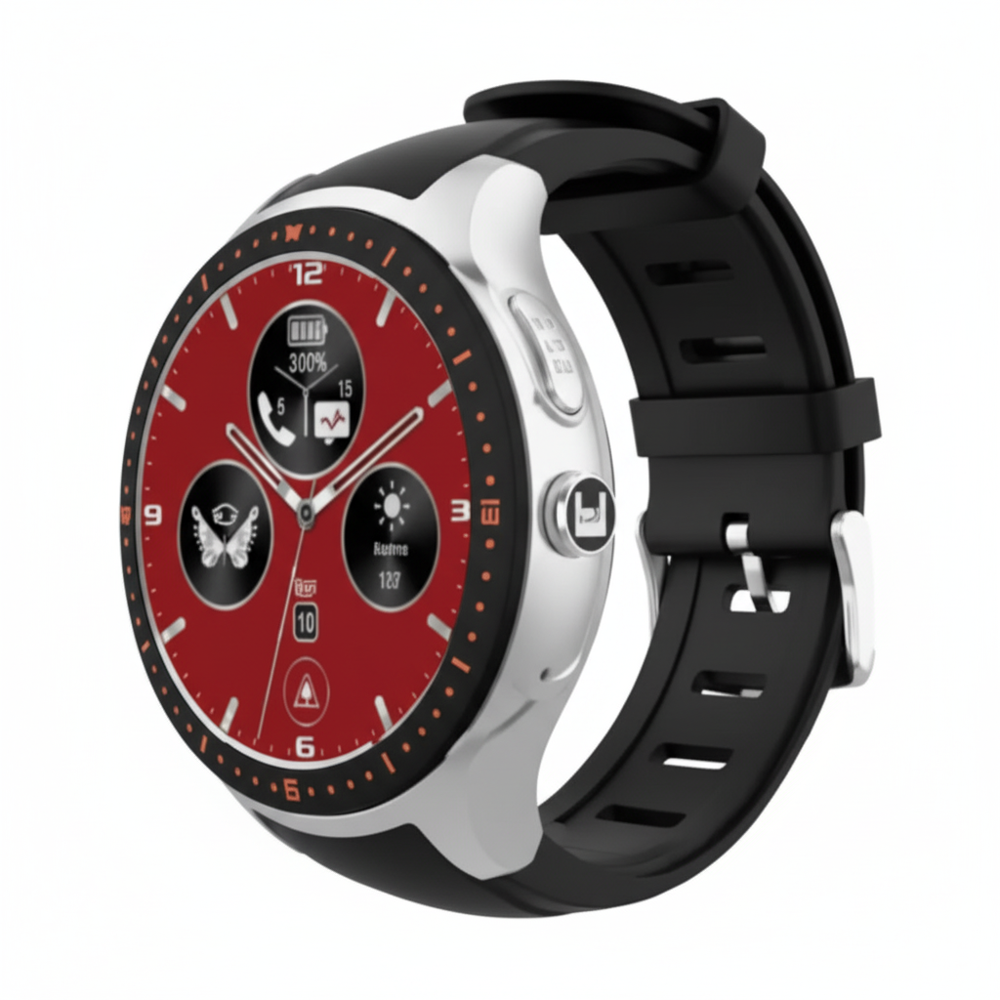

# Laipac - LooK Watch

The LooK Watch is a rugged, Plaspy compatible GPS tracker in the form of an emergency-response smartwatch built for continuous monitoring and fast assistance. With a stainless steel housing, 1.39" AMOLED display protected by sapphire glass, and worldwide 3G UMTS cellular connectivity plus integrated GPS, the LooK Watch delivers reliable real-time tracking, SOS activation and two-way voice for immediate contact during critical events.

The device is engineered for safety-first deployments — elderly care, lone-worker protection, first responders and VIP security — where mPERS features like man-down detection, programmable geofences and check-ins are essential. When paired with Plaspy, the LooK Watch feeds location, event and health data into a centralized platform for timely alerts, event escalation and historical route analysis.

## Key Highlights

- Plaspy compatible GPS tracker in smartwatch form — continuous location updates and breadcrumb trail reporting for historical review.
- Dedicated SOS emergency button with two-way voice for immediate communication and rapid response coordination.
- Rugged premium build: stainless steel case, sapphire glass and a bright 1.39" AMOLED display for durability and readability.
- Advanced safety features: man-down \(fall\) detection, watch removal alerts, check-in reminders and up to 20 programmable geofences.
- Practical daily monitoring: vibration/sound notifications, medicine reminders, low-battery alerts and multiple on‑watch apps including heart-rate collection.
- Lightweight and wearable — ~110 g with multiple color and band combinations for user comfort and adoption.
- Supports worldwide 3G UMTS cellular connectivity and integrated GPS for accurate, continuous telemetry and position reporting.

## How It Works with Plaspy

Integrated with Plaspy, the LooK Watch becomes a live data source for real-time tracking, alarm escalation and operational reporting. The watch transmits GPS coordinates and event messages \(SOS, fall detection, geofence breaches, check-ins and low battery\) over its 3G connection. Plaspy ingests that feed to display live location on maps, trigger alerts to dispatch teams, and store route history for later analysis.

- Real-time location and telemetry updates flowing from the watch into Plaspy for live monitoring and replay.
- SOS, man-down and watch-removal alerts that generate immediate notifications and escalation workflows in Plaspy.
- Geofence events \(up to 20 programmable zones\) and check-in reminders captured as time-stamped events.
- Two-way voice capability used for direct contact and confirmation within incident handling workflows.
- Battery and status reporting \(low-battery alerts\) to maintain device uptime and schedule replacements or charging.

## Technical Overview

| Model | LooK Watch |
| --- | --- |
| Connectivity | Worldwide 3G UMTS cellular |
| GNSS | Integrated GPS for continuous location reporting |
| Display | 1.39" AMOLED with sapphire glass |
| Build & Weight | Stainless steel housing; approximately 110 g |
| Power & Battery | Magnet charging port; typical battery duration ~18 hours; low-battery alerts supported |
| Interfaces & Controls | Dedicated SOS emergency button; two-way voice; vibration and sound notifications |
| Sensors | G-sensor for man-down/fall detection; watch removal detection |
| Alerts & Features | Programmable geofences \(up to 20\), check-in alerts, medicine reminders, breadcrumb trail \(route history\) |
| On-watch Apps | Supports additional apps: fitness, weather, time, alarm and heart-rate collection |
| Options & Accessories | Multiple color/band combinations \(Silver with white/blue/black bands; Gold with blue/black bands\); downloadable brochures and demo videos available |

## Use Cases

- Elderly care and remote patient monitoring — automatic fall detection, medicine reminders and SOS make the watch ideal for home or assisted living deployments.
- Lone-worker protection — real-time location, man-down alerts and two-way voice enable rapid check-in and emergency support for solo field staff.
- First-responder support and VIP security — rugged construction, immediate SOS and live tracking simplify coordination during incidents.
- Mobile personal emergency response \(mPERS\) — continuous telemetry and breadcrumb trails provide incident context and response timelines.
- On-demand monitoring and adherence programs — check-in reminders and heart-rate telemetry support virtual nurse workflows and wellness checks.

## Why Choose This Tracker with Plaspy

The LooK Watch offers a compact, wearable GPS tracker solution that pairs well with Plaspy’s platform for organizations that require dependable, wearable monitoring. Its mix of SOS, two-way voice and automated safety alerts reduces time-to-assist while the integrated GPS and breadcrumb trail reporting provide audit-ready location history. For teams that require broader telemetry — such as ignition state, immobilizer control, fuel monitoring or additional sensor inputs — Plaspy can aggregate LooK Watch location and event data alongside vehicle telematics and Bluetooth sensor feeds to create a complete operational picture.

Choose the LooK Watch with Plaspy when you need a Plaspy compatible, wearable GPS tracker that emphasizes rapid response, clear escalation paths and comfortable day-long wearability. The device’s established feature set supports scalable deployments across healthcare, lone worker programs, security and emergency response while Plaspy supplies centralized alerting, reporting and integrations that extend telemetry capability for mixed fleets and assets.

