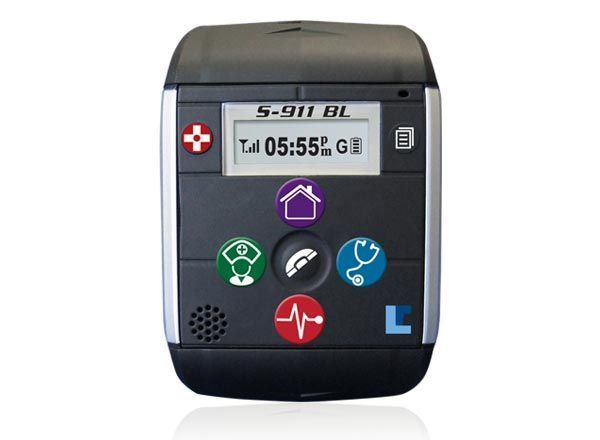

# Laipac - S911 Bracelet HC

The Laipac S911 Bracelet HC is a wearable GPS locator designed specifically for healthcare and patient monitoring. Built for everyday use by patients and elderly users, the device provides continuous location tracking, an SOS emergency button for immediate assistance, two way voice communication for direct contact, and fall detection to help identify potential emergencies. Additional features include GeoFence protection, tamper detection, an LCD display for status information, and a durable IP67 rated design suitable for routine wear.

As a Plaspy compatible device, the S911 Bracelet HC can feed its real time location and event data into Plaspy for centralized monitoring and reporting. Care teams, call centers, and facility staff can view location updates, receive SOS and tamper alerts, and use Plaspy tools to build operational workflows around the bracelet's healthcare focused features. Compatibility with Plaspy makes this tracker a practical option for organizations that need remote oversight and timely response capabilities.

## Key Highlights

- Designed for healthcare use with a wearable bracelet form factor suitable for patients and elderly users
- SOS emergency button and two way voice communication for immediate contact and assistance
- Fall detection and tamper alerts to help caretakers identify urgent situations quickly
- Real time position updates and built in data logging for historical location review
- GeoFence support to notify when a wearer enters or leaves predefined areas
- Durable IP67 rating and an LCD display for clear status information

## How It Works with Plaspy

When paired with Plaspy, the S911 Bracelet HC's location and event streams become part of a consolidated fleet and asset monitoring view. Plaspy ingests the device's real time positions and notifications so teams can maintain situational awareness and respond faster to incidents.

- View live location on Plaspy maps alongside other tracked assets for unified monitoring
- Receive and route SOS alerts and fall detection notifications to assigned users or response teams
- Track GeoFence in and out events within Plaspy to automate alerts and attendance checks
- Access historical waypoints and movement logs in Plaspy for playback and incident review
- Configure report schedules and activity summaries that include bracelet location and event data

## Typical Use Cases

- Locating and monitoring patients with Alzheimer disease or dementia in care facilities
- Providing remote oversight for elderly individuals living independently or in assisted living
- Monitoring individuals with autism or other conditions where wandering is a concern
- Integrating caregiver call center workflows with wearable SOS and voice features
- Recording movement histories for post incident review and operational analysis

## Why Choose This Tracker with Plaspy

The S911 Bracelet HC combines a healthcare oriented wearable design with practical safety features that align with common monitoring needs. Its SOS button, two way voice capability, fall detection, and tamper alerts make it well suited to environments where rapid response and clear status information are critical. Used with Plaspy, these features can be surfaced in a single monitoring platform so teams have better visibility and can coordinate responses more efficiently.

Plaspy compatibility lets organizations bring bracelet data into existing monitoring, alerting, and reporting workflows without forcing a separate management system for wearable devices. Where detailed specifications are required for procurement or integration planning, consult the manufacturer documentation and your Plaspy account team to confirm the operational details that matter for your deployment.

To learn more about using Plaspy with wearable healthcare trackers visit https://www.plaspy.com. Product specifications and availability can change over time, so please verify current details on the manufacturer site https://laipac.com/.
