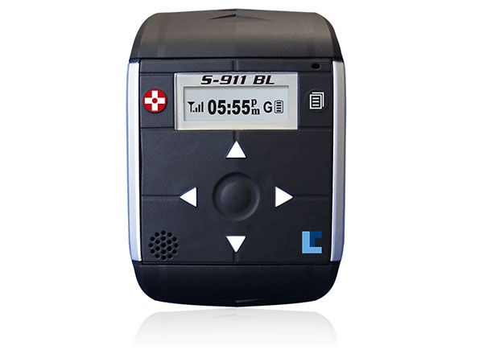

# Laipac - S911 Bracelet ST

The Laipac S911 Bracelet ST is a wearable GPS tracking device designed for law enforcement and supervised monitoring. It provides continuous location reporting for offenders, individuals under house arrest, or persons released on bail. The device combines a high sensitivity AGPS receiver with a range of safety and control features including two-way voice communication, an emergency SOS button, geo-fencing, tamper alerts, and an LCD for status information.

As a Plaspy compatible device, the S911 Bracelet ST can deliver the location, zone and event information Plaspy needs to provide centralized monitoring and reporting. Its real-time updates, event alerts, and built in logger make it suitable for integration into Plaspy workflows so agencies and monitoring centers can consolidate visibility, respond to alerts, and retain an audit trail within the Plaspy platform.

## Key Highlights

- Purpose built for offender supervision with features tailored to monitoring and compliance.
- Two-way voice communication and quick dialing for direct contact between wearer and monitoring center.
- Emergency SOS button, tamper alert, and a 3 axis impact sensor to report falls and incidents.
- Geo-fencing capability with immediate alerts when boundaries are crossed via email, SMS, or phone call.
- Built in intelligent logger with thousands of reference points for timestamped position and event history.
- Compact, lightweight, and IP67 rated for dust and water resistance suitable for daily wear.

## How It Works with Plaspy

When used with Plaspy, the S911 Bracelet ST provides location and event information that Plaspy can present alongside other fleet and asset data to support monitoring workflows. Plaspy can take device events and translate them into actionable notifications, reports, and map visualizations for operators.

- Real-time position updates displayed on Plaspy maps for continuous monitoring.
- Geo-fence entries and exits forwarded as alerts so teams can act on confinement breaches.
- Event forwarding for SOS, tamper alerts, and fall or impact detections to trigger notifications.
- Historical route and logger data available in Plaspy for review and evidence retention.
- Speed and mileage summaries surfaced in Plaspy reports to support oversight and audit needs.

## Typical Use Cases

- Court ordered monitoring of offenders released on bail or under supervision.
- House arrest monitoring where confined movement must be enforced and audited.
- Supervised release programs requiring location oversight and rapid alerting.
- Transport monitoring during movement between facilities to ensure compliance.
- Situations requiring a wearable, tamper aware tracker with direct voice contact capability.

## Why Choose This Tracker with Plaspy

The S911 Bracelet ST pairs practical supervision features with wearable comfort and durability, making it a logical choice where continuous oversight and reliable alerts are required. Its event logger, geo-fencing, and emergency functions align well with Plaspy capabilities for centralized visibility, alerting, and historical reporting.

If you are evaluating devices for supervised monitoring, the Laipac S911 Bracelet ST offers a focused set of features that Plaspy can surface and manage alongside other tracked assets. To learn more about Plaspy and how this tracker can fit into your monitoring workflows visit https://www.plaspy.com. Product specifications, availability, and manufacturer details can change over time; please verify current specifications with the manufacturer at https://laipac.com/.
