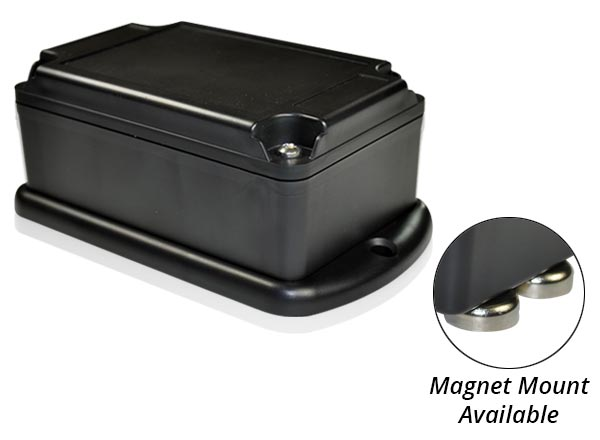

# Laipac - Starfinder KAMEL

The Laipac Starfinder KAMEL is a versatile GPS tracking device that is designed to monitor, track, and recover both non-powered and powered assets. Whether you need to keep an eye on vehicles, watercraft, trailers, construction machinery, or stationary equipment, the Starfinder KAMEL has you covered. It is the perfect solution for industrial applications, thanks to its impressive battery life that can last up to four months on a full charge.

One of the standout features of the Starfinder KAMEL is its ability to provide reliable reports of an asset's positioning at any time of the day, 24/7. This ensures that you always have access to up-to-date information about the location of your assets. The device is equipped with a rechargeable Li-Ion polymer battery with a capacity of 18Ah, providing long-lasting power for extended tracking periods.

In addition to its tracking capabilities, the Starfinder KAMEL offers a range of useful features to enhance asset management. These include Geo-Fence capability with in/out of fence alerts, curfew alerts, motion detection, and over-speed alerts. These features allow you to set up customized notifications and alerts to ensure that your assets are being used appropriately and to help prevent theft or misuse.

The Starfinder KAMEL is designed for easy installation and can be permanently mounted using the included mounting screws or attached to metal surfaces using the rare-earth magnet attachments, which provide a strong 80 lb force. This flexibility allows you to choose the installation method that best suits your needs.

### Key Features:

- GSM/GPRS for worldwide coverage
- SiRF 4 GPS Receiver 48Ch with AGPS Service
- Geo-Fence capability with in/out of fence alert
- 3 Axial accelerometer to report movement and impact
- Sleep mode to extend battery life
- Real-time position updates based on time and distance intervals
- Mileage report and over-speed alert
- Industrial-grade rechargeable Li-Ion polymer battery of 18Ah
- Strong waterproof \(IP67\), shockproof, and dustproof container
- Rare-earth magnets attach to metal surfaces \(80 lb force\)

### Specifications:

- Width: 8.25cm
- Height: 6.35cm
- Length: 13.97cm
- Weight: 566g
- Available for Permanent Mount & Magnet Mount

