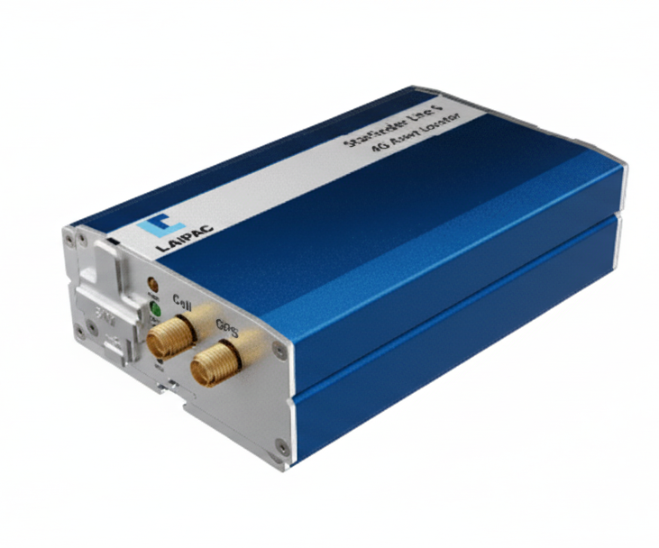

# Laipac - Starfinder Lite S

The Starfinder Lite S from Laipac is a compact 4G LTE GPS tracker built for vehicle mounted fleet and asset tracking. It provides GNSS positioning and cellular connectivity to deliver real time location updates, configurable reporting, and event logging aimed at operational visibility and theft protection. The device is designed to support time interval and distance based reporting while offering I O and dataport interfaces for integration with vehicle systems.

As a Plaspy compatible device by design, the Starfinder Lite S can stream position and event telemetry into Plaspy for centralized monitoring and reporting. That compatibility makes it straightforward to visualize live locations, receive configurable alerts for events such as tow or power loss, and aggregate movement events and driver performance data in Plaspy for operational oversight and historical analysis.

## Key Highlights

- Plaspy compatible GPS tracker with GNSS positioning and 4G LTE connectivity for reliable real time tracking
- Flexible reporting modes with time interval and distance traveled updates to balance timeliness and bandwidth use
- Vehicle integration through user friendly I O and dataport to monitor main power and enable remote control actions
- Event driven alerts for tow, overspeed, geofence violation, and missing main power to support anti theft workflows
- Movement logging and driver performance reports for analytics and operational improvement
- Compact vehicle mounted form factor suited for fleet and asset protection in transport and construction environments

## How It Works with Plaspy

When connected to Plaspy, the Starfinder Lite S transmits GNSS positions and event telemetry so fleet managers can view live locations, set alert rules, and generate reports within a single platform. Plaspy ingests scheduled updates and device events to provide mapping, playback, notifications, and aggregated reporting for fleet operations.

- Real time location and telemetry updates appear in Plaspy for live tracking and mapping
- Tow, overspeed, and geofence alerts generate notifications and can feed escalation or response procedures in Plaspy
- Main power and device state monitoring from the tracker are surfaced in Plaspy for device health and anti theft visibility
- Movement logging and driver performance metrics are forwarded to Plaspy for analytics and historic reporting
- Dataport enabled remote actions and inputs can be presented in Plaspy for centralized control and operational response

## Typical Use Cases

- Fleet management for commercial vehicle tracking, route monitoring, and driver performance oversight
- Vehicle protection and anti theft monitoring with early alerts for tow, geofence breaches, and power loss
- Transport logistics where distance and time based reporting improve route visibility and delivery tracking
- Construction equipment oversight to log movement and protect onsite vehicles and mobile assets
- Asset tracking and compliance reporting with event logs and automated reports for audits and insurer requirements

## Why Choose This Tracker with Plaspy

The Starfinder Lite S is a practical choice for organizations that need a compact, vehicle mounted tracker that integrates into a centralized fleet platform. Its combination of GNSS positioning, 4G LTE connectivity, and vehicle integration points makes it suitable for teams that want straightforward real time tracking, event alerts, and movement reporting aggregated inside Plaspy.

If your priority is consistent location visibility, configurable alerts for theft and misuse, and the ability to collect vehicle state information into one dashboard, pairing the Starfinder Lite S with Plaspy delivers a manageable foundation for fleet operations. Learn more about Plaspy on the main website https://www.plaspy.com. Product specifications, availability, and manufacturer details can change over time and should be verified on the manufacturer official website https://laipac.com/.
