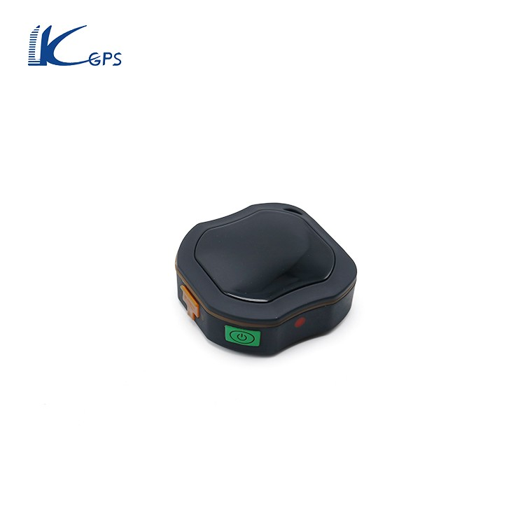

# LK-GPS - LK109

The LK109 is a compact personal GPS tracker designed to provide dependable location monitoring and safety features for people and small assets. Its small form factor and waterproof construction make it convenient for everyday carry and resilient in challenging conditions. The device includes a built in GPS chip with published positioning sensitivity and an accuracy rating around five meters, together with practical functions such as SOS alarm, fall alarm, geo fence alerts, and call support.

As a tracker compatible with Plaspy, the LK109 can be integrated into a broader tracking and fleet management workflow to provide location visibility and event alerts. Its combination of compact design, positioning accuracy, and emergency features makes it a suitable candidate for organizations and families that use Plaspy to monitor personnel, vehicles, or valuable equipment while maintaining simple, actionable alerts and reporting.

## Key Highlights

- Compact and portable design for discreet personal use and easy attachment
- Waterproof construction for reliable operation in wet or outdoor conditions
- Built in GPS with published sensitivity and typical position accuracy near 5 meters
- SOS alarm and fall alarm functions for rapid alerting in emergencies
- Geo fence capability to trigger entry and exit alerts for defined areas
- Call support and mobile app tracking options for direct communication and location queries

## How It Works with Plaspy

When paired with Plaspy, the LK109 provides location data and alert events that Plaspy can display, log, and act on within its platform. Plaspy ingests location updates and device alerts to offer operational visibility and historical records for each tracked unit.

- Real time location display and map visualization inside Plaspy dashboards
- Alert handling for SOS and fall alarms routed to Plaspy notification systems
- Geo fence events processed by Plaspy to generate boundary entry and exit alerts
- Location history and basic reporting for routes and presence over time
- Centralized monitoring for small fleets or groups of personal trackers to support operational oversight

## Typical Use Cases

- Personal safety monitoring for elderly relatives and children
- Portable asset tracking for small equipment or personal belongings
- Private car or rental vehicle tracking where a compact device is preferred
- Field staff location visibility for remote workers and lone worker oversight
- Pet tracking and temporary monitoring of high value items

## Why Choose This Tracker with Plaspy

The LK109 is a practical choice when you need a small, durable tracker that supports emergency alerts and geofencing while delivering reasonably accurate position information. Its feature set aligns with common Plaspy use patterns such as alerting, geofence monitoring, and simple location history, making it straightforward to include in mixed device fleets or personal safety deployments.

While the LK109 is not positioned as an industrial grade telematics unit, its combination of portability, waterproofing, and safety features makes it useful for organizations and families that require compact devices integrated into Plaspy for centralized monitoring and response.

Plaspy can help consolidate LK109 location and alert data into unified dashboards and reports so teams can act on events and review historical movement. To learn more about Plaspy and how it can work with compatible devices visit https://www.plaspy.com. Product specifications and availability can change over time, so please verify current details with the manufacturer at https://www.lk-gps.com.
