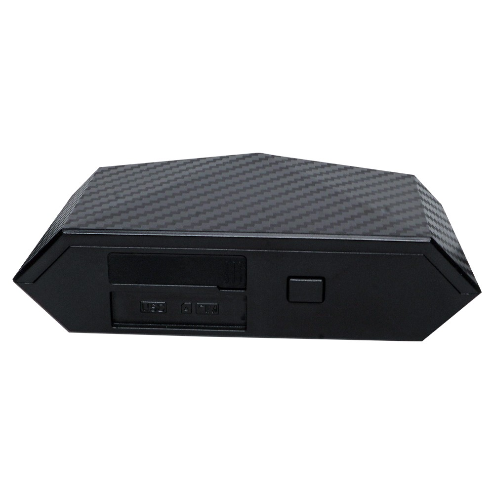

# LK-GPS - LK110 4G Global E-bike/Bicycle GPS Tracker

The LK110 4G Global E-bike/Bicycle GPS Tracker is a compact, rugged device purpose built for bicycles and e bikes. It offers global 4G connectivity, waterproof and shock resistant construction, and a fixed bracket for fast tool free installation. The unit delivers real time location reporting, configurable alerts, and remote control features designed for riders, families, and small fleet operators.

As a Plaspy compatible tracker, the LK110 can be integrated into Plaspy workflows for centralized monitoring and reporting. Its configurable upload streams and alarm events feed into Plaspy so administrators and owners can see live locations, receive immediate alerts, and issue remote commands from a single platform while preserving battery life through intelligent modes.

## Key Highlights

- Plaspy compatible for seamless integration into existing real time tracking dashboards and fleet management workflows
- Global 4G connectivity for consistent location updates across regions
- Compact waterproof and shock resistant enclosure with a fixed bracket for quick mounting on bicycles and e bikes
- Configurable upload frequency and power saving modes to balance tracking detail and battery life
- Multiple intelligent alarms including geofence vibration displacement and low battery alerts for anti theft protection
- Remote controls for arming disarming remote restart and taillight on off to support safety and management needs
- Multi platform access via mobile app PC web platform SMS and WeChat for flexible user workflows

## How It Works with Plaspy

When paired with Plaspy the LK110 feeds location and event telemetry into a single monitoring platform where live positions and historic tracks are visible alongside device events. Plaspy ingests the device upload streams and alarm notifications so teams can act on geofence breaches vibration or displacement alerts and low battery warnings while using Plaspy for reporting and oversight.

- Real time location and history playback displayed on Plaspy maps for operational visibility
- Geofence entry and exit events delivered to Plaspy for perimeter monitoring and automated notifications
- Vibration and displacement alarms forwarded to Plaspy and relayed to users via supported client channels for rapid response
- Low battery notifications surfaced in Plaspy to help prevent tracking interruptions and schedule maintenance
- Remote management commands such as arm disarm restart and taillight control issued from Plaspy or supported client interfaces

## Typical Use Cases

- Small e bike fleet management with centralized real time tracking and route history
- Anti theft protection for individual bicycles and e bikes using vibration displacement and geofence alerts
- Family safety monitoring to track riders and receive low battery warnings for maintained coverage
- Shared or rental e bike operations requiring location tracking geofencing and remote device control
- Nighttime rider safety using remote taillight control managed from a central platform

## Why Choose This Tracker with Plaspy

The LK110 is a practical choice for organizations and individuals who need a purpose built bicycle and e bike tracker that integrates into a centralized monitoring system. Its rugged design and global connectivity make it suitable for everyday use while the device features align with common fleet and anti theft workflows that Plaspy supports for visibility and response.

Choosing the LK110 with Plaspy gives you a straightforward path to consolidate location data alerts and remote controls in one platform. For more information about Plaspy and how it can support your tracking needs visit https://www.plaspy.com. Product specifications and availability can change over time so verify current details with the manufacturer at https://www.lk-gps.com.
