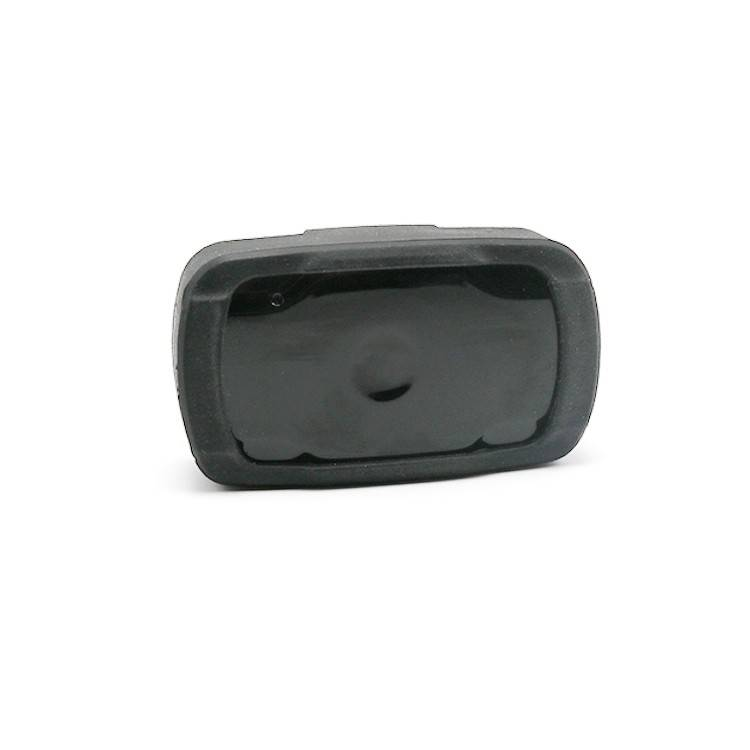

# LK-GPS - LK120

The LKGPS LK120-2G/4G is a compact, wearable GPS tracker engineered for reliable real-time tracking of pets and people. Plaspy compatible out of the box, the LK120 delivers responsive location updates, geofence alerts, and SOS notifications via 2G/4G cellular networks so owners, shelters, and small-scale asset managers can monitor movements and react quickly when it matters most.

Designed for everyday use and outdoor adventures, the LK120 combines a rugged, waterproof housing with a discreet, lightweight form factor that clips to a collar or tucks into a pocket. With up to 72 hours of runtime on a single charge and configurable alerts for movement and low battery, this GPS tracker brings practical telemetry to pet safety and portable-asset monitoring while integrating seamlessly into Plaspy’s platform for centralized tracking, reporting, and notification management.

## Key Highlights

- Plaspy compatible for smooth integration into dashboards, alerts, and reporting — get immediate location visibility on your existing platform.
- Real-time tracking over 2G/4G networks provides fast location updates for rapid recoveries and continuous monitoring.
- Wearable, compact, and waterproof design suited for collars, pockets, and clothing — rugged enough for hiking and everyday urban use.
- Rechargeable battery with up to ~72 hours of typical operation offers extended runtime between charges.
- Customizable geofencing and movement alerts deliver telemetry-driven notifications when a device leaves or enters set zones.
- Dedicated SOS button sends immediate alerts and the current location to pre-set contacts for quick assistance.
- Lightweight and affordable solution for pet owners, shelters, pet boarding facilities, and portable-asset tracking.

## How It Works with Plaspy

When paired with Plaspy, the LK120 becomes part of a centralized telemetry and tracking ecosystem. Plaspy ingests the device’s GPS coordinates, timestamps, and status messages to provide live maps, event-driven alerts, historical routes, and automated notifications. Integration is focused on secure, low-latency delivery of location and status data so end users can act on anti-theft events, SOS calls, or geofence breaches in real time.

- Real-time location and telemetry updates — GPS coordinates and timestamps feed directly into Plaspy for live map tracking.
- SOS button events — Plaspy receives SOS notifications and the current position to notify pre-set contacts immediately.
- Geofence entry/exit alerts — virtual boundaries configured in Plaspy trigger instant notifications for unauthorized movement.
- Battery level and low-battery warnings — telemetry updates allow Plaspy to notify owners before power is lost.
- Movement notifications — motion-based alerts help detect roaming, escapes, or unusual behavior.
- Bluetooth sensors — the LK120 description does not list BLE sensor support; where BLE-capable trackers are available, Plaspy can ingest sensor data for temperature, proximity, or other readings.

## Technical Overview

| Connectivity | 2G / 4G cellular communication \(model dependent\) |
| --- | --- |
| Bands | Not specified; band availability may vary by model and market |
| Power & Battery | Rechargeable battery, up to ~72 hours typical runtime on a single charge |
| Interfaces | Dedicated SOS button; wearable mounting \(collar clip/pocket\); no vehicle ignition or immobilizer ports specified |
| GNSS | GPS positioning for location tracking \(accuracy varies with environment and signal conditions\) |
| Bluetooth | Not specified in supplied description |
| Remote Management | Compatible with Plaspy for cloud-based tracking and alerting; remote firmware management not specified |
| Form Factor | Compact, lightweight wearable designed for pets and personal carry; waterproof and rugged housing |

## Use Cases

- Pet recovery and anti-theft: real-time tracking and geofence alerts help owners find cats and dogs that wander or are taken.
- Outdoor activities and travel: waterproof, rugged housing and extended battery life support hiking, camping, and transport scenarios.
- Shelters and boarding facilities: monitor multiple animals, ensure they remain within designated zones, and receive movement alerts.
- Personal safety: wear as a compact personal tracker with SOS functionality for quick assistance in emergencies.
- Portable asset monitoring: track small, movable assets or temporary equipment with Plaspy’s telemetry and notification features.

## Why Choose This Tracker with Plaspy

The LK120 pairs practical hardware with Plaspy’s proven platform to deliver straightforward, reliable GPS tracking for pets and portable assets. Its combination of Plaspy compatibility, rugged waterproof construction, and up to ~72 hours of battery life provides consistent real-time tracking and telemetry without adding complexity. Owners and operators benefit from immediate SOS alerts, configurable geofences, and low-battery notifications so they can act decisively on anti-theft events or unexpected movement. While tailored for pets and personal safety, the LK120’s lightweight, wearable design also suits small-scale fleet management of portable devices and other telemetry-led monitoring tasks when integrated through Plaspy.

