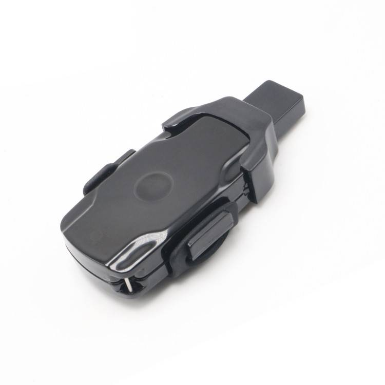

# LK-GPS - LK120-4G

The LK120-4G is a compact, waterproof GPS tracker designed primarily for pets and personal use. It combines built in GPS and GSM antennas with Assisted GPS to provide real time location updates in a small, rugged enclosure that fits easily on collars or personal carry items. The device is described as capable of frequent position reports and typical accuracy in the low single digit meters, making it suited to close range tracking and outdoor activity monitoring.

As a Plaspy compatible device out of the box, the LK120-4G streams its location and event telemetry into Plaspy for unified monitoring and management. That compatibility makes it straightforward to view live position on maps, receive geofence and SOS alerts, and review route history within Plaspy, providing a single place to manage tracking, notifications, and basic device status for pet owners and personal safety workflows.

## Key Highlights

- Native compatibility with Plaspy for map display, alerts, and history playback.
- Compact waterproof form factor suitable for collar mounting and outdoor use.
- Assisted GPS combined with on board GPS and GSM antennas for reliable fixes.
- High update frequency with position reports as frequent as every 5 seconds.
- Built in SOS button plus two way audio options for situational response.
- Power saving and movement wake features to extend operating time between charges.
- Long term route logging supported for retrospective review and behavior analysis.

## How It Works with Plaspy

When connected to Plaspy the LK120-4G sends location and event data into the Plaspy platform so users can monitor live position, configure alerts, and access historical routes from a single dashboard. Plaspy consolidates telemetry and presents it on a map view, routes list, and event timeline to support day to day tracking and incident response.

- Live position updates delivered to Plaspy for map visualization and tracking.
- Geofence entry and exit alerts routed through Plaspy notifications and user contacts.
- SOS events forwarded to authorized contacts and logged in the Plaspy event stream.
- Two way voice and ambient listening events available through Plaspy workflows or phone initiated actions.
- Route history and playback retained in Plaspy for later review and analysis.
- Device status such as movement and battery indicators visible in the Plaspy device view for maintenance planning.

## Typical Use Cases

- Pet safety and tracking during outdoor activities and off leash time.
- Personal safety for children or vulnerable individuals when a compact tracker is required.
- Lost pet recovery using SOS and two way audio to locate and assess situation.
- Portable asset monitoring for small valuables and removable equipment.
- Route logging for behavior review and pattern analysis over time.

## Why Choose This Tracker with Plaspy

The LK120-4G pairs a small, durable hardware footprint with practical tracking features that align well with Plaspy usage scenarios. Its frequent update capability and assisted positioning help keep location displays current, while SOS and two way communication support basic emergency workflows that many pet owners and caregivers value. Using the tracker with Plaspy brings these device level features into a central platform for monitoring, alerts, and historical review.

If you want centralized map based tracking, quick alerting, and straightforward history playback for pet or personal safety use cases, the LK120-4G is a compatible option to consider with Plaspy. Learn more about Plaspy on the main website https://www.plaspy.com. Product specifications, availability, and manufacturer details can change over time, so please verify current specifications on the official manufacturer website https://www.lk-gps.com.
