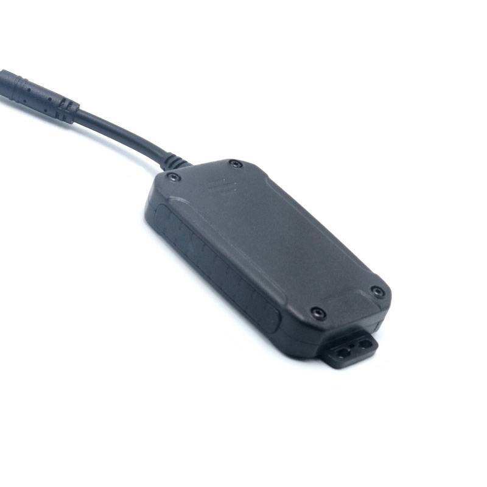

# LK-GPS - LK210-3G

The LK210-3G is a compact, easy to install GPS tracker designed for motorcycles, cars, and trucks. It combines a built in GPS receiver and GSM connectivity with an integrated vibration sensor and shock wake up to provide reliable position updates, anti theft alerts, and discreet mounting options. Its small form factor and magnetic attachment make deployment fast and non intrusive for both personal vehicles and fleet assets.

As a Plaspy compatible device, the LK210-3G streams location and status data into Plaspy so fleet managers and owners can monitor movements, receive tamper and vibration notifications, and view battery status from a centralized platform. Support for mobile apps, a browser based dashboard, and SMS commands increases flexibility for regions with variable connectivity, making the model a practical option for organizations using Plaspy for tracking and security workflows.

## Key Highlights

- Plaspy compatible GPS tracker for real time tracking and fleet management integration
- Built in GPS and GSM antennas for position fixes and cellular connectivity without external antennas
- Integrated vibration sensor with shock wake up for anti theft and tamper detection
- Internal rechargeable battery with low power modes for extended standby and reduced maintenance
- Compact magnetic design for quick attachment to metal surfaces ideal for motorcycles and rental vehicles
- Flexible access via Android iOS apps, browser based platform, and SMS commands for remote querying and configuration
- OEM customization options to support branded or large scale deployments

## How It Works with Plaspy

When connected to Plaspy the LK210-3G forwards its location and event data to a central management environment where that information is mapped, logged, and used to trigger alerts and reports. Plaspy normalizes the device data so it can be combined with other assets and used in dashboards, workflows, and operational reporting.

- Real time location updates and route history visible in Plaspy maps and timeline views
- Vibration and shock alerts forwarded into Plaspy for instant anti theft notifications and escalation
- Battery and standby reports shown in Plaspy to help schedule maintenance and reduce downtime
- SMS command support provides resilience for remote querying where data connectivity is limited and can synchronize status when the device reconnects
- Browser and mobile access ensures fleet managers can view device status and alarms on the go

## Typical Use Cases

- Fleet anti theft and security monitoring with immediate vibration notifications
- Route monitoring and compliance tracking for mixed vehicle fleets
- Rental vehicle and motorcycle recovery using discreet magnetic mounting
- Logistics and delivery oversight to confirm pickups and drop offs
- General asset tracking for occasional use equipment and field assets

## Why Choose This Tracker with Plaspy

The LK210-3G is a practical choice for teams that need a compact, easy to deploy tracker with anti theft sensing and flexible connectivity. Its combination of built in antennas, vibration detection, and standby modes aligns with common fleet and security requirements while keeping installation non intrusive for vehicle owners and field technicians.

To learn more about how Plaspy can use the LK210-3G in your tracking workflows visit https://www.plaspy.com. Product specifications, availability, and manufacturer details can change over time, so please verify current technical information on the official manufacturer website https://www.lk-gps.com.
