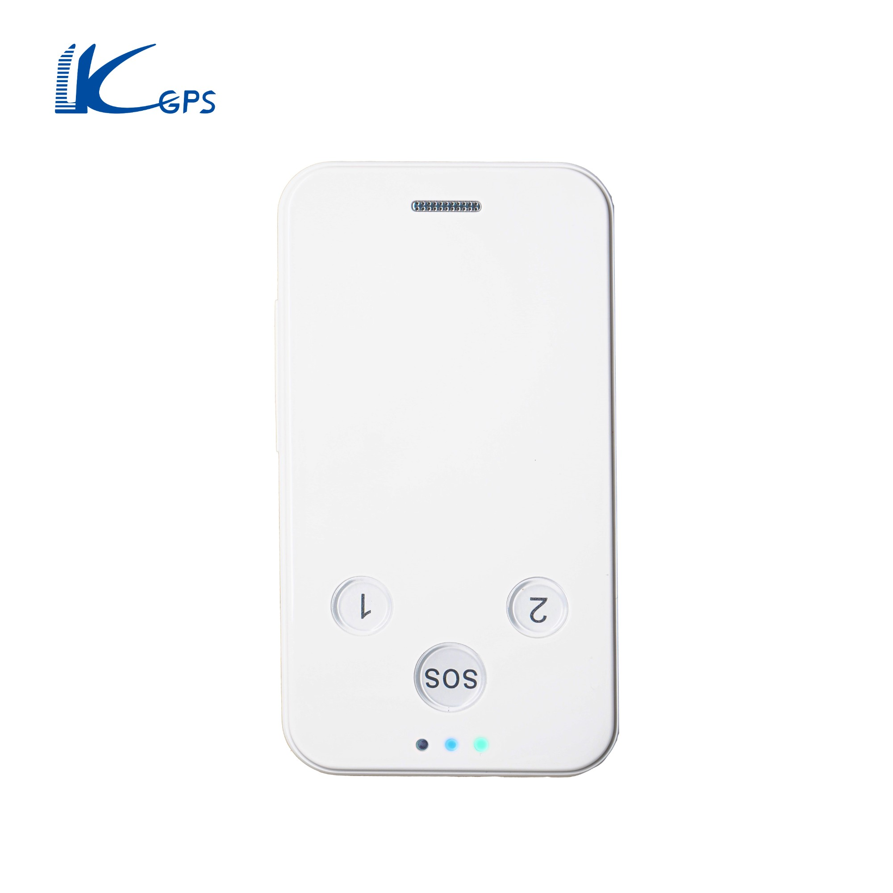

# LK-GPS - LK610

The KJ-GPS LK610 is a compact wearable GPS tracker designed primarily for kids and personal safety use. It offers real time tracking, an SOS alarm for emergencies, and multiple location query options including a mobile app, a PC webpage, and WeChat access. The device supports electronic fence entry and exit alerts, low power and displacement alarms, and provides simple visual status feedback via an LED lamp.

As a Plaspy compatible device, the LK610 can feed location and alert data into Plaspy for centralized visibility and operational oversight. Its wearable form factor and personal safety features make it a practical choice where continuous location awareness and quick alerting are important, and its selectable locating upload modes allow flexible reporting cadence within a fleet or personal tracking workflow.

## Key Highlights

- Real time location tracking suitable for personal and child safety monitoring
- SOS alarm provides an immediate alert channel for emergencies
- Multiple location query methods including mobile app PC webpage and WeChat
- Electronic fence entry and exit alerts plus displacement and low power notifications
- Wearable design with visible LED indicators for basic device status checks
- Supports different locating upload modes such as timing real time and fixed point
- AGPS support to improve positioning speed and reliability

## How It Works with Plaspy

When paired with Plaspy the LK610 sends location updates and alert messages that Plaspy can display and manage for monitoring and reporting. Plaspy can aggregate the device signals into maps timelines and alert streams to help teams maintain situational awareness and respond to incidents.

- Live location display on Plaspy maps so caregivers and operators can see current position
- Historical route logging and basic reporting for review of movements over time
- Geofence alerts forwarded to Plaspy so entry and exit events can trigger notifications
- SOS alarm events visible in Plaspy to escalate incidents and notify designated contacts
- Low power and displacement alerts surfaced in the platform to prompt follow up
- Device status indicators presented in Plaspy to help confirm connectivity and health

## Typical Use Cases

- Child safety and parent tracking for daily commutes and outings
- Caregiver oversight for vulnerable individuals who need location monitoring
- Personal safety for solo workers or travelers where an SOS function is valuable
- Short term rental or supervised activities where wearable tracking is required
- Situations that benefit from geofence notifications and timely location updates

## Why Choose This Tracker with Plaspy

The LK610 pairs a straightforward wearable design with practical alerting features that map well to Plaspy use cases focused on individual safety and small scale fleet style oversight. Its multiple reporting modes and SOS capability allow organizations and families to balance update frequency and battery life while ensuring critical events are communicated to the monitoring platform.

Because the LK610 offers several ways to query location and built in alerts for geofence entry exit low power and movement it can serve as a simple dependable endpoint for Plaspy driven monitoring workflows. This makes it a useful option for teams and families who want clear location visibility and timely notifications without complex device management.

To learn more about Plaspy and how it can display and manage LK610 devices visit https://www.plaspy.com. Product specifications availability and manufacturer details can change over time so please verify current specifications and compatibility on the official LK GPS website https://www.lk-gps.com.
