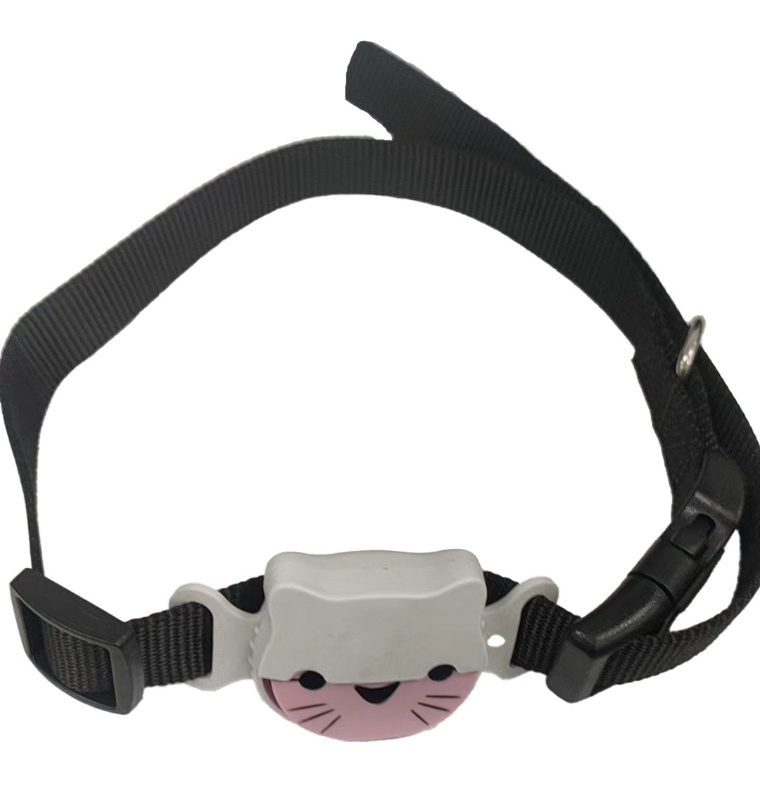

# LK-GPS - LK630

The LK630 is a compact pet tracker from LK GPS designed for cats and small dogs. It combines multi technology positioning with low power cellular connectivity to provide frequent location updates and assistive fixes in challenging environments. The device is lightweight, water resistant, and intended to attach comfortably to collars and harnesses so pets can be monitored without restricting movement.

As a Plaspy compatible device, the LK630 streams location and status information into the Plaspy platform for centralized visualization, alerting, and history. That compatibility brings pet focused telemetry into the same monitoring environment used for other assets, enabling owners and operators to manage notifications, view route history, and maintain visibility from a single place.

## Key Highlights

- Designed specifically for cats and small dogs with a compact, collar friendly form factor.
- Multi technology positioning combining GPS with Wi Fi and Bluetooth assistance for improved urban and close range accuracy.
- Cat M 4G connectivity provides reliable updates and supports frequent reporting while optimizing power use.
- Water resistant enclosure and lightweight design for continuous wearable monitoring.
- Configurable geofence alerts and low battery notifications via the companion mobile app for iOS and Android.
- Movement and activity reporting to help identify roaming behavior and unexpected motion.

## How It Works with Plaspy

When used with Plaspy, the LK630 transmits position fixes and assistive positioning data to Plaspy where it is visualized on maps, included in device history, and evaluated by rule based alerts. Plaspy captures geofence events, battery and movement status, and stores location history so owners can review routes and receive timely notifications.

- Live location updates and history playback available through Plaspy dashboards.
- Geofence enter and exit events forwarded as configurable alerts to owners and operators.
- Movement and activity status used to trigger notifications or to filter reporting in Plaspy.
- Low battery and device status alerts delivered into Plaspy for proactive maintenance reminders.
- Assistive Wi Fi and Bluetooth positioning points stored with location history to improve urban accuracy.

## Typical Use Cases

- Pet recovery and tracking for lost or roaming cats and small dogs with real time visibility.
- Geofence protection around home, yard, or other safe zones with instant leave and enter alerts.
- Monitoring daily activity and roaming patterns to understand behavior over time.
- Improved urban and edge of indoor tracking using Wi Fi and Bluetooth assistance when GPS is less reliable.
- Lightweight everyday tracking for owners who want continuous monitoring without bulk.

## Why Choose This Tracker with Plaspy

The LK630 pairs a pet centric hardware design with Plaspy compatibility to provide straightforward, centralized tracking for small animals. Its compact, water resistant build and multi technology positioning make it practical for owners who need reliable location updates in outdoor and urban environments. Within Plaspy, LK630 data becomes part of a unified monitoring workflow so alerts, history, and device status are accessible alongside other assets.

If you are evaluating a pet tracker for everyday monitoring or recovery use, the LK630 offers a balance of comfort and visibility that integrates into Plaspy for consolidated notification and reporting. Learn more about Plaspy on the main website https://www.plaspy.com and verify current product specifications and availability with the manufacturer at https://www.lk-gps.com. Product specifications and availability can change over time so checking the manufacturer documentation ensures you have the latest details.
