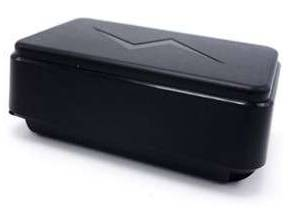

# LK-GPS - LK660

The LK660 is a compact GPS tracker from LK-GPS designed for personal safety and simple deployment. It combines GPS and LBS (A GPS) positioning with 2G cellular connectivity to provide reliable real time location tracking. The device is built for everyday use with a small waterproof housing, integrated antennas, long battery life through low power and sleep modes, one touch SOS, two way voice, and built in fall detection.

As a Plaspy compatible device, the LK660 forwards location and event data into the Plaspy platform so you can monitor devices alongside other fleet and asset endpoints. Integration with Plaspy enables live map display, configurable alerts, route playback, and consolidated reporting while keeping the deployment straightforward for caregivers, institutions, and outdoor users.

## Key Highlights

- Compact and waterproof personal tracker suited for daily wear or carry
- GPS plus LBS A GPS positioning for dependable location updates
- Long battery life supported by low power and sleep modes for extended use
- One touch SOS, fall detection, and two way voice for rapid response and verification
- Supports frequent location updates and route playback for operational oversight
- Works with mobile apps and browser access through the Plaspy platform

## How It Works with Plaspy

When the LK660 is paired with Plaspy, the device sends position and event information to the platform so administrators and caregivers can view live locations, receive alerts, and review historical movement. Plaspy displays LK660 telemetry alongside other compatible devices to provide unified situational awareness and reporting.

- Real time location updates and map visualization for live monitoring
- SOS, fall detection, and geo fence alerts delivered through Plaspy notifications
- Route history retention and playback to review past movements and events
- Grouping and device management for monitoring multiple personal trackers
- Alerts and reporting tools to support operational workflows and notifications

## Typical Use Cases

- Eldercare monitoring with SOS and fall detection for faster assistance
- Child safety and family tracking for peace of mind during daily activities
- Outdoor activities such as hiking and travel where compact waterproof design is beneficial
- Institutional monitoring in care facilities or supervised living environments
- OEM or bulk deployments for organizations seeking ready compatible personal trackers

## Why Choose This Tracker with Plaspy

The LK660 is a practical choice for organizations and families that need a straightforward personal tracking solution. Its combination of GPS plus LBS positioning, user focused features like one touch SOS and two way voice, and a durable compact design make it well suited for eldercare, child safety, and outdoor use. With long battery life and simple controls, the device minimizes maintenance while delivering continuous visibility.

Using the LK660 with Plaspy lets you centralize visibility across mixed device types and maintain consistent alerting and reporting. Plaspy presents LK660 data alongside other fleet and asset telemetry so teams can manage safety, location monitoring, and historical review from a single platform.

To learn more about Plaspy and how it can work with LK660 devices, visit https://www.plaspy.com. Product specifications and availability can change over time; please verify current technical details and regional variations on the manufacturer's official site https://www.lk-gps.com.
