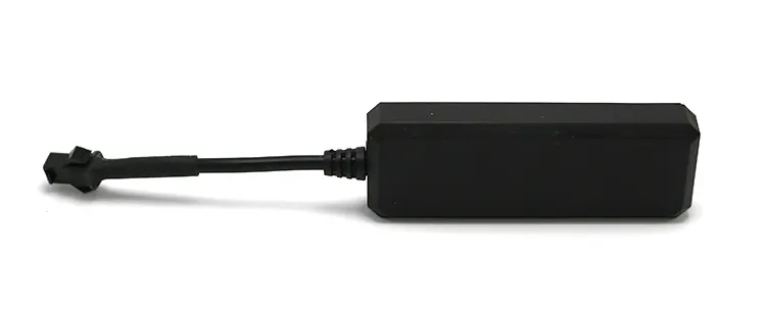

# LK-GPS - LK710

The LK710 is a compact, waterproof GPS tracker designed for reliable and discreet real-time tracking and remote vehicle control. It combines GPS positioning with quad-band cellular communication in a small housing, providing location updates, battery reporting and remote immobilizer control. The form factor and feature set make the LK710 suited for vehicles, rental fleets, portable assets, bikes and personal protection scenarios where dependable tracking and discreet installation are important.

As a Plaspy compatible device out of the box, the LK710 can forward location and status data into Plaspy to deliver live maps, history and alerting. Its remote immobilizer and SMS/config capabilities mean Plaspy can use both data and control features to support anti-theft workflows, low-battery notifications and routine fleet visibility without requiring additional hardware changes to the tracker itself.

## Key Highlights

- Plaspy compatible tracker for live location, history and fleet visibility
- Compact waterproof housing sized for discreet vehicle or asset placement
- Quad-band cellular connectivity for broad coverage and telemetry forwarding
- GPS positioning based on industry MTK chipset delivering reliable location data
- Remote immobilizer feature for fuel cut and resume control in security events
- Battery level reporting and low-power modes to support uninterrupted monitoring

## How It Works with Plaspy

When configured to report to a cloud platform such as Plaspy, the LK710 supplies the positional data and device status that Plaspy uses to populate maps, trigger alerts and build reports. Plaspy ingests location updates and telemetry sent by the unit and can combine those signals with rule based workflows and operator tools to provide operational oversight.

- Deliver live position updates and location history into Plaspy maps and dashboards
- Surface battery and power status so Plaspy can generate low-battery alerts and maintenance reminders
- Tie remote immobilizer actions to Plaspy alert workflows for anti-theft response and operator control
- Use SMS command support as an alternative channel when data connectivity is limited
- Combine LK710 telemetry with other device feeds in Plaspy for consolidated reporting and oversight

## Typical Use Cases

- Fleet management for route monitoring, asset tracking and driver oversight
- Anti-theft protection with remote immobilizer control integrated into alert workflows
- Rental vehicle and car sharing programs needing discreet telemetry and usage monitoring
- Portable asset and equipment tracking for bicycles, luggage or field devices
- Field staff location visibility for distributed teams and mobile workforce coordination

## Why Choose This Tracker with Plaspy

The LK710 pairs practical vehicle level features with a compact waterproof design, making it a straightforward choice for operations that need discreet tracking and basic remote control capabilities. Its ability to report position, battery status and accept remote commands aligns with Plaspy’s core strengths in live mapping, alerting and centralized fleet oversight.

For organizations using Plaspy, the LK710 can be a reliable data source to power location based workflows, immobilizer response scenarios and routine reporting. Where additional sensors or device types are required, Plaspy can integrate multiple feeds alongside LK710 telemetry to provide a broader operational view while maintaining centralized management.

Learn more about Plaspy on the main website https://www.plaspy.com. Product specifications, availability and manufacturer details can change over time, so please verify current technical information on the official manufacturer site https://www.lk-gps.com.
