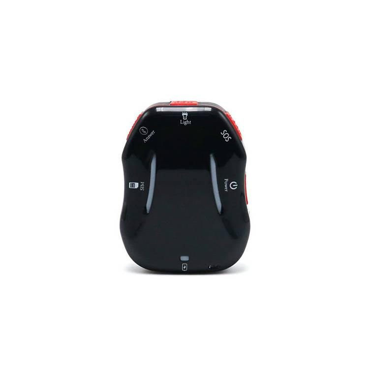

# LK-GPS - LK800

The LK800 is a compact personal GPS tracker designed for real time safety and discreet everyday carry. It combines multi system satellite positioning with A GPS assistance to improve fixes in challenging signal conditions and is specified by the manufacturer to deliver frequent position updates, with update capability down to 5 second intervals. The device includes emergency features such as a prominent SOS button, automatic fall detection and two way voice to support direct communication when needed.

As an out of the box Plaspy compatible device, the LK800 forwards location, alerts and basic telemetry into the Plaspy platform for centralized monitoring and reporting. This compatibility makes the LK800 suitable for organizations and families that want to consolidate personal locator data alongside other telematics sources in Plaspy for real time oversight, historical route review and configured alerting workflows.

## Key Highlights

- Plaspy compatible for seamless integration of location, alerts and history into a centralized monitoring platform.
- Real time tracking with manufacturer stated capability for frequent position updates, down to 5 second intervals.
- Prominent SOS button and automatic fall detection to support rapid notification and caregiver response.
- Two way voice and remote listening for direct communication and situational awareness.
- Multi system GNSS with A GPS assistance to improve position fixes in weak signal conditions.
- Compact, waterproof form factor suited to pocket carry, pendant use or accessory mounting with small footprint.

## How It Works with Plaspy

When connected to Plaspy, the LK800 transmits location and event information so administrators, caregivers or monitoring teams can view live positions on maps, receive alerts, and replay historical routes. Plaspy consumes the tracker’s telemetry and alarm messages to provide notification routing, reporting and consolidated operational visibility alongside other asset data.

- Live location updates and map display for real time monitoring and rapid response.
- SOS and fall detection events routed to authorized contacts and platform alarms for immediate awareness.
- Two way voice and remote listening available through Plaspy linked communications for direct contact.
- Historical route playback and reporting for review, compliance and incident analysis.
- Battery status and basic device state visible in Plaspy to help manage device health and maintenance.
- Combine LK800 data with other Plaspy compatible device feeds to create unified dashboards and cross asset alerts.

## Typical Use Cases

- Family safety and child location monitoring with instant SOS and geofence notifications.
- Elder care and assisted living scenarios where fall detection and two way voice improve response.
- Student and lone person monitoring for campus safety and fieldworker oversight.
- Pet tracking when used with appropriate mounts or accessories for small animals.
- Personal security for vulnerable users and caregivers needing centralized alert history and location playback.

## Why Choose This Tracker with Plaspy

The LK800 provides a focused personal tracking experience that maps well to Plaspy use cases for safety, monitoring and incident review. Its combination of frequent updates, assisted satellite fixes, SOS alarm and fall detection gives caregivers and operators timely information to act on, while two way voice adds a direct communication channel that complements alert workflows in Plaspy. For teams already using Plaspy as their consolidation layer, adding LK800 units enables consistent handling of personal locator events alongside broader telematics streams.

If you want to learn more about how Plaspy can manage LK800 trackers and other compatible devices, visit https://www.plaspy.com. Product specifications, availability and manufacturer details can change over time, so please verify current technical information and approvals on the official LK GPS site https://www.lk-gps.com.
