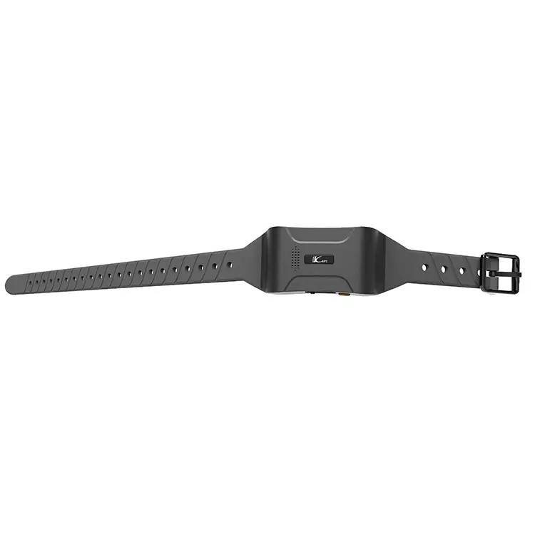

# LK-GPS - LK880 Cat1

The LK880 Cat1 from LK-GPS is a compact, rugged GPS tracker designed specifically for cats and dogs. It provides continuous cellular connectivity and delivers real time location updates, route history, and activity summaries while being built to withstand everyday outdoor use. The device combines location awareness with pet focused features to support recovery, monitoring and guided behavior control.

As a Plaspy compatible device out of the box, the LK880 Cat1 can feed its location and telemetry into Plaspy’s cloud platform for centralized monitoring. That compatibility makes it straightforward to include pet tracking alongside other GPS assets within a single Plaspy account, enabling unified alerts, historical playback and consolidated situational visibility.

## Key Highlights

- Plaspy compatible GPS tracker for centralized location and activity telemetry.
- Continuous 4G Cat1 connectivity for frequent real time position updates.
- Waterproof and durable design suitable for daily use on cats and dogs.
- Integrated remote training collar capability for supervised behavior control.
- Configurable geofencing with displacement and low battery alerts.
- Historical route playback and on demand positioning support for recovery and review.
- Companion iOS and Android apps for interactive maps and activity summaries.

## How It Works with Plaspy

When connected to Plaspy, the LK880 Cat1 streams its reported position and activity information into Plaspy’s dashboard and alerting system, allowing you to monitor pets in the same interface used for other devices. Plaspy consolidates incoming telemetry so owners and operators can view location, receive events, and review histories from a single place.

- Real time location updates visible in Plaspy for immediate situational awareness.
- Geofence events and instant alerts forwarded to Plaspy when a pet exits a safe zone.
- Historical route playback stored and viewable in Plaspy for recovery or analysis.
- Displacement and low battery alarms sent to Plaspy so you can respond promptly.
- Centralized alerting and reporting allow combining pet data with other tracked assets.

## Typical Use Cases

- Rapid recovery of a lost pet using real time location and Plaspy mapping.
- Daily activity and movement monitoring to review exercise patterns.
- Safe zone enforcement with instant notifications when a pet leaves a boundary.
- Supervised behavior training using the tracker’s remote training collar features.
- Durable outdoor tracking for pets that spend time outside in varied conditions.

## Why Choose This Tracker with Plaspy

The LK880 Cat1 is focused on pet safety and owner convenience, delivering continuous reporting, activity summaries, and pet specific features that align with common needs for recovery and behavior support. Its waterproof build and compact form make it practical for everyday use on cats and dogs, while the device’s telemetry and alerts become more useful when aggregated inside Plaspy.

Choosing the LK880 Cat1 with Plaspy gives pet owners centralized visibility and unified event management alongside other GPS devices. If your priority is dependable location tracking, geofence alerts and activity reporting for companion animals, this tracker provides a practical match for Plaspy’s monitoring and notification capabilities. Learn more about Plaspy on the main website https://www.plaspy.com. Product specifications and availability can change over time, so verify current details with the manufacturer documentation at https://www.lk-gps.com.
