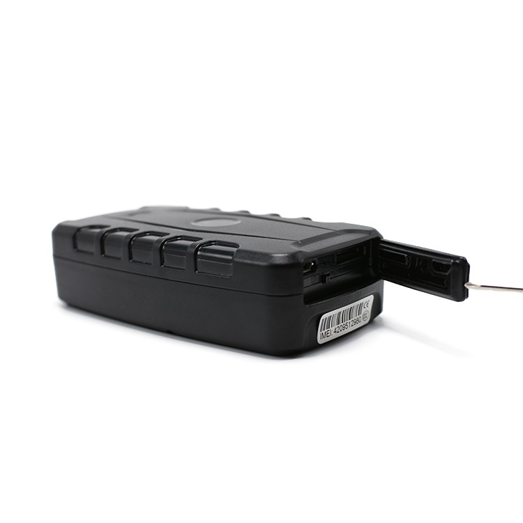

# LK-GPS - LK900A/B/C

The LK900A/B/C is a Plaspy compatible 4G magnet GPS+GSM tracker engineered for long-term, reliable vehicle and asset monitoring. Available in three high-capacity battery variants \(5000 mAh, 10000 mAh, and 20000 mAh\), the LK900 series provides extended standby times and continuous location updates to Plaspy’s web platform and mobile app, making it a practical choice for fleet managers, rental operators, logistics providers, and asset security teams.

Designed for discreet, non-permanent mounting with a powerful magnetic housing, the LK900A/B/C delivers real-time tracking, movement detection, geofence alerts, and a suite of telemetry events that integrate smoothly with Plaspy for fleet management and anti-theft workflows. Durable and easy to deploy, this GPS tracker helps organizations maintain visibility and operational oversight without complex installation.

## Key Highlights

- Plaspy compatible GPS tracker: seamless delivery of live positions and historical routes to Plaspy’s platform and mobile app for immediate access.
- Long battery life: choose from 5000, 10000, or 20000 mAh battery options to extend standby and tracking time when vehicle power is off.
- 4G LTE connectivity: fast, reliable updates for real-time tracking and telemetry across supported networks.
- Magnetic housing for quick mounting: rapid, discreet attachment to vehicles, containers, and equipment without permanent wiring.
- Comprehensive event alerts: geofence, overspeed, drop/detachment, vibration/shock, low battery, and movement detection for improved anti-theft and security monitoring.
- Power-saving modes: sleep and interval tracking options to balance update frequency and battery life for long deployments.
- History route playback: review past routes and driver behavior to support fleet management and operational oversight.

## How It Works with Plaspy

The LK900A/B/C sends GPS location and device telemetry over 4G LTE to Plaspy’s cloud services, where data is visualized in real time and archived for reports and playback. Integration is plug-and-play on Plaspy: once the tracker is registered, position updates, alerts, and history are available through the web dashboard and mobile app for dispatch, monitoring, and analysis.

- Real-time location and telemetry updates delivered to Plaspy for live tracking and dispatch.
- Geofence alerts and history route playback visible in Plaspy for route verification and compliance.
- Movement detection, drop/detachment, vibration, and shock alerts feed Plaspy event logs for anti-theft and incident response.
- Low battery and overspeed warnings are sent to Plaspy so fleet managers receive proactive notifications and can schedule maintenance or intervention.
- Automatic interval and blind-area \(periodic\) tracking preserve battery while ensuring coverage in areas with limited connectivity; Plaspy reconciles periodic updates and displays aggregated routes.

## Technical Overview

| Model | LK900A / LK900B / LK900C |
| --- | --- |
| Connectivity | 4G LTE and GSM \(4G magnet GPS+GSM tracker\) |
| Bands | Not specified in description \(4G connectivity will depend on regional variants and carrier support\) |
| Power & Battery | High-capacity rechargeable batteries: 5000 mAh, 10000 mAh, 20000 mAh; designed for extended standby and operation when vehicle power is off |
| Interfaces | Magnetic housing for non-permanent mounting; no permanent wiring or ignition input specified in the provided description |
| GNSS | GPS positioning \(provides precise location updates; specific GNSS constellation support not detailed\) |
| Bluetooth | Not specified |
| Remote Management | Live data and history available via Plaspy web platform and mobile app; device configuration handled through platform integration |
| Form Factor | Magnetic, compact housing suitable for vehicles, containers, and mobile assets |

## Use Cases

- Fleet management: track vehicle locations, monitor routes, and review history playback for route optimization and driver oversight.
- Anti-theft protection: movement detection, drop/detachment, and vibration/shock alerts provide immediate notifications for suspected tampering or theft.
- Logistics and delivery: maintain visibility over cargo and delivery vehicles with geofence alerts and overspeed warnings to enforce policies and improve safety.
- Container and asset tracking: magnetic mounting and long battery life make the LK900 ideal for temporary or rotating asset monitoring without permanent installation.
- Rental and shared vehicles: quick installation and reliable telemetry help rental operators monitor usage patterns and secure assets between rentals.

## Why Choose This Tracker with Plaspy

Choosing the LK900A/B/C for Plaspy integration delivers practical value: robust 4G GPS tracking, extended battery options for long deployments, and a magnetic form factor that simplifies installation. The device’s event suite — including geofence, overspeed, movement, and low battery alerts — feeds Plaspy’s telemetry and reporting modules so teams can act on incidents quickly and analyze operational performance over time.

For organizations that need reliable real-time tracking, scalable fleet management, and straightforward asset security, the LK900 series offers a balance of endurance, durability, and integration readiness. While the tracker is optimized for position and event telemetry, Plaspy’s platform can incorporate those data streams into broader workflows such as ignition and immobilizer control or fuel monitoring where external sensors, vehicle wiring, or additional hardware are used. This makes the LK900 a flexible choice for businesses that want Plaspy-compatible GPS tracking that supports anti-theft, telemetry, and operational oversight without complex installation.

