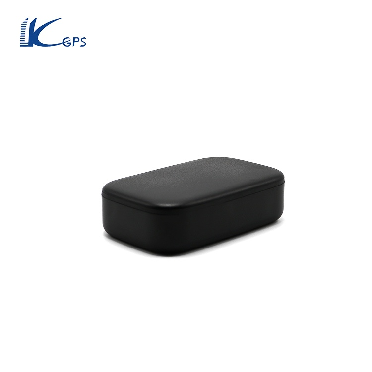

# LK-GPS - LK930

The LK930 GPS Tracker by KJ-GPS is a powerful and reliable vehicle tracking device that offers real-time tracking and location-based services. With its compact size and built-in GPS and GSM antennas, this tracker is perfect for monitoring the whereabouts of your vehicles. Whether you're a fleet manager or a concerned parent, the LK930 GPS Tracker provides the peace of mind you need to ensure the safety of your assets and loved ones.

One of the standout features of the LK930 GPS Tracker is its long standby time. With a 6000mAh battery, this tracker can last up to 60 days on standby, making it ideal for long-term tracking applications. Additionally, the LK930 GPS Tracker supports various alert notifications, including vibration, displacement, low battery, power off, and over-speed alerts, ensuring that you stay informed of any unusual activities or emergencies.

With the LK930 GPS Tracker, you can easily track your vehicles in real-time using the smartphone app or web platform. The tracker supports both Android and Apple devices, allowing you to monitor your assets from anywhere, at any time. You can also check the history of routes taken by the tracker within the past year, giving you valuable insights into the movements of your vehicles.

Other notable features of the LK930 GPS Tracker include geo-fencing, which allows you to set up virtual boundaries for your vehicles and receive alerts when they breach those boundaries. The tracker also supports one-way communication, allowing you to listen to the surrounding environment using your cell phone. Additionally, the LK930 GPS Tracker features AGPS and WiFi locating capabilities, further enhancing its accuracy and reliability.

Overall, the LK930 GPS Tracker is a versatile and feature-packed device that offers precise tracking, long standby time, and a range of alert notifications. Whether you need to monitor your fleet of vehicles or keep an eye on your loved ones, the LK930 GPS Tracker is the perfect solution.

### Key Features:

- Real-time tracking
- One-way communication
- Geo-fence
- History route
- Magnetic \(optional\)
- AGPS locating
- WiFi locating \(optional\)
- Vibration/Displacement/Low battery/Power off/Over-speed alert

### Technical Specifications:

- Network: GSM & GPRS
- Band/mHz: 850/900/1800/1900
- GSM chip: MTK2503
- GPS chip: MTK2503
- GPS sensitivity/dBm: -159
- GPS accuracy/m: 5

