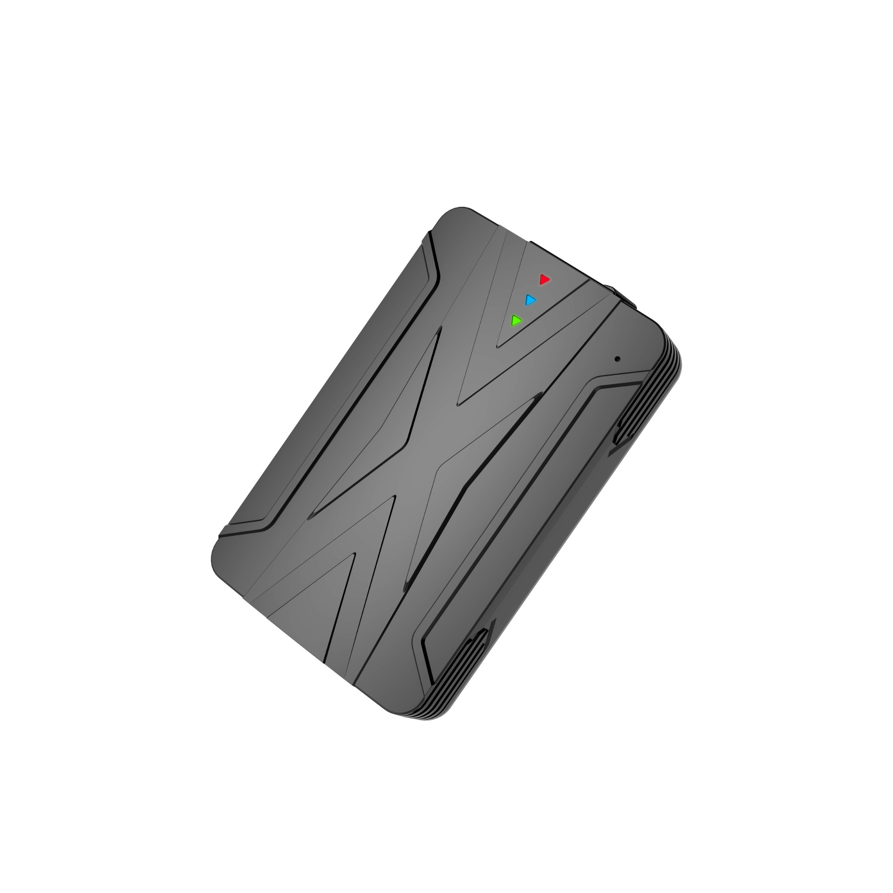

# LK-GPS - LK970

The LK970 is a compact 4G GPS tracker from LK-GPS designed for discreet tracking and monitoring of vehicles, motorcycles, and handheld devices. It combines a small footprint with strong magnetic free installation and onboard batteries to allow placement in a variety of locations while providing continuous location information and reporting features suitable for both personal and fleet use.

As a model compatible with Plaspy, the LK970 can be integrated into Plaspy's fleet management environment to provide real time visibility, alerts, and historical location data. Its support for SMS platform mode query and real time tracking along with geofence and event reporting make it a practical device to connect to Plaspy for operational oversight and monitoring.

## Key Highlights

- Compact and discreet form factor suitable for vehicles motorcycles and portable assets
- 4G capable with broad band support for reliable coverage in many regions
- Built in battery capacity and supplementary battery options for extended operation during power loss
- Real time tracking plus SMS platform mode query for flexible location requests
- Built in event reporting including inflection point reports geofence alerts and overspeed or displacement vibration alarms
- Compatible Android and iOS track view app for on the go access to location data

## How It Works with Plaspy

When used with Plaspy the LK970 supplies location and event data that Plaspy can display and act on to support fleet monitoring and asset management. Plaspy can ingest the tracker's reporting to provide consolidated views and configurable alerts across an entire fleet.

- Live location display for vehicles motorcycles and handheld units inside the Plaspy dashboard
- Geofence creation and notification forwarding based on the LK970 electronic fence alarms
- Event alerts for overspeed displacement vibration and inflection points routed into Plaspy alerts and notification channels
- Historical route playback and location history for post trip analysis and reporting
- Centralized device management to view battery state and recent communications through Plaspy device lists

## Typical Use Cases

- Fleet vehicle tracking for route oversight and location visibility
- Motorcycle and scooter monitoring where compact discreet placement is required
- Portable asset tracking for rental equipment or high value handheld devices
- Security monitoring with geofence alerts and movement detection
- Backup tracked devices for occasional offline or remote deployments

## Why Choose This Tracker with Plaspy

The LK970 offers a balanced set of capabilities that suit organizations looking for a compact tracker that can be monitored centrally. Its combination of real time tracking, SMS query capability, geofence and event reporting, and onboard power reserve make it a practical choice for operations that need reliable position reporting and basic event alarms.

Because the LK970 is compatible with Plaspy, teams can add these devices into a unified monitoring platform to gain visibility across mixed fleets and asset types. Plaspy helps turn the tracker's location and event signals into actionable insights through consolidated maps alerts and reporting without requiring specialized configuration knowledge.

To learn more about using the LK970 with Plaspy and how it can fit into your tracking workflows visit https://www.plaspy.com. Product specifications availability and manufacturer details can change over time so verify current information and technical documentation on the official manufacturer site https://www.lk-gps.com.
