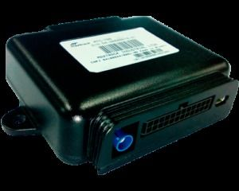

# Maxtrack - MTC-700

The Maxtrack MTC-700 family is a line of professional GPS trackers designed for advanced tracking and telemetry applications. Products in this family serve logistics, risk management, collective transportation, and bespoke operational needs by combining position reporting with flexible telemetry modes, embedded logic, and extended data recording. The MTC-700 platform emphasizes customization and operational resilience, offering features such as embedded scripting, multi SIM support, long term history storage, jamming detection, and options for wireless peripheral connectivity.

As a device compatible with Plaspy, the MTC-700 can be incorporated into fleet and asset monitoring workflows to provide real time visibility and historical data within Plaspy dashboards and reporting. Its programmable behavior and fallback communication options make it suitable for deployments that need tailored business rules and robust connectivity, allowing organizations using Plaspy to adapt tracking logic to specific operational policies and to preserve data continuity when primary communication channels are unavailable.

## Key Highlights

- Highly customizable device family with embedded scripting to implement business rules and custom actions.
- Multiple telemetry modes to support general telemetry, advanced accelerometer reporting, and CAN network telemetry where applicable.
- Communication resiliency with dual SIM support and fallback messaging options to preserve data flow.
- Black box style history that records vehicle and telemetry data for extended retention.
- Optional Wi Fi model for local wireless communication with peripherals and mobile devices.
- Designed for critical operations with the ability to use satellite communication when connected to an external satellite modem.

## How It Works with Plaspy

When used with Plaspy, the MTC-700 provides location and telemetry data that can be visualized, analyzed, and acted on through Plaspy interfaces. Plaspy can ingest the tracker's reporting and expose it to fleet managers, operations teams, and reporting workflows to improve situational awareness and operational control.

- Real time location tracking and map visualization of assets within Plaspy.
- Event and alert generation based on device messages and embedded business rules.
- Historical data and black box records available for route reconstruction and post event analysis.
- Telemetry and status reporting used in Plaspy dashboards and scheduled reports for operational oversight.
- Use of the device's programmable features to trigger contextual notifications or state changes visible in Plaspy.

## Typical Use Cases

- Logistics fleet tracking and route monitoring for delivery and distribution operations.
- Risk and security management for high value cargo or vehicles requiring telemetry and jamming detection.
- Public or collective transportation monitoring with long term history and reporting needs.
- Remote or rural operations that may require fallback communication or satellite connectivity.
- Custom projects requiring embedded scripting to implement tailored business rules or workflows.

## Why Choose This Tracker with Plaspy

The MTC-700 family is a strong option for organizations that need a flexible, programmable tracker that can be adapted to diverse operational requirements. Its combination of embedded scripting, multiple telemetry modes, and extended history recording aligns well with Plaspy use cases where configurable behavior and reliable data capture are important.

Pairing MTC-700 devices with Plaspy lets teams centralize visibility and reporting while leveraging the tracker's customization capabilities to enforce operational logic at the device level. This can reduce manual intervention, improve data continuity during communication failures, and provide richer context for fleet management and incident analysis.

To learn more about Plaspy and how compatible devices like the Maxtrack MTC-700 can fit into your fleet strategy visit https://www.plaspy.com. Product specifications, availability, and manufacturer details can change over time, so please verify current technical information on the manufacturer site https://maxtrack.com.br before final decisions.
