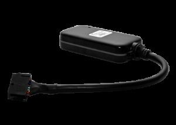

# Maxtrack - MXT-140

The Maxtrack MXT-140 is a compact and robust GPS tracker designed for high volume operations that require minimal field maintenance. It combines positioning and cellular data connectivity in a single internal processor, offering a streamlined architecture aimed at delivering efficient performance. Notable design priorities include electrical protection, impermeability, and mechanical durability, making the device appropriate for harsh environments and installations where reliability is important.

As a Plaspy compatible device, the MXT-140 can be integrated into fleet monitoring workflows to provide positioning and event information from vehicles and mobile assets in areas with GPRS coverage. Its small form factor and flexible input output options, available in two variants, make it a practical choice for mixed fleets that include motorcycles and light vehicles. When connected to Plaspy, the MXT-140 contributes to real time visibility, alerting, and operational reporting without requiring frequent interventions.

## Key Highlights

- Compact and durable design optimized for environments prone to interference and moisture
- Single processor architecture for combined positioning and cellular connectivity
- Two model variants with differing input output counts to match installation needs
- Certified by ANATEL and designed for continuous high volume operations
- Features useful for fleet control such as panic input and immobilization output
- Suitable for motorcycle installations due to small size and impermeability

## How It Works with Plaspy

When paired with Plaspy, the MXT-140 sends positioning and event data to the platform so teams can monitor location, status, and alerts centrally. Plaspy ingests the device data to present it on maps, dashboards, and reports that support operational oversight and decision making.

- Vehicle and asset location displayed on Plaspy maps for live monitoring and historical playback
- Alerts and events such as panic trigger and immobilizer activation routed into Plaspy for immediate notification
- Accelerometer based movement detection used to generate motion alerts and support theft detection workflows
- Different MXT-140 A and B input output configurations mapped in Plaspy to track digital inputs and control outputs relevant to operations
- Reporting and exportable histories in Plaspy to analyze uptime, movement patterns, and intervention needs

## Typical Use Cases

- Large scale fleet management where low maintenance and continuous operation are priorities
- Motorcycle fleet tracking where size, impermeability, and resistance to interference are important
- Rental and financial services fleets requiring position verification and remote immobilization options
- Insurance and telematics projects that rely on reliable positioning and event reporting in GPRS areas
- Remote monitoring of mobile assets operating in challenging electrical and environmental conditions

## Why Choose This Tracker with Plaspy

The MXT-140 is a practical fit for organizations that need a resilient, low complexity tracker to feed location and event data into a centralized fleet management system like Plaspy. Its emphasis on electrical protection and mechanical sealing helps reduce intervention frequency, which is valuable for high volume deployments where uptime matters. The availability of two I O configurations makes the tracker adaptable to different operational requirements without introducing unnecessary complexity.

Paired with Plaspy, the MXT-140 supports core fleet visibility and control capabilities such as monitoring, alerting, and basic remote actions. For teams managing mixed fleets or operations in environments where interference and moisture are common, this combination provides a straightforward and maintainable solution.

To learn more about how Plaspy can work with the Maxtrack MXT-140 visit https://www.plaspy.com. Product specifications and availability can change over time, so please verify current technical details and certification information with the manufacturer at https://maxtrack.com.br.
