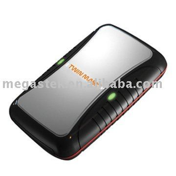

# Megastek - GTP-69

The Megastek GTP-69 is a compact, lightweight GPS tracker designed for versatile asset and vehicle tracking. It combines a SiRF Star III GPS chipset for positioning with a GSM SIM 900 cellular module that supports quad band frequencies, providing broad coverage for location reporting. The unit includes practical features such as track on demand, interval tracking, motion detection, an SOS button, geo fencing, over speed warning, low battery notification, and local data logging to retain positions when cellular coverage is unavailable.

As a device compatible with Plaspy, the GTP-69 can feed positioning and alert data into the Plaspy platform for centralized monitoring and reporting. Its compact form factor and range of tracking and safety features make it suitable for integrating into Plaspy workflows for fleet oversight, asset protection, and personal safety monitoring. The combination of onboard alerts and stored location history helps Plaspy users maintain situational awareness even when coverage is intermittent.

## Key Highlights

- Reliable positioning with SiRF Star III GPS chipset for consistent location fixes
- Wide cellular compatibility via SIM 900 quad band support for broad coverage
- Flexible tracking modes including on demand and time interval reporting
- Safety features such as SOS button, geo fencing, and over speed warning
- Alerts for no GPS and low battery conditions to maintain operational awareness
- Built in memory for data logging so locations can be retrieved after outages
- Compact size and lightweight design for discreet placement and easy use

## How It Works with Plaspy

When connected to Plaspy, the GTP-69 delivers location updates and alert events to the platform where they can be visualized and managed alongside other devices. Plaspy uses incoming position reports and device alerts to provide consolidated tracking, notifications, and historical reporting across a fleet or group of assets.

- Real time visibility of device locations on the Plaspy map for operational monitoring
- Configurable alerts in Plaspy for SOS, geo fence breaches, over speed, and low battery
- Historical playback and reporting using position data received directly and from device memory
- Grouping and tagging of GTP-69 devices for fleet management and role based oversight
- Dashboards and exportable reports to analyze movement patterns and compliance
- Event driven notifications to keep dispatch and managers informed of critical events

## Typical Use Cases

- Vehicle tracking for small fleets and individual cars requiring discreet installation
- Fleet fleet monitoring where compact units with alerting are preferred
- Personal safety or lone worker monitoring using SOS and movement alerts
- Asset protection for high value items that benefit from concealed tracking
- Rental or short term vehicle tracking with interval reporting and historical logs

## Why Choose This Tracker with Plaspy

The Megastek GTP-69 pairs practical hardware features with Plaspy platform capabilities to provide a balanced tracking solution. Its combination of reliable GPS positioning, cellular reach, and safety alerts makes it a suitable choice for organizations that need continual visibility and event based notifications. The device memory and warning features help ensure continuity of data in real world conditions where coverage can vary.

Choosing the GTP-69 with Plaspy offers a straightforward path to add compact, feature rich trackers to an existing monitoring setup. While this page summarizes commonly useful characteristics, device selection should consider specific operational needs such as reporting cadence and alert preferences to ensure the best fit for your Plaspy deployment.

To learn more about how Plaspy supports devices like the Megastek GTP-69 visit https://www.plaspy.com. Product specifications, availability, and manufacturer details can change over time, so please verify current technical information and documentation on the manufacturer site https://www.megastek.com/.
