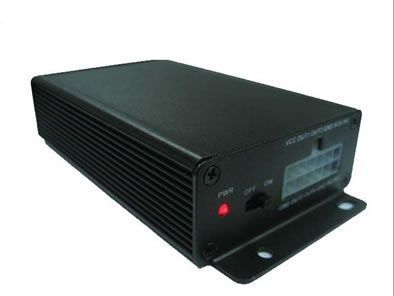

# Megastek - GVT-369

The Megastek GVT-369 is a high-quality GPS tracker designed to provide accurate and reliable tracking for a variety of applications. With its compact and durable design, this tracker is perfect for both personal and commercial use. The GVT-369 features a GPS chipset from SiRF Star III, ensuring precise location tracking. It also utilizes a GSM chipset \(SIM 900\) with quad-band support \(850/900/1800/1900 MHz\), allowing for seamless communication and tracking capabilities worldwide.

One of the standout features of the GVT-369 is its ability to set up to three authorized cell phone numbers, providing added security and control over who can access the tracker's information. The tracker can be easily tracked on demand or at specific time intervals, giving you the flexibility to monitor its location whenever you need to. Additionally, the GVT-369 supports tracking via mobile phone, making it convenient and accessible for users on the go.

The GVT-369 is equipped with a range of advanced features to enhance its functionality. It has a power-saving mode to conserve battery life, ensuring that the tracker can operate for extended periods without needing to be recharged. The SOS button allows for immediate rescue and alarm activation in emergency situations. The tracker also includes an internal backup battery, providing backup power in case of a main power failure.

Other notable features of the GVT-369 include a motion sensor, geo-fence alarm, "No GPS" signal warning, low battery warning, over-speed limit warning, and background voice surveillance. It also supports data logging with its built-in memory, allowing you to store and retrieve tracking data even when there is no cellular signal available.

The GVT-369 offers a range of inputs and outputs, including three digital inputs \(including ACC\) and two analog inputs. It also has two outputs, providing flexibility for various applications. With its compact dimensions of 124\*66\*28mm and a net weight of 210g, the GVT-369 is easy to install and conceal. It comes in a sleek black color and is packaged in a box measuring 26\*16\*7cm, with a gross weight of 750g.

Overall, the Megastek GVT-369 is a feature-packed GPS tracker that combines reliability, functionality, and convenience. Whether you need to track vehicles, assets, or loved ones, the GVT-369 is an excellent choice that delivers accurate and real-time tracking information.

