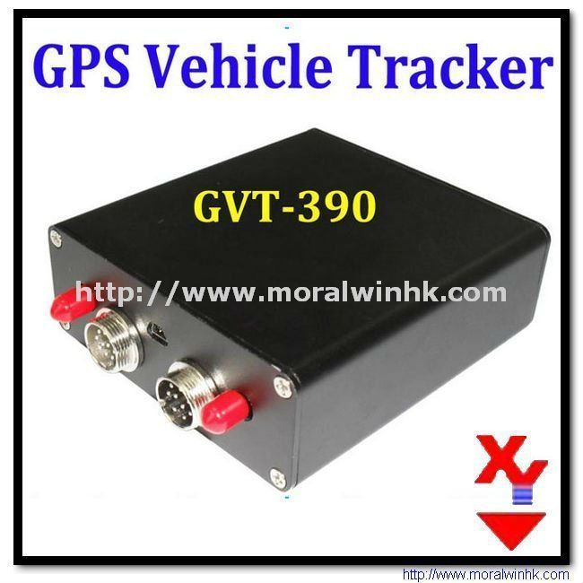

# Megastek - GVT-390

The Megastek GVT-390 is a compact GPS tracker designed to deliver accurate and reliable location tracking for a range of applications. Built around a SiRF Star III GPS chipset and using a SIM900 GSM module for quad band connectivity, the GVT-390 provides position updates, configurable alarms, and a set of inputs and outputs for expanded functionality. Its feature set includes SOS, geo-fencing, overspeed alerts, motion detection, background voice monitoring, power saving mode, and the ability to accept multiple simultaneous instructions, making it suitable for both personal and commercial tracking needs.

As a device compatible with Plaspy, the GVT-390 can be incorporated into Plaspy's fleet and asset management environment to provide visibility and operational oversight. Plaspy can consume the device's position updates and event notifications to display locations on maps, generate alerts, and produce reports. The combination of the GVT-390 hardware features and Plaspy's monitoring and reporting capabilities makes this tracker a practical option for organizations that need reliable tracking integrated into a broader management platform.

## Key Highlights

- Precise location reception using a SiRF Star III GPS chipset for dependable tracking.
- Quad band GSM connectivity via SIM900 for broad cellular coverage in multiple regions.
- Built-in features such as SOS button, geo-fencing alarm, overspeed alarm, and motion detection.
- Support for multiple simultaneous instructions and up to five authorized phone numbers for controlled access.
- Inputs and outputs including multiple digital and analog inputs plus outputs for integration with vehicle systems.
- Compact form factor that is suitable for a variety of installations and concealment needs.

## How It Works with Plaspy

The GVT-390 provides positional data and event signals that Plaspy ingests to deliver real time visibility, alerting, and historical playback for operators. Plaspy uses these inputs to present location, status, and event timelines in the user interface for oversight and reporting.

- Real time location display and periodic updates for fleet and asset monitoring.
- Event driven alerts within Plaspy for SOS, geo-fence breaches, overspeed, and low power warnings.
- Historical route playback and location history to support auditing and route analysis.
- Use of digital and analog input events to trigger custom alerts or operational rules in Plaspy.
- Centralized reporting and dashboards combining GVT-390 data with other devices managed in Plaspy.

## Typical Use Cases

- Fleet tracking and route monitoring for small to medium vehicle fleets.
- Asset protection and recovery for high value movable equipment.
- Personal safety monitoring where SOS and audible monitoring are beneficial.
- Delivery and logistics operations requiring geofence alerts and location history.
- Rental or shared vehicle oversight relying on event alerts and usage records.

## Why Choose This Tracker with Plaspy

The GVT-390 pairs practical tracking hardware with a set of features that align well with Plaspy's visibility and management capabilities. Its SiRF Star III GPS module supports accurate positioning, while the GSM connectivity options help maintain communications across diverse service areas. The device's alarm set and multi instruction support give operations teams flexibility to configure tracking behavior that fits their workflows.

When combined with Plaspy, the GVT-390's inputs, outputs, and event reporting can be turned into actionable intelligence for dispatch, compliance, and safety monitoring. Organizations looking for a versatile tracker that can feed location and event data into a full featured fleet management platform will find the GVT-390 a practical, well rounded option.

To learn more about Plaspy and how it can manage devices like the GVT-390 visit https://www.plaspy.com. Product specifications and availability can change over time, so please verify current technical details and documentation with the manufacturer at https://www.megastek.com/ before purchase or deployment.
